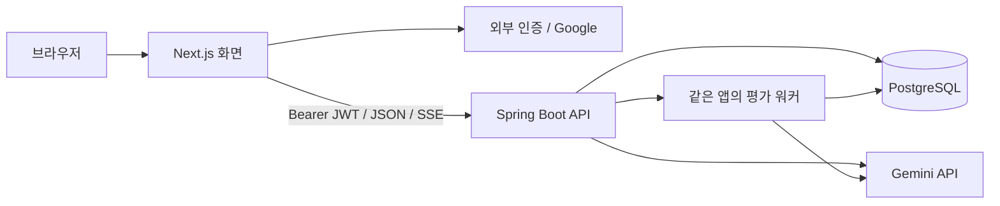

> **F00 당시 범위 (2026-09-06, 과거 기록):** 해당 작업은 [개발 환경 구축](F00_ENVIRONMENT.md)만 수행한다. 기존 전체 MVP·ERD·seed·AI·배포 계획은 후속 작업이다. 현재 실행 명령은 [루트 README](../README.md)를 따른다.


# 되짚 (Doezip) 개발 통합 명세

> **기획의 언어를 화면 → API → 데이터 → 평가 → 테스트로 연결한다.**
>
> 목표는 2주 안에 실제 사용자가 첫 과제를 끝까지 수행하고 근거 있는 리포트를 받는 것.
> 모든 기능을 넓게 만드는 것보다 학습 흐름 하나의 완성도를 우선한다.

현재 1인 개발의 작업 순서는 [기능 백로그](FEATURE_BACKLOG.md)를 따른다. 아래 2인 일정은 최초 계획이다.

## 0. 문서의 기준과 해석

**사용자가 지정한 조건:** 2인, 역할 고정 없이 피처 단위 개발, 약 2주, 기술스택 후보 ①.
**제품 기준:** 기획안 v5의 요청 설계 / 근거 검증 / 결과 문서화 / 판단 방어, 검산 챌린지, 원본 근거 중심 리포트.[^P]
**DB 기준:** ERD v1.0의 22개 테이블, 상태 코드, 불변 문서·입력 스냅샷, 비공개 정답 분리.[^E]

이 문서는 원문을 단순 병합하지 않는다. 실행에 필요한 API와 작업 순서는 **새 구현 제안**이다.
원문과 차이가 있는 결정은 `DECISIONS.md`에 별도로 기록했다. 팀 승인 전 이미 합의된 요구사항인 것처럼 취급하지 않는다.

우선순위는 **사용자 최신 지시 → 승인된 결정 기록 → 이 통합 명세/API → ERD 컬럼 정의 → 기획 원문**이다.
충돌을 발견하면 둘 중 한 문서를 임의로 무시하지 말고 결정을 기록한 뒤 같은 PR에서 수정한다.

## 1. 제품과 이번 릴리스

### 1.1 제품 한 줄

**AI와 과제를 수행하고, AI의 주장과 원본 자료를 대조하며, 자신의 판단과 문서를 고쳐보는 AI 활용 역량 훈련 서비스.**

초기 타깃은 AI 활용 과제 전형을 준비하는 개발자 취업 준비생이다. 채용 합격 예측, 사용자 지능 판정, 무AI 실력 인증은 하지 않는다.[^P]

### 1.2 이번에 완성할 한 가지 경험

사용자가 결제 API 장애 자료를 읽고 AI와 분석한다. 자신의 보고서를 1차 제출한다.
이와 별도로 제공된 훈련 초안에서 수치 오류와 근거 없는 단정을 찾아 원문 자료로 설명하고 수정한다.
1차 피드백을 확인한 뒤 후속 질문 두 개에 답하고, 추가 자료에 맞춰 자기 보고서를 수정해 최종 리포트를 받는다.

### 1.3 완료 정의

| 완료 조건 | 확인 방식 |
|---|---|
| 독립된 두 계정이 처음부터 최종 리포트까지 완료 | 실제 배포 E2E |
| 새로고침·일시적 실패 후 이어서 진행 | 상태 복원 / 자동 저장 테스트 |
| 다른 사람의 세션이나 미공개 자료를 읽을 수 없음 | 부정 접근 테스트 |
| 근거 클릭 시 실제 자료·문장·답변으로 이동 | 모든 리포트 근거 ID 검사 |
| LLM 실패를 성공 리포트로 포장하지 않음 | 오류·재시도 시나리오 |
| INITIAL/FINAL은 실제로 다른 입력을 평가 | 입력 스냅샷·문서 해시 비교 |
| 데모가 실제 구현과 같고 샘플 데이터는 표시됨 | 발표 리허설 |

수치화된 사업성이나 우승 확률은 이번 개발 범위가 아니다.

## 2. 2주 범위 — 무엇을 만들고 무엇을 보류할까

### 2.1 목표 범위

| 필수 기능 | 최소 구현 | 관련 기능 ID |
|---|---|---|
| 로그인·소유권 | Google 로그인 1개, 최소 users, 서버 JWT 검증 | F01 |
| 과제·자료 | 가상 과제 1개, 초기 자료 5개 + 단계 공개 자료 1개 | F02 |
| 워크스페이스 | 자료 / 채팅 / Markdown 편집, draft 저장 | F02, F03 |
| 채팅 | 단일 제공사, HTTP 스트리밍, 완료 메시지 저장 | F03 |
| 검산 | 별도 초안 1개, 정상·오류 문장, 근거 연결·수정·제출 | F04 |
| 1차 평가 | 규칙 검사 + LLM 의미 평가 + 근거 리포트 | F05, F06 |
| 되묻기 | 2개 질문, 생성 실패 시 표시된 템플릿 대체 | F07 |
| 조건 변경 | 새 자료 1개 공개, 새 보고서와 변경 이유 제출 | F07 |
| 최종 평가 | 4영역 결과, 실제 입력 기준 수정 전후 비교 | F06, F07 |
| 배포·검증 | 권한, 저장 충돌, 작업 복구, 핵심 E2E | F08 |

### 2.2 원문 대비 명시적 조정

원문의 “반드시 구현” 목록과 P0/P1 분류는 자동 주장 분석·되묻기에서 중첩된다.[^P]
이번 일정에서는 다음으로 고정하는 **우선순위 조정 제안**을 적용한다.

- **수동 근거 연결은 필수.** 검산에서 `fault_attempts → evidence_links → materials`를 끝까지 연결한다.
- **자동 Claim 추출·자동 자료 추천은 보류.** `claims` 테이블과 원래 모델은 유지하지만 기본 흐름에서는 비어 있어도 된다.
- 자동 Claim 대신 리포트는 `document_version_id + 원문 발췌`로 문서 근거를 표시한다. 이것을 자동 Claim Mapper 구현 완료라고 발표하지 않는다.
- **되묻기와 조건 변경은 목표 범위로 올린다.** 문서를 직접 고치고 재평가하는 학습 루프를 살리기 위함이다.
- 전체 타임라인 시각화, 새 과제 추천, 재도전 전용 화면은 보류. 원본 이벤트 저장은 유지한다.
- 과제 1개라 추천 엔진 대신 “다음에 해볼 검증 행동” 텍스트만 제공한다.

### 2.3 만들지 않는 것

결제, ATS, 관리자 CMS, 조직 관리, 임의 파일 업로드, 코드 샌드박스, GitHub 연동,
벡터 DB, 외부 웹 검색 RAG, 실시간 공동 편집, 다중 AI 제공사 라우팅, 공식 인증,
동적 오류 생성 엔진, 과제 마켓플레이스, 모든 테이블의 범용 CRUD API.

**22개 테이블 ≠ 22개 화면/컨트롤러.** 콘텐츠는 seed, 사용자 API는 실제 행동 단위로 만든다.

## 3. 기술스택 — 후보 ① 구체화

### 3.1 기준 조합

| 영역 | 권장 기준 | 결정 이유 / 상태 |
|---|---|---|
| 런타임 | Node.js 24 LTS / Java 21 | 추가 구현 제안. 팀·CI 동일 버전 |
| 웹 | Next.js 16 + React + TypeScript | 후보 ① 유지. React는 Next와 호환되는 설치 버전을 lockfile로 고정 |
| UI | Tailwind CSS + shadcn/ui | 후보 ① 유지. 새 디자인 시스템을 만들지 않음 |
| 서버 데이터 | TanStack Query v5 | 조회·mutation·작업 상태 polling |
| 작성 상태 | React 로컬 상태 | Redux/Zustand를 초기부터 추가하지 않음 |
| 보고서 | CodeMirror 6 Markdown + 안전한 미리보기 | 에디터와 검산 문장 카드를 분리 |
| API | Spring Boot **3.5.16** / Spring MVC | 3.5 계열을 택한 구현 제안. 최신 메이저라는 뜻 아님 |
| AI | Spring AI **1.1.8** + Google GenAI starter | Boot 3.5 호환 계열. 어댑터 내부에 격리 |
| DB 접근 | Spring Data JPA + 필요한 곳 JDBC/native SQL | 일반 도메인은 JPA, 작업 획득·CAS는 명시 SQL |
| DB | PostgreSQL 17 + Flyway | ERD 기준 유지. 호환 최신 minor를 설치 시 고정 |
| 인증 | Spring Security Resource Server + 외부 JWT | ERD 외부 인증 전제 유지 |
| 인증 공급자 | Supabase Auth / Google 1개 | **새 제안.** Auth만 사용, 브라우저의 도메인 DB 직접 접근 금지 |
| 검증 | Bean Validation / Zod | 입력·API·AI 결과를 각각 검증 |
| 테스트 | JUnit / Testcontainers / Vitest / Playwright | DB 제약은 실제 PostgreSQL로 검증 |
| 배포 | Vercel 웹 + Render 상시 실행 API + 관리형 PostgreSQL | 계정/지역/요금은 D1에 확인. 무료 상시 실행 보장 가정 금지 |

Spring AI 1.1 문서는 Boot 3.4/3.5 지원을 명시하며, 해당 문서의 안정 버전 표기는 1.1.8이다.
Boot 3.5 문서에는 3.5.16과 Java 21을 포함한 지원 범위가 표시되어 있다.[^S1][^S2]
Next 공식 설치 요구사항과 Node 공식 LTS 현황을 확인해 런타임을 선택했다.[^S3][^S4]

**버전 고정 규칙:** D1에 실제 의존성 해석·빌드·채팅·JSON 반환 smoke test를 수행한다.
Gradle wrapper/BOM과 `package-lock.json`을 커밋한다. 매 빌드마다 `latest`를 다시 설치하지 않는다.
위 조합은 문서상 호환성을 확인한 제안이며, 이 패키지에서 Java/Node 앱을 빌드해 검증한 결과는 아니다.

### 3.2 AI 모델

초기 smoke test 모델은 `gemini-2.5-flash`로 제안한다. 공식 모델 목록에 있는 텍스트 모델이며,
Google GenAI 연동은 API 키 기반 Developer API를 지원한다.[^S5][^S6]

`AI_CHAT_MODEL`, `AI_EVALUATION_MODEL`로 이름을 외부화한다. 처음에는 동일 모델을 사용한다.
더 비싼 모델이 무조건 좋은 평가를 한다고 가정하지 말고 동일 fixture 8개로 품질·지연을 비교한다.
모델 교체 시 `llm_config_json`에 실제 모델·프롬프트 버전을 남긴다. 프롬프트만 바꿔놓고 같은 평가 버전으로 부르지 않는다.

### 3.3 초기 의존성

백엔드: web, validation, data-jpa, security, oauth2-resource-server, actuator,
PostgreSQL driver, Flyway 및 PostgreSQL 지원 모듈, Spring AI Google GenAI starter,
테스트 starter, security-test, Testcontainers PostgreSQL.

프론트: Next/React/TypeScript, TanStack Query, Zod, CodeMirror Markdown,
Markdown renderer, Supabase Auth SDK, UI 컴포넌트, 테스트 도구.

Spring AI가 제공하는 구조화 변환과 Google의 JSON Schema 지원은 유용하지만,
**스키마에 맞는 JSON이라고 내용까지 사실이 되는 것은 아니다.** 서버의 근거 검증은 따로 구현한다.[^S7][^S8]

## 4. 아키텍처와 코드 구조

### 4.1 단일 백엔드



실제 작업 전달은 위 다이어그램의 직접 호출에 의존하지 않고 **DB QUEUED 행 polling**으로 수행한다.
Next Route Handler에 도메인 로직·평가 로직을 중복 구현하지 않는다. 별도 FastAPI 서버는 없다.

### 4.2 모노레포 제안

```text
doezip/
  apps/
    web/
      src/app/                         # URL/레이아웃만 얇게
      src/features/
        auth/ task/ workspace/ chat/
        challenge/ feedback/ defense/
      src/shared/api/                  # fetch·token·오류 처리
      src/shared/ui/
      src/generated/api-types.ts       # 계약에서 생성
    api/
      src/main/java/.../doezip/
        auth/ task/ learning/ chat/
        challenge/ evaluation/ defense/
        shared/                        # 공통 오류, Clock, ID만
      src/main/resources/db/migration/
      src/main/resources/prompts/
      src/main/resources/taskpacks/    # 비공개 seed, 서버 전용
      src/test/
  contracts/openapi.yaml
  fixtures/public/                     # 브라우저 개발에 안전한 fixture
  docs/
  compose.local.yml
```

각 백엔드 기능 안에는 controller / service / repository / dto를 둔다.
복잡한 다중 모듈 빌드, CQRS, 이벤트소싱, 공용 GenericCRUDService는 만들지 않는다.

### 4.3 모듈 계약

| 모듈 | 소유 데이터 | 다른 기능에 제공할 것 |
|---|---|---|
| auth | users | 검증된 CurrentUser |
| task | 7개 콘텐츠 테이블 | 공개 자료 조회 / 내부 정답 조회를 다른 서비스로 분리 |
| learning | sessions, documents, events | 소유권 검사, draft CAS, snapshot, 이벤트 기록 |
| chat | messages | 공개 context 구성, 스트림, 확정 메시지 |
| challenge | runs, attempts, evidence_links | 공개 초안, 잠긴 검토 스냅샷 |
| evaluation | runs, dimensions, evidence, reports | 작업 요청·실행·공개 리포트 |
| defense | questions, answers | 질문 공개, 추가 자료 공개, 최종 입력 연결 |

`SessionAccessService`, `VisibleMaterialService`, `EventRecorder`, `AiGateway`의 시그니처를 D1에 합의한다.
다른 기능이 소유한 Entity를 직접 수정하지 말고 서비스 호출로 상태 변경을 수행한다.

## 5. 화면과 서버 상태

### 5.1 화면

| 화면 경로 제안 | 사용자가 하는 일 | 필수 UI 상태 |
|---|---|---|
| `/` | 되짚 목적 확인, 첫 과제 시작 | 로그인 유도 |
| `/tasks/{taskId}` | 과제·공개 루브릭 확인 | unavailable / archived |
| `/sessions/{id}` | 자료·채팅·자기 보고서 작성 | loading / saving / saved / conflict |
| `/sessions/{id}/challenge` | 훈련 안내 확인, 문장 검토·근거 연결 | not started / editing / submitted |
| `/sessions/{id}/feedback` | INITIAL 대기·실패·리포트 확인 | queued / running / failed / success |
| `/sessions/{id}/defense` | 되묻기 2개, 추가 자료 확인, 수정 | locked / follow-up / condition-change |
| `/sessions/{id}/report` | 최종 결과와 실제 근거 확인 | final pending / failed / complete |

현재 단계의 판단은 `learning_sessions.current_step`과 서버의 `allowedActions`가 기준이다.
URL만 직접 입력해서 다음 단계로 갈 수 없다. 백엔드가 단계와 소유권을 다시 검사한다.

### 5.2 정확한 학습 전이

| 현재 단계 | 액션·선행 조건 | 저장·다음 단계 |
|---|---|---|
| WRITING | draft 저장 성공 후 INITIAL 스냅샷 요청 | INITIAL 본문 생성·즉시 봉인 → CHALLENGE |
| CHALLENGE | noticeVersion 확인 후 시작 | challenge_run 생성, 별도 초안 배정 |
| CHALLENGE | 문장별 검토 저장 후 검산 제출 | run SUBMITTED / 응답·인용 잠금 |
| CHALLENGE | INITIAL 평가 요청 | 고정 입력 + QUEUED → FEEDBACK |
| FEEDBACK | INITIAL 평가 성공 | 1차 리포트 노출; 단계는 FEEDBACK 유지 |
| FEEDBACK | 되묻기 시작 | 2개 질문 공개 → FOLLOW_UP |
| FOLLOW_UP | 질문 두 개 확정 답변 | 아직 추가 자료는 비공개 |
| FOLLOW_UP | 조건 변경 공개 요청 | 자료·질문 공개 + timestamp → CONDITION_CHANGE |
| CONDITION_CHANGE | 수정한 draft를 FINAL 스냅샷으로 봉인 | FINAL 버전 생성; 단계 유지 |
| CONDITION_CHANGE | 조건 변경 답변이 FINAL 문서를 참조 | 답변 확정 → FINAL_REVIEW |
| FINAL_REVIEW | FINAL 평가 요청 | QUEUED, 기존 INITIAL과 비교 대상 고정 |
| FINAL_REVIEW | FINAL 성공·리포트 원자적 발행 | COMPLETED / DONE |

평가 오류는 `evaluation_runs.status`로 표현한다. 세션 상태에 임의의 FAILED를 추가하지 않는다.
제출 전에는 부분 검토도 저장 가능하다. 제출할 때 미검토 문장 수를 알리되 모든 문장을 의무 체크시키지는 않는다.
미검토를 정상 유지로 간주하지 않는다.

### 5.3 허용 액션 요약

- 자료 읽기: 세션 소유자, 현재 공개 자료만. COMPLETED 이후에도 읽기 가능.
- draft 수정: ACTIVE의 WRITING / FEEDBACK / FOLLOW_UP / CONDITION_CHANGE / FINAL_REVIEW.
- CHALLENGE 화면 중 draft 편집은 잠시 비활성화한다. INITIAL 평가 입력은 이미 고정되어 있다.
- FINAL 평가 QUEUED/RUNNING 이후 draft 쓰기를 막아 사용자에게 “평가 중인 최종본”을 명확히 보여준다.
- AI 대화: ACTIVE에서 가능하되 평가 요청 순간 STREAMING 메시지가 있으면 409로 완료/취소를 요구한다.
- 검산 수정: IN_PROGRESS만. SUBMITTED 이후 되돌리지 않는다.
- 되묻기 답변: 공개된 질문에만, 1개 확정 답변. 같은 내용 재전송은 같은 결과, 다른 내용 변경은 409.
- 현재 단계 임의 PATCH API는 제공하지 않는다.

## 6. 검산 챌린지 구현 명세

### 6.1 문서 세 개를 섞지 않는다

| 종류 | 저장 | 공개 범위 |
|---|---|---|
| 사용자가 만든 보고서 | draft / document_versions | 해당 사용자 |
| 훈련용 AI 초안 | challenge_templates / challenge_statements | 챌린지 시작 후 |
| 오류 위치·허용 수정 기준 | fault_templates / ground_truths | 평가 서버만 |

오류를 넣는 시점은 **콘텐츠 제작 시점**이다. 실시간 채팅 답변을 임의로 훼손하지 않는다.
발표에서도 “지금 모델이 자연 발생한 오류”가 아니라 **사전 설계한 훈련용 AI 초안**이라고 설명한다.

### 6.2 화면 입력

각 문장에 대해 사용자는 다음을 저장한다.

- `KEEP`: 내용 유지. 이유는 필수, replacement는 null.
- `CORRECT`: 내용 수정. 이유와 새 문장 필수.
- `INSUFFICIENT_EVIDENCE`: 확정 근거 부족. 이유와 불확실성을 반영한 새 문장 필수.
- 근거 자료와 줄 범위를 0개 이상 연결한다. 자료를 안 붙였다는 이유로 입력을 막지는 않되 근거 부족으로 피드백할 수 있다.

고정 자료에 줄 번호를 부여해 사용자가 범위를 선택한다. 원문 인용은 서버가 해당 줄에서 생성한다.
일반 본문과 다른 줄 번호·임의 quote를 받아 그대로 저장하지 않는다.

### 6.3 무엇을 평가하는가

전체 오류 키 집합과 전체 정상 문장 집합에서 시작해 응답을 LEFT JOIN한다.
사용자가 제출한 오류 신고만 순회하면 미탐이 누락되므로 금지한다.

탐지, 근거, 수정, 재검증을 각각 구분한다. 정상 문장의 타당한 표현 개선을 무조건 오탐으로 보지 않는다.
정답 키 밖의 지적이지만 근거가 타당해 보이면 `REVIEW_REQUIRED`로 남긴다.[^E]

**숫자 일치·ID 존재·인용 범위는 규칙으로 검증할 수 있지만, 자유 서술의 의미적 정당성은 LLM/사람 검수가 필요하다.**
LLM 결과를 항상 확정적인 “객관적 실력 측정”으로 포장하지 않는다.

## 7. ERD를 실제 구현으로 연결

### 7.1 22개 테이블 사용 범위

| 구분 | 테이블 | 이번 구현 |
|---|---|---|
| 사용자 | users | 외부 인증 식별자 매핑 |
| 콘텐츠 | tasks, materials, ground_truths, rubric_dimensions | seed / 검수, 관리 화면 없음 |
| 검산 콘텐츠 | challenge_templates, challenge_statements, fault_templates | seed / 비공개 key |
| 학습 | learning_sessions, chat_messages, session_events, document_versions | 실제 API·저장 |
| 주장 | claims | 스키마만 유지, 자동 추출 API는 다음 릴리스 |
| 검산 수행 | challenge_runs, fault_attempts, evidence_links | 수동 인용 연결 필수 |
| 평가 | evaluation_runs, dimension_evaluations, evaluation_evidence, feedback_reports | 실제 워커·API |
| 되묻기 | defense_questions, defense_answers | 2개 질문+1개 조건 변경 |

**테이블·컬럼·기존 ENUM 의미는 원본 ERD를 따른다.** 인증 공급자 추가 제안도 기존 users 컬럼 안에서 처리한다.
참고용 전체 컬럼 명세: `sources/ERD.md` §4. 그 SQL 부록은 전체 마이그레이션이 아니므로 D1~D2에 CREATE SQL을 구현해야 한다.

### 7.2 마이그레이션 계획

`V1__create_core_schema.sql` 하나에서 22개 테이블과 필요한 FK/UNIQUE/CHECK를 만든다.
참조 순서를 단순화하려면 평가·되묻기 관련 테이블을 먼저 생성한 뒤 ALTER로 FK를 추가한다.
D1 공동 설계 후 한 사람이 마이그레이션 PR을 작성하고 다른 사람이 컬럼·제약을 리뷰한다.
병합된 V1은 수정하지 않고 이후 변경은 새 버전으로 추가한다.

| 후속 migration/seed | 내용 |
|---|---|
| V2__indexes_and_chat_guard.sql | ERD 조회 인덱스 + 세션당 ASSISTANT STREAMING 1개 제한 제안 |
| V3__seed_payment_incident_v1.sql | 서버 전용 과제 패키지. 가상 자료/정답 두 사람 검수 후 발행 |
| 후속 변경 | 새 Flyway 버전. 발행 콘텐츠 변경은 새 task 버전 |

추가 부분 유일 인덱스 제안:

```sql
CREATE UNIQUE INDEX uq_chat_one_stream_per_session
ON chat_messages (session_id)
WHERE role = 'ASSISTANT' AND status = 'STREAMING';
```

이 인덱스는 기존 ERD에 없던 강화안이다. `DECISIONS.md`에 기록했다.

### 7.3 JPA 구현에서 지킬 것

- Entity를 API 응답으로 반환하지 않고 공개 DTO를 둔다.
- 텍스트는 PostgreSQL `text`와 일치하도록 매핑한다. DB가 text인데 다른 대형 객체 타입을 기대하게 만들지 않는다.
- `ddl-auto=validate`, 스키마 변경은 Flyway만 수행한다.
- 관계 전체를 EAGER로 연결하지 않는다. 화면에 필요한 ID 집합을 모아 batch 조회한다.
- 하나의 컬럼을 writable FK field와 writable association 양쪽에 중복 매핑하지 않는다.
- JSONB에는 가변 요약·고정 입력 명세만 넣고 핵심 관계는 FK를 유지한다.
- ID는 서버 UUID, 시간은 UTC timestamptz, 표시만 사용자 시간대로 변환한다.
- 모든 user_id는 검증된 토큰에서 얻는다. 요청 본문 userId는 받지 않는다.

### 7.4 자동 저장과 제출

기본 debounce는 1초, 서버 요청은 한 번에 하나만 보낸다. 연속 입력은 마지막 버퍼를 이어서 저장한다.
`draft_lock_version`은 문서 편집 전용 CAS 값이다. 채팅 순번/step 변경으로 이 값을 올리지 않는다.
따라서 session Entity 전체의 JPA `@Version`과 무심코 동일시하지 않는다.

```sql
UPDATE learning_sessions
SET draft_markdown = :text,
    draft_lock_version = draft_lock_version + 1,
    updated_at = now()
WHERE id = :session_id
  AND user_id = :current_user_id
  AND draft_lock_version = :expected_version
  AND status = 'ACTIVE'
RETURNING draft_lock_version;
```

위 SQL 외에 단계/최종 평가 잠금 검사를 같은 쓰기 경로에 적용해야 한다.
0행 갱신이면 원인을 확인해 404/409를 구분한다. 충돌 시 서버 내용을 로컬 편집 내용에 자동 덮어쓰지 않는다.

제출은 **자동 저장 성공을 기다린 후** 예상 lockVersion과 contentHash로 요청한다.
짧은 세션 잠금 트랜잭션에서 일치 여부 확인 → version_no 발급 → 문서 생성 → 봉인 → step 변경 → 이벤트를 기록한다.
`MAX(version_no)+1`을 잠금 없이 계산하지 않는다.

P0는 별도 Claim 주석 편집이 없으므로 snapshot 생성과 seal을 한 트랜잭션에 한다.
추후 자동 Claim 기능 추가 시 원본 ERD의 “생성 → 주석 확인 → 봉인”을 별도 API로 확장한다.

## 8. 공개 API 원칙

전체 계약은 `API_CONTRACT.md`와 `contracts/openapi.yaml`에 있다.

- `/api/v1`, JSON 필드 camelCase, enum은 ERD의 대문자 그대로.
- 일반 JSON 응답은 리소스를 그대로 반환하며 불필요한 `data.data` envelope를 만들지 않는다.
- 오류는 `{code, message, requestId, details}`로 고정한다.
- HTTP 401 인증, 404 미존재/타인 소유, 409 상태·버전 충돌, 422 의미 검증, 429 사용량 제한.
- 알 수 없는 JSON 필드와 서버 전용 ID를 보내면 거부한다. `faultTemplateId`, `userId`, `leaseToken` 입력 금지.
- user 도메인 API는 Bearer JWT. 공개 과제 목록/설명은 인증 없이 가능하지만 자료는 세션별로 조회한다.
- 평가만 `Idempotency-Key` UUID를 필수로 받는다. 그 외 모든 POST가 멱등하다고 주장하지 않는다.
- 읽기 응답은 상태를 바꾸지 않는다. 질문·추가 자료 공개는 POST 액션이다.
- private 응답과 SSE는 캐시하지 않는다.

### 8.1 최소 API 목록

| 기능 | 주요 API |
|---|---|
| 로그인 연결 | POST `/me/bootstrap`, GET `/me` |
| 과제 | GET `/tasks`, `/tasks/{id}` |
| 학습 | POST `/sessions`, GET `/sessions/{id}/workspace` |
| 자료 | GET `/sessions/{id}/materials/{materialId}` |
| draft | PUT `/sessions/{id}/draft` |
| 보고서 버전 | POST/GET `/sessions/{id}/document-versions` |
| 채팅 | POST/GET `/sessions/{id}/messages`, POST `.../{messageId}/cancel` |
| 검산 | POST `/sessions/{id}/challenge`, GET `/challenge-runs/{id}` |
| 검산 저장/제출 | PUT `/challenge-runs/{id}/reviews`, POST `.../submit` |
| 평가 | POST `/sessions/{id}/evaluations`, GET `/evaluations/{id}`, POST `.../retry` |
| 리포트 | GET `/reports/{id}` |
| 되묻기 | POST/GET `/sessions/{id}/follow-ups`, POST `/defense-questions/{id}/answers` |
| 조건 공개 | POST `/sessions/{id}/condition-change/reveal` |
| 관찰 이벤트 | POST `/sessions/{id}/events` (클라이언트 MATERIAL_OPENED만 허용) |

## 9. AI 채팅

### 9.1 요청 context

현재 공개된 과제·자료, 공개 루브릭, 완료된 대화, 사용자가 제공한 보고서 맥락만 포함한다.
LLM을 DB에 자유 접근시킬 도구는 없다. 미공개 조건 자료·fault key·ground truth는 절대 전달하지 않는다.
검산 초안은 시작 후 공개된 문장만 필요할 때 전달한다. 모델이 정답을 추론하는 것은 금지할 수 없지만,
비공개 정답을 시스템이 직접 유출하지 않도록 해야 한다.

### 9.2 스트리밍 계약

`POST /messages`를 `fetch`로 호출하고 `text/event-stream`을 읽는다. Bearer를 붙여야 하므로
브라우저 기본 EventSource만으로 POST를 처리하려 하지 않는다.
Spring MVC는 SseEmitter 등을 통해 SSE를 제공한다.[^S9]

1. 서버가 세션 소유권·상태·사용량을 검증한다.
2. 짧은 트랜잭션으로 USER 메시지와 ASSISTANT STREAMING 행, 각각의 seq를 발급한다.
3. 트랜잭션 밖에서 모델을 호출한다. 토큰을 화면에 보내되 토큰마다 DB 쓰기를 하지 않는다.
4. 완료 시 최종 본문·provider/model·usage·completed_at을 저장한다.
5. 실패/취소는 FAILED/CANCELLED로 기록하고 완성된 답으로 평가에 포함하지 않는다.
6. 단절 뒤에는 DB 메시지 목록으로 복원한다. 모든 토큰의 재전송을 보장하는 스트림 리플레이는 범위 밖이다.

하트비트 15초, 생성 최대 90초는 초기 설정 제안이다. 시작 시 남아 있는 STREAMING 메시지는 FAILED로 정리한다.
MVP의 단일 API 인스턴스 전제에서만 이 복구를 적용한다. 다중 인스턴스로 바꾸면 메시지 실행 소유권 모델을 추가해야 한다.

같은 `clientMessageKey` 재요청은 새 모델 호출을 하지 않는다. 완료됐다면 저장된 답으로 terminal 이벤트를 반환하고,
실행 중이면 409와 조회할 메시지 ID를 반환한다. 실패 메시지의 의도적 재생성은 새 key와 새로운 요청으로 처리한다.

## 10. 평가 엔진과 작업 실행

### 10.1 규칙 / 의미 / 집계

```text
EvaluationSnapshotBuilder
  → DeterministicChecks
  → LlmEvaluationAdapter
  → EvidenceValidator
  → EvidenceAggregator
  → ReportPublisher
```

| 단계 | 구현 |
|---|---|
| 입력 고정 | 문서·완료 메시지·공개 자료·제출 검산·확정 답변·이벤트 cutoff·버전 |
| 규칙 | 자료/인용 존재, 숫자 fixture, 검토 대상·중복·누락, 필수 섹션 |
| 의미 | 주장-근거 타당성, 불확실성 표현, 대안 검토, 조건 변경 대응 |
| 검증 | 반환된 ID가 snapshot에 속하고 인용이 실제 원문에 있는지 |
| 집계 | 상태와 gap, 다음 행동. 형식·프롬프트 길이 점수 없음 |
| 발행 | 차원 결과·evidence·report와 SUCCEEDED를 한 트랜잭션으로 저장 |

모델은 평가 결과와 개선 **방향**을 반환한다. 완성 보고서 전체를 대신 써주는 결과 필드는 없다.

### 10.2 최소 루브릭

MVP는 기획의 4영역을 유지하고 다음 8개 항목으로 좁히는 제안이다.

| code | 영역 | 주요 관찰 |
|---|---|---|
| prompt.context | PROMPT | 목표·대상·시간·자료 범위 |
| prompt.iteration | PROMPT | 답변 문제를 근거로 요청을 보완했는지 |
| evidence.source_check | EVIDENCE | 실제 자료 대조·수치 확인 |
| evidence.calibration | EVIDENCE | 오류/정상/불확실함을 구분 |
| document.grounding | DOCUMENT | 문장과 원본 근거 연결 |
| document.uncertainty | DOCUMENT | 사실·추론·미확인 구분 |
| defense.explanation | DEFENSE | 판단 이유 설명 |
| defense.revision | DEFENSE | 새 증거 반영·최종 문서 일관성 |

단계에 기회가 없으면 NOT_OBSERVED, 기회는 있었으나 직접 증거가 없으면 NEEDS_REVIEW다.
증거의 원본이 동일하면 이름만 바꿔 두 종류로 세지 않는다. 단순 클릭·자료 열람·AI 제안 승인만으로 충분한 근거를 주지 않는다.

### 10.3 DB 워커

`evaluation_runs`를 큐로 사용하되 새로운 Redis/Kafka를 넣지 않는다. Spring 안의 bounded worker를 실제 구현한다.
PostgreSQL의 `FOR UPDATE SKIP LOCKED`는 이런 큐 형태의 소비 작업에 사용할 수 있다.[^S10]

- scheduler는 기본 2초마다 빈 실행 슬롯이 있는지 확인한다.
- 동시 평가 1개에서 시작. API의 채팅 처리와 executor를 분리한다.
- 작업 획득 트랜잭션에서 QUEUED 한 건을 고르고 RUNNING, lease token, expires, attempt를 갱신한다.
- SQL 락을 해제한 후 외부 LLM을 호출한다.
- lease 180초, heartbeat 20초, 모델 호출 timeout 60초, 한 attempt 전체 150초를 초기 상한으로 둔다.
- 모델 결과 검증 실패/429/일시적 5xx는 자동으로 최대 3회 시도. 재시도 간격 5초·20초+jitter, Retry-After가 더 길면 준수한다.
- 전체 네트워크 호출 재시도 주인은 워커다. SDK의 숨은 반복 재시도로 3×3회가 되지 않게 제한한다.
- 완료 transaction에서 lease token·유효기간을 재확인한다. 만료 작업자가 뒤늦게 쓴 결과는 거부한다.
- 결과 저장 실패 시 전체 rollback. 일부 dimension만 저장된 상태를 공개하지 않는다.
- 프로세스 재시작 후 lease 만료 RUNNING을 회수한다. 시도 한도 초과면 FAILED.
- 자동 3회 실패 뒤 일시 오류에 한해 사용자 명시 재실행 1회를 허용한다. run당 총 시도 상한은 4회이고 attempt_count는 누적한다. 4번째 실패는 더 재시도하지 않는다.
- FAILED 재실행은 같은 입력·run으로만 처리한다. 새 작업이 있다면 409. 호출 비용은 중복될 수 있다.

정확히 한 번의 LLM 호출을 보장하지 않는다. **정합적인 리포트 1개 발행**을 제어하는 설계다.[^E]

### 10.4 되묻기 생성

성공한 INITIAL 보고서를 기준으로 `POST /follow-ups`가 질문 두 개를 생성한다.
평가 run을 다시 실행하지 않는다. LLM 호출은 transaction 밖, 생성 결과를 세션 잠금 + UNIQUE sequence로 한 번만 발행한다.
동시 요청으로 외부 호출이 중복될 수는 있으나 질문 행은 중복되지 않는다.
20초 이내 실패하면 검수된 템플릿 질문을 사용하고 `generation_version=template-v1`을 남긴다.
UI도 “기본 되묻기 질문”으로 표시한다. 보편적 템플릿을 개인화 성공으로 표시하지 않는다.

조건 변경 질문은 sequence=3, kind=CONDITION_CHANGE로 미리 저장하되 revealed_at=null로 둔다.
두 답변 확정 후 공개 POST가 질문·자료·session timestamp를 원자적으로 변경한다.

### 10.5 수정 전후 비교의 제한

INITIAL 평가에는 이미 검산 제출 결과가 들어 있다. FINAL에 같은 검산 결과를 넣고
“오류 탐지 실력이 개선됐다”라고 다시 계산하지 않는다.

`comparison`에는 차원별 CHANGED / UNCHANGED / NEWLY_OBSERVED를 표시한다.
조건 변경 자료가 늘어난 FINAL은 동일 시험 조건의 향상 실험이 아니다.
“이번 수정에서 근거 없는 문장이 줄었다”, “새 자료를 반영했다”처럼 관찰 사실로 표현한다.
좋아지지 않았거나 더 불확실해진 결과도 그대로 보여준다.

## 11. 인증·보안·비공개 자료

### 11.1 추가 인증 제안

Supabase Auth는 로그인에만 사용한다. 웹은 Google OAuth 후 받은 사용자 access token으로 Spring API를 호출한다.
Spring은 고정 issuer, audience, exp/nbf, 서명·허용 알고리즘을 검증한다. 로그인 직후 `POST /me/bootstrap`에서 `users(auth_provider, auth_subject)`를 멱등 연결하고, `GET /me`는 조회만 한다.
이메일이나 요청 body의 subject로 계정을 찾지 않는다.

Supabase JWKS는 비대칭 서명 키를 사용하는 프로젝트에 공개 키를 제공한다.[^S11]
이번 제안은 ES256 키를 사용하고 Spring decoder에 허용 알고리즘을 명시하는 구성이다.
기존 HS256 프로젝트라면 단순 JWKS 방식으로 연결되지 않으므로 D1에 조정해야 한다.
issuer와 JWK URI 모두 고정하고 audience도 별도로 검증한다.[^S12]

토큰은 인증 SDK의 세션 기능으로 관리한다. URL/query/log에 넣지 않는다. 자체 refresh token 테이블을 새로 만들지 않는다.
MVP에서는 인증 상태를 필요한 클라이언트 화면에서 처리하며, SSR까지 새 인증 계층을 확장하지 않는다.

### 11.2 필수 보호

- 모든 사용자 리소스는 parent session 소유권 확인. UUID의 무작위성은 권한 검사가 아니다.
- Bearer API는 허용 Origin CORS를 명시한다. `*`와 credential 조합을 사용하지 않는다.
- CSRF 비활성화는 **쿠키로 인증하지 않는 Bearer-only API**에 한정한다. 이후 쿠키 인증을 도입하면 재설계한다.
- Markdown raw HTML·임의 script·javascript URL을 실행하지 않는다. 외부 이미지 자동 로딩을 금지해 자료 유출 경로를 줄인다.
- 사용자의 문서/채팅은 LLM에 전달되는 **비신뢰 데이터**다. “평가 기준 무시” 문장을 시스템 지시로 취급하지 않는다.
- 정상 보고서 수정을 돕는 chat에 fault key나 비공개 기준을 전달하지 않는다.
- 미래 자료는 제목·요약·개수로도 내용을 누설하지 않는다.
- DB 비밀 데이터가 들어 있는 Entity 전체 직렬화 금지. 공개 DTO/fixture allowlist 테스트 필수.
- 인증 토큰·API key·원문 대화를 운영 로그에 남기지 않는다. 로그는 requestId, sessionId, runId, 상태, 지연, 토큰 사용량만.
- 개인정보 수집 안내와 데이터 삭제 요청 방법을 테스트 시작 전에 안내한다. 보존 기간은 원문 미정이므로 팀의 공개 정책 확정이 필요하다.

### 11.3 사용량 제어 제안

사용자 메시지 최대 4,000 code points, 보고서 20,000, 판단 이유 2,000, 답변 5,000.
세션당 USER 메시지 20개, 평가 INITIAL/FINAL 각 1개의 정상 수행을 목표로 한다.
실패 재시도와 다시 학습한 재평가를 구분한다. IP/사용자별 비용 상한·일일 총 호출 상한을 둔다.
이 상한은 실력 채점 항목이 아니라 운영 안전장치다. 429 때 입력과 draft를 보존한다.

## 12. 기능 단위 협업

### 12.1 A/B는 포지션이 아니라 이번 기능 작성자

| 묶음 | 제안 작성자 | 화면→API→DB→테스트 책임 |
|---|---|---|
| F00 공통 기반 | 공동 | 레포·migration·계약·CI·seed 검수 |
| F01 로그인·접근 | B | 로그인 화면부터 /me·JWT·권한 테스트 |
| F02 과제·작성 | A | 자료 뷰어부터 draft·스냅샷·복원 |
| F03 AI 채팅 | B | chat UI부터 SSE·메시지 저장·실패 복구 |
| F04 검산 | A | 문장 카드부터 인용·잠금·제출 |
| F05 평가 실행 | B | 진행/오류 UI부터 job·worker·AI·검증 |
| F06 근거 리포트 | A | 리포트 화면·조회 API·근거 resolving·비교 |
| F07 되묻기·수정 | B | 질문 화면부터 공개 정책·답변·FINAL 연결 |
| F08 통합 품질·발표 | 공동 | 시나리오 검증, 사용자 피드백, 운영 복구 |

평가의 내부 계산과 리포트 조회가 만나는 데이터/DTO를 D1에 고정한다.
한 기능이 크면 “DB만/프론트만”으로 쪼개기보다 “시작하기/저장하기/제출하기”처럼 작은 end-to-end 단위로 나눈다.
A/B는 교환 가능하고 리뷰어는 다른 한 사람이다.

### 12.2 병렬 작업 규칙

- 각자 WIP 1개, PR은 0.5~1일 단위로 작은 수직 변경.
- `main` 보호, 짧은 `feat/F04-review-save` 브랜치, 리뷰 1명, CI 후 squash merge.
- 첫 PR에 계약·fixture·테스트 기대를 포함. API가 구현될 때까지 다른 사람이 기다리지 않게 한다.
- API 응답, enum, DB migration, shared auth는 동시 수정 예약을 짧게 공유한다.
- migration 번호는 PR 열기 전에 예약한다. 같은 V번호 생성 금지.
- 하루 15분 통합: 어제 배포에서 실제 연결된 흐름, 오늘 계약 변경, 막힌 의존성만 확인.
- 에이전트에게 변경 범위와 테스트를 주고, 필요 없는 테이블/인프라를 자동 추가하지 못하게 한다.

## 13. 14일 계획

**계획 가정:** 14일 중 집중 개발일 10일 × 2명 × 6시간 = 120인시.
핵심 구현 78인시 + 공동 통합/품질 22인시 + 버퍼 20인시. 이는 추정치이며 실제 투입 가능 시간이 적으면 범위를 줄인다.
실제 시작 날짜가 없으므로 달력 날짜나 공식 해커톤 마감일을 추정하지 않는다.

| 구간 | 결과 목표 | 중단/축소 판단 |
|---|---|---|
| D1 | 레포, 스택 smoke test, auth 결정, API·seed·ERD 합의 | 새로운 인프라 도입 동결 |
| D2~D3 | 로그인→작성→저장·복원, 실제 채팅. fixture로 검산→리포트 연결 | D3부터 매일 배포에서 클릭 가능 |
| D4~D5 | 실제 검산 저장/제출→INITIAL worker→실제 리포트 | **D5 첫 실제 수직 흐름 필수** |
| D6~D7 | 휴식·지연 버퍼 | 정규 기능 의존 일정에 넣지 않음 |
| D8~D9 | 되묻기·조건 변경·FINAL·실제 근거 비교 | 자동 주장 추출 시작 금지 |
| D10 | 모든 목표 기능 연결, 오류·권한 점검 | **기능 동결** |
| D11~D12 | 사용자 최대 5명, 결함 수정, 데모 준비 | 새 기능 PR 금지 |
| D13 | 지연/재검증 버퍼, 실제 배포 리허설 | 재배포 후 전체 핵심 흐름 재확인 |
| D14 | 최종 smoke test, 제출·발표 | 불필요한 의존성 업데이트 금지 |

상세 person-hours와 카드별 의존성은 `FEATURE_BACKLOG.md`를 따른다.

### 긴급 축소 기준

D5까지 INITIAL 실제 리포트가 안 나오면 새 피처 착수를 중단하고 저장·검산·평가를 먼저 닫는다.
D8에도 불안정하면 **원문 ERD의 P0 우회 흐름**(FEEDBACK→FINAL_REVIEW)을 별도 축소 릴리스로 선언할 수 있다.
이 경우 되묻기·조건 변경을 구현했다고 발표하지 않고 DEFENSE는 NOT_OBSERVED로 표시한다.
실제 안전장치와 근거 검증을 빼서 일정을 맞추지 않는다.

## 14. 배포·검증 원칙

로컬은 Docker의 PostgreSQL만 사용하고 Node/Java는 host에서 실행한다.
API 인스턴스 1개, 평가 worker 1개, 데이터베이스 1개로 시작한다.
DB credential·LLM key는 서버 secret, 웹에는 API base URL과 인증 publishable key만 둔다.

Render 무료 웹 서비스는 유휴 시 중지될 수 있다. 평가 worker가 상시 polling해야 하므로
실제 데모용으로 상시 실행되는 옵션을 확보하거나 동일 코드의 신뢰할 수 있는 실행 환경을 별도로 준비한다.[^S13]
서비스 요금·학교 크레딧·계정 접근 가능성은 조사/결정 전 확정하지 않는다.

D3 배포 시 실제 도메인에서 JWT/CORS/SSE를 먼저 확인한다. D13에 처음 스트리밍 배포를 시도하지 않는다.
`/actuator/health`는 단순 상태만 공개하고 DB 상세·env·로그는 공개하지 않는다.

CI와 실패 복구·테스트 목록은 `TEST_RUNBOOK.md`에 있다. 문서 패키지 자체의 형식 검증과 앱의 테스트를 구분한다.

## 15. D1 종료 체크

- [ ] 두 사람 모두 과제 원본과 별도 검산 초안을 혼동하지 않는다.
- [ ] API enum·화면 단계와 ERD 상태가 일치한다.
- [ ] 인증 공급자, backend 배포, DB, LLM 계정과 비용 상한을 정했다.
- [ ] 스택 조합으로 실제 채팅 1회·구조화 응답 1회를 확인했다.
- [ ] Flyway 초기 스키마 구현 PR 작성자를 정했다.
- [ ] F02와 F03을 병렬로 시작할 수 있는 공통 fixture와 DTO가 있다.
- [ ] D5 실제 INITIAL 리포트와 D10 전체 루프를 공통 마일스톤으로 승인했다.

## 출처와 설계 구분

[^P]: `sources/PRODUCT_PLAN_v5.md` — 기획 원문 v5. §6 프레임워크, §8 검산, §10 플로우, §11 과제, §12 근거 지도, §14 데이터, §15 MVP. 시장성 주장은 새로 검증하지 않았으며 이 문서의 실행 범위를 정하는 원문으로만 사용했다.
[^E]: `sources/ERD.md` — ERD v1.0, 2026-09-05. §1 설계 가정, §4 22개 테이블, §5 무결성/권한, §6 전이·입력 고정, §9 평가 예시, §10 테스트. 원본을 변경 없이 보존했다.
[^S1]: Spring AI 1.1 Getting Started — Boot 3.4/3.5 호환. `https://docs.spring.io/spring-ai/reference/1.1/getting-started.html` (2026-09-06 확인).
[^S2]: Spring Boot 3.5 System Requirements — 3.5.16, Java·Gradle 범위. `https://docs.spring.io/spring-boot/3.5/system-requirements.html` (동일 날짜 확인).
[^S3]: Next.js Installation — 런타임 요구사항과 프로젝트 설치. `https://nextjs.org/docs/app/getting-started/installation`.
[^S4]: Node.js Releases — Node 24 LTS. `https://nodejs.org/en/about/previous-releases`.
[^S5]: Gemini Models — `gemini-2.5-flash` 식별자. `https://ai.google.dev/gemini-api/docs/models`.
[^S6]: Spring AI Google GenAI — API key, starter와 옵션. `https://docs.spring.io/spring-ai/reference/1.1/api/chat/google-genai-chat.html`.
[^S7]: Spring AI Structured Output Converter. `https://docs.spring.io/spring-ai/reference/1.1/api/structured-output-converter.html`.
[^S8]: Gemini Structured Output. `https://ai.google.dev/gemini-api/docs/structured-output`.
[^S9]: Spring MVC Async Requests — SSE 지원. `https://docs.spring.io/spring-framework/reference/web/webmvc/mvc-ann-async.html`.
[^S10]: PostgreSQL 17 SELECT — queue-like table의 SKIP LOCKED. `https://www.postgresql.org/docs/17/sql-select.html`.
[^S11]: Supabase JWT — issuer/JWKS/비대칭 키. `https://supabase.com/docs/guides/auth/jwts`.
[^S12]: Spring Security 6.5 Resource Server JWT — 서명·issuer·audience·알고리즘 검증. `https://docs.spring.io/spring-security/reference/6.5/servlet/oauth2/resource-server/jwt.html`.
[^S13]: Render Free — 유휴 서비스 중지. `https://render.com/docs/free`.

외부 자료는 **라이브러리 기능·호환성 확인**에만 사용했다. API 설계, 작업 시간, 인원 배치,
상한값, 추가 인증 선택, 우선순위 변경은 이 문서에서 새로 제안한 설계이며 공식 자료가 보장하는 수치가 아니다.
