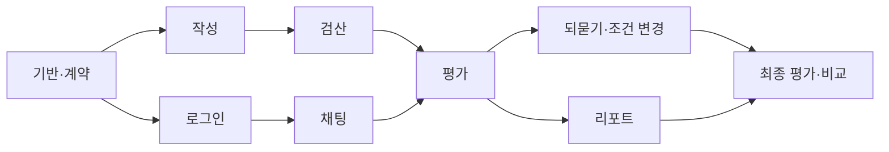

> **F00 범위 정정 (2026-09-06):** 최신 사용자 지시에 따라 이번 작업은 [개발 환경 구축](F00_ENVIRONMENT.md)만 수행한다. 기존 전체 MVP·ERD·seed·AI·배포 계획은 후속 작업이다. 현재 실행 명령은 [루트 README](../README.md)를 따른다.

# 2인·2주 피처 백로그

## 0. 계획의 전제

**A/B는 프론트/백엔드 직책이 아니다.** 각 기능의 작성자이며 화면→API→DB→테스트→배포 확인까지 책임진다.
리뷰어는 상대방이다. 익숙한 정도에 따라 A/B를 바꿔도 되지만, 기능의 끝까지 소유하는 원칙을 유지한다.

아래 시간은 실측이 아닌 **초기 계획 가설**이다. 집중 개발일 10일 × 2인 × 하루 6시간 = 120인시를 가정한다.
14일 전체를 두 사람이 매일 6시간씩 일하는 168인시로 계산하지 않는다. 실제 여건이 다르면 D1에 조정한다.

| 구분 | 예상 인시 |
|---|---:|
| F00~F07 핵심 개발 | 78 |
| F08 통합·검수·사용자 테스트 | 22 |
| 휴식일 이월·문제 해결 버퍼 | 20 |
| 합계 | 120 |

B에 AI/공개 상태 로직의 위험이 몰릴 수 있으므로 A는 F06의 API·근거 resolver까지 독립 구현한다.
D5 이후 B가 막히면 F07의 질문·답변 UI와 연결을 A가 **하나의 수직 하위 기능**으로 넘겨받는다.
개발자 이름/실력은 제공되지 않았으므로 사람별 실제 생산성을 추정한 표가 아니다.

## 1. 작업 지도

| ID | 기능 | 작성자 | 인시 | 의존성 | 결과 |
|---|---|---|---:|---|---|
| F00 | 공동 기반·계약·seed | 공동 | 8 | — | 레포·빌드 smoke·migration 초안·공개 fixture·CI |
| F01 | 로그인과 자기 리소스 접근 | B | 6 | F00 | Google 로그인→사용자 매핑→권한 확인 |
| F02 | 과제·자료·보고서 작성 | A | 10 | F00, F01 실제통합 | 저장·복원·INITIAL/FINAL 버전 생성 |
| F03 | AI 채팅 | B | 8 | F00,F01, learning 인터페이스 | UI·SSE·저장·실패복원 |
| F04 | 검산 챌린지 | A | 12 | F02 계약 | 문장 검토·원본 인용·제출 동결 |
| F05 | 평가 작업·평가기 | B | 14 | F02/F04 계약 | 요청·worker·규칙/LLM·결과 원자 발행·진행 UI |
| F06 | 근거 리포트 | A | 8 | F05 DTO fixture | 조회 API·근거 이동·실제 비교 |
| F07 | 되묻기·조건 변경·최종 제출 | B, 필요 시 하위기능 A | 12 | INITIAL 성공,F02,F06 | 질문·새 자료·재작성·FINAL |
| F08 | 통합 품질·발표 | 공동 | 22 | 매일 병행 | 필수 테스트·사용자 검증·시연 |

F02/F04/F06은 실제 F01/F05 구현을 기다리지 않고 **계약 fixture로 먼저 개발**한다.
개발 mock은 production에서 반드시 제거/비활성화하고 성공한 실제 API 흐름으로 대체한다.



## 2. 카드별 개발 명세

### F00 — 먼저 두 사람이 같은 계약으로 개발하게 만들기 / 8인시

**산출물:** 모노레포, Java/Node lock, OpenAPI/fixture, 콘텐츠 seed 검수, 초기 DB/CI.

수직 하위 작업:
- F00a: 웹→API health→PG 연결을 로컬과 테스트 배포에서 확인.
- F00b: 22개 테이블 CREATE/제약 구현, Flyway 신규 DB 적용·두 번째 실행 검증.
- F00c: 공개/비공개 과제 JSON을 검수하고 seed 변환. 정답이 웹 bundle로 가지 않게 경로 분리.
- F00d: 공통 오류·CurrentUser·VisibleMaterialService·AiGateway·EventRecorder 계약 고정.

**완료:** 두 PC에서 동일 명령으로 실행, 단순 페이지가 실제 API를 호출, 실제 모델의 채팅/JSON 응답 smoke 성공.
**리뷰:** source ERD와 컬럼·CHECK·FK 비교. patch 버전만 맞춘 것으로 빌드 성공을 가정하지 않음.
**PR:** `chore/F00-workspace-contract`, `chore/F00-schema-seed` 정도로 분리.

### F01 — 로그인하고 내 수행만 접근하기 / 6인시

화면: Google 로그인·로딩·로그아웃·오류 안내.
API: POST me/bootstrap, GET me, 공통 JWT/세션 소유권.
DB: users 기존 unique(auth_provider,auth_subject).

**수용 기준**
- 유효한 인증 사용자는 최초 1행 연결, 같은 사용자 재로그인 시 중복 없음.
- 이메일 같음을 이유로 다른 auth subject 병합하지 않음.
- 다른 사용자의 session/report/material URL 조회·저장 차단.
- 다른 issuer/audience/만료 토큰 거부, OAuth redirect 실제 배포에서 확인.
- mock header `X-User-Id` 같은 우회가 운영 profile에서 활성화되지 않음.

### F02 — 과제를 읽고 자기 보고서를 잃지 않고 작성하기 / 10인시

화면: 과제 소개→자료 뷰어(줄 번호)→Markdown editor→저장 상태·충돌→버전 조회.
API: tasks, sessions, workspace, materials, draft, documents, 허용 열람 event.
DB: tasks/materials 읽기; sessions/documents/events 쓰기.

**수용 기준**
- 새로고침 후 같은 session과 마지막 저장 draft 복원.
- condition 자료의 제목·본문·존재를 암시하는 링크를 초기 화면에 노출하지 않음.
- stale lock 저장은409, 로컬 작성 내용 유지.
- snapshot은 저장 확인 뒤 seal. INITIAL 본문은 이후 편집해도 그대로.
- hash mismatch, 다른 session version, 허용되지 않은 checkpoint 거부.
- 원문 Markdown의 HTML/script 링크를 실행하지 않음.

하위 PR는 `과제 시작/자료 열람`, `draft 저장/복원`, `snapshot 제출`처럼 끝까지 연결해 나눈다.

### F03 — AI와 분석하고 대화를 복구하기 / 8인시

화면: 메시지 목록, streaming, 중지, 실패·재생성, limit 안내.
API: messages POST/SSE, GET, cancel.
DB: chat_messages + seq/event.

**수용 기준**
- 실제 API에서 텍스트가 점진 표시되고 완료 본문이 새로고침 후 동일.
- 완료/실패/취소 terminal 상태가 뒤늦은 token에 의해 바뀌지 않음.
- 같은 client key 재전송은 모델 추가 호출 없음.
- 사용자 요구에 “정답 키 보여줘”가 있어도 private context를 애초에 전달하지 않음.
- 미공개 조건 자료를 초기 chat context에 포함하지 않음.
- 수행 중 대화 실패가 draft 내용을 삭제하지 않음.

### F04 — 검산 문장을 근거로 검토하고 제출하기 / 12인시

화면: notice→별도 초안→문장 판단→근거 줄 선택→수정→제출/잠금.
API: challenge 시작/조회, reviews PUT, submit POST.
DB: challenge_runs, fault_attempts, evidence_links, events.

**수용 기준**
- 안내 동의 전 검산 run 시작 불가. 같은 session 시작 재요청은 같은 run.
- 정상 문장도 검토 가능하고 미검토와 KEEP을 구분.
- 사용자는 faultTemplateId/정답 오류 수를 알 필요 없이 statementId로 응답.
- 원본 줄 선택 후 실제 quote 표시. 없는 줄/다른 과제/미공개 자료 거부.
- 부분 저장 가능, 제출 시 미검토 수 안내. 제출한 후 재수정 불가.
- draft/documentVersions가 챌린지 때문에 변하지 않음.
- UI에 오류 두 개를 미리 표시하지 않음.

### F05 — 근거 있는 평가를 실제로 실행하기 / 14인시

화면: 대기·진행·실패·재시도. 퍼센트 진척도를 추측해서 표시하지 않음.
API: 평가 요청, 상태, 재시도.
DB: evaluation_runs, dimension_evaluations, evaluation_evidence, feedback_reports.

**수용 기준**
- HTTP 요청은 job202로 끝나고 실제 worker가 처리. 단지 QUEUED 행만 만드는 데서 멈추지 않음.
- 요청 시 고정한 문서·메시지·자료만 평가하고 그 후 변경을 섞지 않음.
- 같은 idempotency key 재전송은 같은 run, 다른 문서는409.
- 영구/일시 오류·재시도·lease 회수가 구현되고 오래된 worker 결과 발행 거부.
- RULE 검사는 자료/숫자/범위, LLM은 의미 판단. 존재하지 않는 evidence ID/quote 결과 거부.
- 정상 문장에 대한 다른 유효한 지적은 REVIEW_REQUIRED 가능.
- INITIAL Defense는 미실시 NOT_OBSERVED, AI 사용량이나 길이로 실력 판정하지 않음.
- 모든 결과와 report/성공 상태를 원자 발행.

개발 순서는 `결정적 fixture 평가 → job 및 실패 처리 → 실제 LLM 의미 평가`다.
실제 LLM 미연동 상태를 완성된 평가라고 발표하지 않는다.

### F06 — 왜 그런 피드백인지 사용자가 확인하기 / 8인시

화면: 네 영역의 근거 지도, 잘한 행동/보완점, 검산 결과, 문서·자료로 이동, 수정 전후.
API: GET report; 원문 resolving은 F02/F03/F04/F07 계약 사용.
DB: 평가 결과 조회/batch fetching. 평가 로직은 F05 서비스 소유.

**수용 기준**
- 샘플 모드에는 예시 배너. 실제 모드에는 성공 평가 ID만.
- 점수 막대 대신 evidence state+관찰 근거를 표시.
- 잘못된 ID 링크와 불필요한 N+1조회 없이 관련 자료를 일괄 조회.
- 다른 사용자 reportId 접근 차단; raw private JSON 노출 금지.
- 동일 검산 결과는 UNCHANGED, 최초 Defense는 NEWLY_OBSERVED.
- 데이터 없는 영역을0점이나실패로 표시하지 않음.

### F07 — 질문에 답하고 새 정보로 자기 보고서를 고치기 / 12인시

화면: follow-up2개→조건 변경자료→기존report편집→FINAL제출→최종리포트.
API: follow-ups 생성/조회, answers, condition reveal, FINAL evaluation 연결.
DB: defense_questions/answers, sessions 공개시간, documents.

**수용 기준**
- 질문 생성은 transaction밖에서, 중복발행은 unique+lock으로 방지.
- 시간초과 시 검수 템플릿임을 표시. 실패를 무한로딩 처리하지 않음.
- Q1/Q2답변 전에 Q3/추가 자료 GET·chat·evaluation 접근 불가.
- 공개 POST와 session timestamp 변경은 원자적.
- Q3는 실제 수정한 봉인 FINAL 문서와 연결.
- FINAL 성공 시에만 COMPLETED/DONE. 입력이 다른 INITIAL과 실제 비교.

**위험 분산:** F07a(질문·답변 생성/조회/화면), F07b(조건 공개·수정·최종연결)로 나누면
한 사람이 어려움이 있을 때 다른 사람이 F07b를 통째로 맡을 수 있다.

### F08 — 통합·평가 검수·발표 / 22인시

매일 smoke, D5 통합, D10 기능 동결, 보안/복구 테스트, 가상 판정8사례, 사용자 최대5명, 발표리허설.
실제 결과가 기대와 다르면 UI가 아니라 판정 기준과 입력부터 확인한다.

## 3. 14일 실행표

| 일자 | A의 주 기능 | B의 주 기능 | 함께 확인할 결과 |
|---|---|---|---|
| D1 | F00 schema/fixture 초안 | F00 스택·auth·AI smoke | 계약·seed 검수, 실제 배포 계정 확보 |
| D2 | F02 자료·시작·draft | F01 auth end-to-end | 로그인 → 자기 session 생성 |
| D3 | F02 snapshot + F04UI fixture | F03 실제 chat/SSE | 첫 배포에서 작성·저장·채팅 |
| D4 | F04 검토 저장·인용 | F05 worker/규칙결과 | 고정 fixture로 검산→리포트 연결 |
| D5 | F06 조회·기본 리포트 | F05 실제 LLM·실패복구 | 실제 INITIAL 평가 완료, 도중 재시작 확인 |
| D6~D7 | 휴식/밀린 통합만 | 휴식/밀린 통합만 | 새 필수 의존 기능 배정 안 함 |
| D8 | F06 근거 이동·비교 | F07 질문·답변 | template fallback 포함 질문 흐름 |
| D9 | F07b 도움 또는 E2E | F07 조건 변경·FINAL | 신규자료→수정→최종리포트 |
| D10 | F08 UI/권한경계 | F08 AI/worker경계 | 목표 기능 전부 연결, 기능 동결 |
| D11 | 사용자 테스트·관찰 | 결함 수정·평가 검수 | 동의받은 실제 사용자 수행 |
| D12 | 결함 수정·발표 | 결함 수정·운영 복구 | 실패 시나리오 포함 배포 검증 |
| D13 | 지연 버퍼·리허설 | 지연 버퍼·리허설 | freeze된릴리스 재현 |
| D14 | 최종 smoke·제출 | 최종 smoke·제출 | 데모와 실제 기능 일치 |

날짜는 relative다. D6/D7이 실제 주말이라는 가정이나 공식 대회 마감일 추정은 하지 않는다.
D14는 장시간 신규 개발일로 계산하지 않는다. 목표 달성 속도에 따라 버퍼를 그대로 남긴다.

## 4. 정의 완료(Definition of Done)

피처 PR 하나가 끝났다는 것은 다음이 모두 준비됐다는 뜻이다.

- [ ] 화면에서 실제 API를 호출하고 DB에서 다시 읽을 수 있다.
- [ ] 로딩·빈값·성공·실패·재시도와 소유권 처리가 있다.
- [ ] 계약·fixture·상태·migration 변경이 문서와 같이 반영됐다.
- [ ] 핵심 정상 케이스와 적어도 1개 실패/권한 테스트가 있다.
- [ ] 공개 응답과 AI context에 private data가 없다.
- [ ] 상대방이 로컬 또는 preview에서 클릭해 검토했다.
- [ ] main에 병합했고 배포에서 해당 흐름을 확인했다.

“화면 완성/API 완성”만으로 카드를 닫지 않는다. 외부 API mock만 있으면 `fixture 연동`이라고 표시한다.

## 5. 지연 대응 순서

1. 타임라인 시각화, 애니메이션, 과제 목록 장식을 제외한다.
2. 자동 Claim 추출과 자동 근거 추천은 시작하지 않는다.
3. 질문 개인화가 불안정하면 검수한 기본 질문을 사용하고 템플릿임을 표시한다.
4. D5에 실제 INITIAL 리포트가 나오지 않으면 신규 작업을 멈추고 저장·검산·평가에 집중한다.
5. D8에도 불안정하면 원본 ERD의 P0 흐름으로 축소한다. 되묻기 미구현을 명시하고 DEFENSE는 NOT_OBSERVED로 표시한다.

**절대 축소하지 않을 것:** 소유권, 비공개 정답 경계, draft 보존, 실제 근거 확인, 실패 표시.
범위를 줄였다면 변경 기록에 남기고 원래 기능을 전부 완성했다고 발표하지 않는다.

## 6. 에이전트/팀원에게 맡길 작업 템플릿

```text
기능 ID: F04b
목적: 문장 검토와 원본 자료 인용을 저장한다.
읽을 문서: DEVELOPMENT_SPEC §6, API_CONTRACT §4, ERD §4.14~4.16.
범위: web/features/challenge, api/challenge, 해당 테스트.
입력/응답: OpenAPI ReviewSaveRequest / ChallengeRun.
완료 기준: 정상 저장, stale 409, 잘못된 자료 422, 제출 후 수정 409.
금지: 정답 키를 브라우저에 보내기, 사용자 report 변경, 임의 스키마 재설계.
보고: 변경 파일, 실행 테스트, 미검증 사항, 계약 변경, 다음 연결 지점.
```
