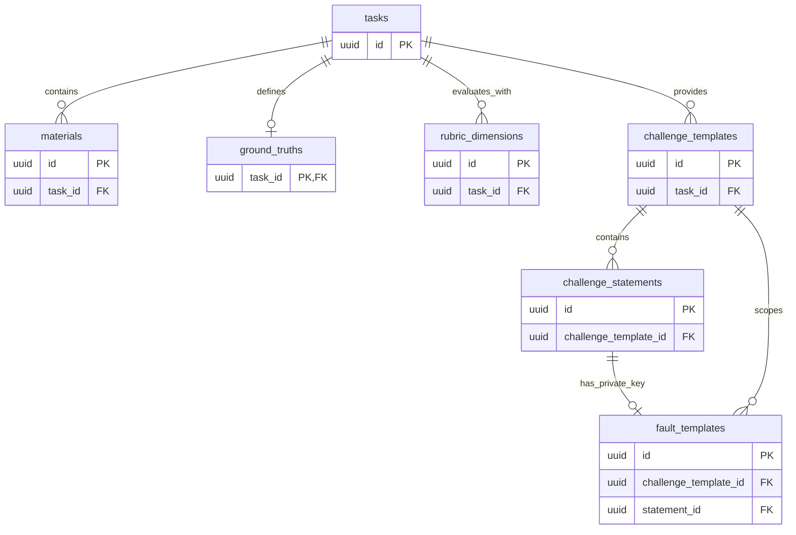
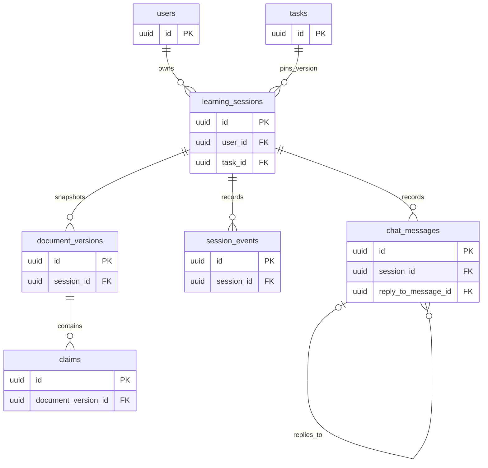
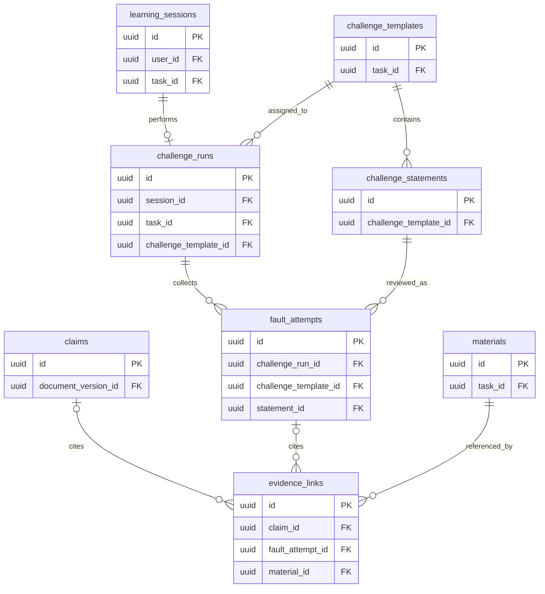
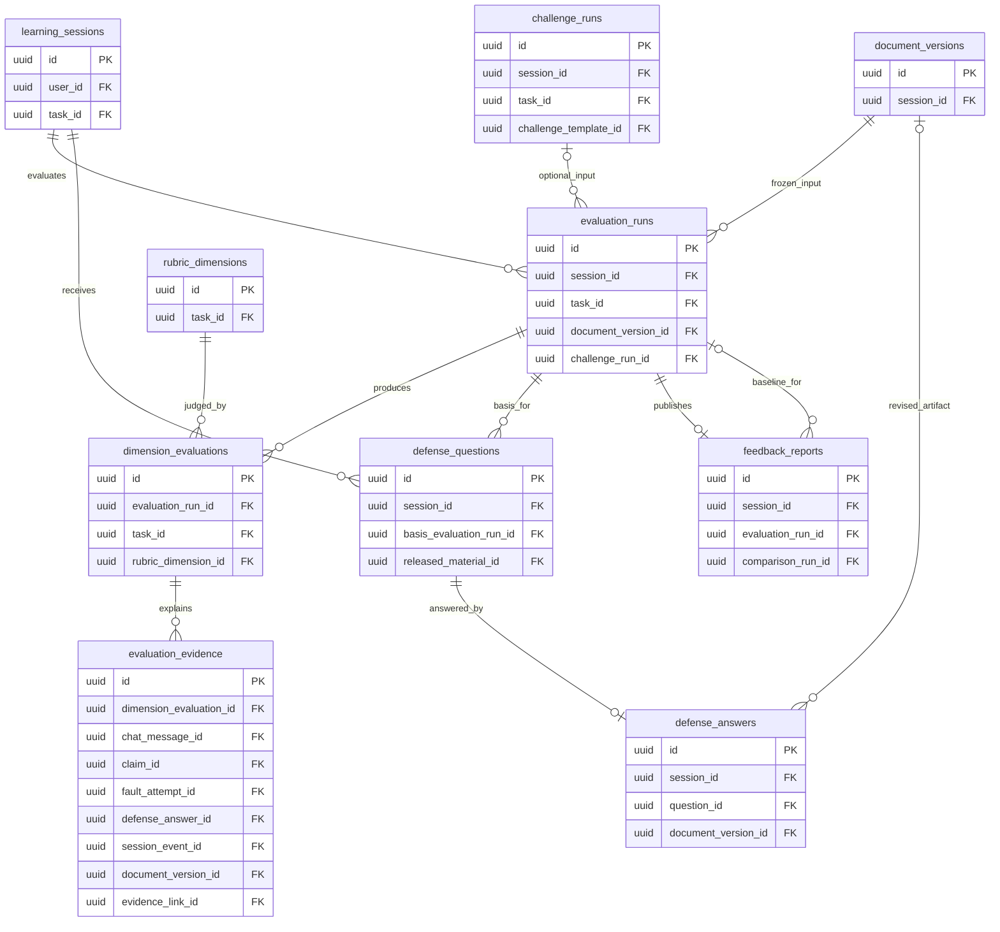
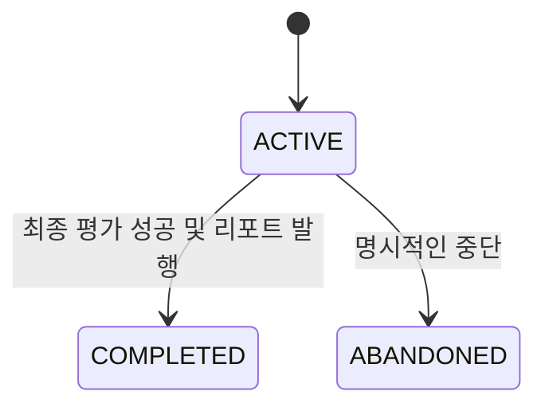
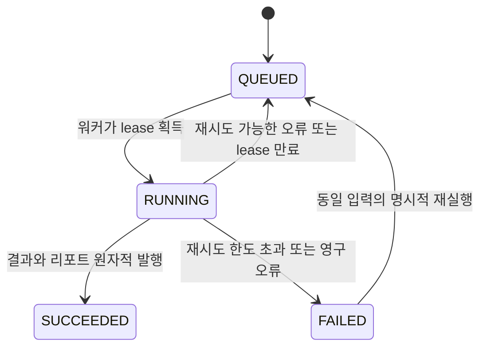

# 되짚 (Doezip) — ERD

> **문서 버전, AI와의 작업 기록, 검산에서의 판단, 근거 자료, 평가 결과를 연결하는 MVP 데이터 모델.**
>
> 기획안의 `요청 설계 → 근거 검증 → 결과 문서화 → 판단 방어`를 보존한다. 프롬프트 길이·AI 사용량을 실력 점수로 환산하거나, 채용 합격 여부를 판단하는 스키마는 만들지 않는다.

## 목차

1. 설계 범위와 전제
2. 기획 요구사항 → 데이터 모델 매핑
3. 전체 관계와 영역별 Mermaid ERD
4. 테이블 명세
5. 데이터 무결성·공개 범위
6. 상태 전이와 실제 저장 흐름
7. 핵심 제약 SQL 예시
8. 인덱스와 조회 패턴
9. 검산 평가·리포트 입력 예시
10. 구현 순서·테스트·남은 결정
11. 출처

---

## 1. 설계 범위와 전제

### 1.1 기획안에서 가져온 범위

기준 문서는 첨부한 **`되짚 아이디어.md`**이며 문서 내부 버전은 v5다. 핵심 데이터 명칭은 기획안 §14, MVP 범위는 §15를 따른다.[^P]

| 포함 | 제외 |
|---|---|
| 개발 직군 장애 분석 과제와 고정 참고 자료 | 코드 실행 샌드박스, GitHub 연동 |
| AI 채팅, Markdown 보고서, 수행 기록 | 개인 업무 문서 업로드 |
| 주장–근거 연결, 검산 챌린지 | 기업 채용 관리, 자동 합격 판단 |
| 후속 질문·조건 변경, 수정 전후 리포트 | 결제·구독, 인증 배지, 조직 관리 |
| 수동 과제 등록용 seed 데이터 | 관리자 CMS, 다직무 콘텐츠 마켓 |

**22개 테이블은 별도 서비스 22개가 아니라 하나의 관계형 DB 안의 데이터 구조다.** 과제 콘텐츠는 seed로 넣고 UI 없이 운영한다. P1 기능의 테이블은 마이그레이션에 포함하되 해당 기능이 없을 때 비어 있어도 된다.

### 1.2 기획에 없는 부분은 아래와 같이 설계 가정으로 둔다

| ID | 설계 가정·제안 | 이유 / 확인 필요사항 |
|---|---|---|
| D01 | PostgreSQL을 기준으로 작성하되 Spring Boot / FastAPI / Next.js 백엔드와 독립적인 모델로 둔다. | 직전 대화에서 스택은 후보 단계였다. 특정 프레임워크가 확정된 것은 아니다. |
| D02 | 외부 인증의 사용자 식별자에 최소 users 행을 연결한다. | 인증 방식·공급자는 기획에 없다. 공급자 선택은 팀 결정 사항이다. |
| D03 | 검산 초안은 사용자의 보고서와 별도로 보관한다. | 기획 §10은 보고서 작성 후 검산으로 이어지지만 초안 소유 관계는 명확하지 않다. 직전 설명에서 제안한 분리 방식을 채택한 설계 가정이다. 사용자 원본을 몰래 수정하지 않는다. |
| D04 | 과제의 한 행은 발행 버전 하나다. 발행 후 내용은 불변으로 둔다. | 자료·정답·루브릭이 바뀌어 과거 평가가 달라지는 것을 피하기 위한 구현 제안이다. |
| D05 | 세션당 사용자 보고서 1개, 검산 수행 1개, 후속 질문 2개, 조건 변경 1개로 제한한다. | 보고서는 여러 버전으로 남긴다. 과제 재도전은 새 세션으로 표현한다. |
| D06 | MVP는 사전 검수한 검산 초안과 문장별 정답 키를 제공한다. | 실시간 LLM 오류 변형은 기획의 미결정 사항이므로 채택하지 않는다. 실제 구현 전 팀 확인이 필요하다. |
| D07 | 평가 실행·입력 스냅샷·임대 상태를 DB에 저장한다. | 재시도와 재평가를 구분하기 위한 운영 데이터다. 실제 워커 구현은 별도로 필요하다. |
| D08 | AI 제안과 사용자 확인을 구분하고, 아직 수행 기회가 없는 항목은 미확인으로 둔다. | AI 자동 연결을 사용자 역량으로 오인하거나, 아직 제시하지 않은 Defense를 실패로 처리하지 않기 위한 설계다. |

위 가정은 제품 요구사항에 새 기능을 확정한 것이 아니다. 특히 **인증 방식, 검산 초안 제공 방식, 문서 버전 정책**은 팀 검토 후 마이그레이션 전에 확정한다.

### 1.3 공통 표기

| 항목 | 규칙 |
|---|---|
| 테이블·컬럼 | 영문 `snake_case`, 테이블명은 복수형 |
| PK | 서버에서 생성하는 `uuid`; ID를 안다고 조회 권한이 생기는 것은 아님 |
| FK | 아래 명세에 명시. 같은 과제·세션 범위까지 필요한 관계는 복합 FK 또는 서비스 검증을 병기 |
| 시간 | `timestamptz`, 서버에서 기록하고 화면에서 사용자 시간대로 표시 |
| 상태 | `varchar` + 허용 값 CHECK. 상태 전이 자체는 서비스 계층에서 통제 |
| JSONB | 과제 정답 설정·고정 입력 명세·가변 요약에 제한적으로 사용. 핵심 관계는 FK로 연결 |
| Null | 표의 `Y`만 nullable. 기본값 `—`는 호출자가 명시해야 함 |
| 생성/수정 시각 | `created_at` 기본값은 `now()`. `updated_at`은 UPDATE 시 자동 갱신을 가정하지 않음 |
| 삭제 | 일반 FK는 RESTRICT/NO ACTION. 발행 콘텐츠는 보관 처리. 사용자 데이터 제거는 명시적인 종속 삭제 트랜잭션으로 수행 |
| 우선순위 | P0: 핵심 데모에 사용. P1: 자동 주장 연결·되묻기. P2: 추천·타임라인 화면·재도전 UI |

상태값을 CHECK로 제한하는 것과 현재 상태에서 다음 상태로 넘어갈 수 있는지는 다른 문제다. 공개 전 자료 접근, 제출 후 수정, 과제 발행 검수 같은 조건은 별도 트랜잭션 규칙으로 정의한다.

---

## 2. 기획 요구사항 → 데이터 모델 매핑

| 기획안 용어·기능 | 테이블 | 매핑 설명 |
|---|---|---|
| Task, Material | tasks, materials | 발행 버전과 자료 묶음 |
| GroundTruth, Evidence Key | ground_truths | 정답·허용 가설·원본 근거 키; 서버 전용 |
| RubricDimension | rubric_dimensions | Prompt / Evidence / Document / Defense 세부 항목 |
| FaultTemplate | challenge_templates, challenge_statements, fault_templates | 공개 초안·모든 문장·비공개 오류 정답을 분리 |
| Session | learning_sessions | 사용자와 과제 버전 사이의 한 번의 수행 |
| PromptEvent, AIResponseEvent | chat_messages | 동일 대화의 role로 통합. 전용 테이블 둘을 만들지 않음 |
| 수행 타임라인 | session_events | 저장·자료 열람·검토 등의 서버 기록 |
| DocumentVersion | document_versions | 불변 제출본과 수정본. 편집 버퍼는 세션에 보관 |
| Claim | claims | 버전별 핵심 주장·원문 위치 |
| EvidenceLink | evidence_links | 보고서 주장 또는 검산 응답과 원본 자료를 연결 |
| FaultAttempt | challenge_runs, fault_attempts | 어느 초안을 검토했고 무엇을 유지·수정·보류했는지 |
| EvaluationEvidence | evaluation_runs, dimension_evaluations, evaluation_evidence | 고정 입력·항목별 결과·추적 가능한 관찰 근거 |
| DefenseQuestion, DefenseAnswer | defense_questions, defense_answers | 후속 질문과 조건 변경, 확정 답변 |
| FeedbackReport | feedback_reports | 특정 평가에 대응하는 공개용 리포트 |

`users`, 버전·작업 관리와 공개 초안 분리는 구현을 위해 추가한 모델이다. 기획안에서 이 테이블 이름과 컬럼이 이미 확정돼 있었다는 뜻은 아니다.[^P]

---

## 3. 전체 관계와 영역별 Mermaid ERD

### 3.1 가장 중요한 관계

```text
사용자 ──< 학습 세션 >── 과제 버전
                 │          ├──< 공개 자료 / 단계별 공개 자료
                 │          ├──  기준 사실·근거 키 [비공개]
                 │          ├──< 루브릭
                 │          └──< 검산 초안 ──< 정상·오류 문장 ── 0..1 오류 정답 [비공개]
                 │
                 ├──< 채팅 / 수행 이벤트
                 ├──< 보고서 버전 ──< 주장 ──< 근거 연결 >── 자료
                 ├── 0..1 검산 수행 ──< 문장별 검토 ──< 근거 연결 >── 자료
                 ├──< 평가 실행 ──< 항목별 결과 ──< 관찰 근거
                 │              └── 0..1 리포트
                 └──< 되묻기 질문 ── 0..1 확정 답변 ── 0..1 수정 보고서 버전
```

- `──<`는 1:N, `0..1`은 선택적인 단일 행이다.
- 같은 세션에서 INITIAL과 FINAL 평가는 별도 행으로 남긴다. 동일 평가의 서버 재시도는 같은 행이다.
- 원본 문서, 검산 초안, 기준 정답은 서로 다른 데이터다.
- 아래 Mermaid는 읽기 쉽게 PK와 주요 FK만 표시한다. 전체 컬럼과 복합 제약은 §4~§7이 기준이다.

### 3.2 과제 콘텐츠와 비공개 기준



초안 제작 중 빈 자료/문장 목록을 허용하므로 0..N으로 표시했다. PUBLISHED 상태에서는 필요한 콘텐츠가 존재하는지 발행 검수로 강제한다.

### 3.3 사용자 수행과 문서 버전



### 3.4 검산과 원본 근거 연결



`evidence_links`의 두 선택 관계에는 XOR 제약을 적용한다. 한 행은 주장과 검산 응답 중 하나에만 속한다. 둘 다 없거나 둘 다 있으면 저장할 수 없다.

### 3.5 평가·되묻기·리포트



관찰 근거의 대상 FK 여섯 개는 복잡도를 줄이기 위해 이 그림의 연결선에서는 생략했다. §4의 `evaluation_evidence` 명세와 §7의 XOR 제약을 따른다. 평가 실행 중에는 리포트가 없고 성공 시 1개가 발행된다.

---

## 4. 테이블 명세

| 영역 | 테이블 수 | 역할 |
|---|---:|---|
| A. 사용자·과제 패키지 | 8 | 계정과 seed 콘텐츠·비공개 기준 |
| B. 수행·문서 | 5 | 세션, 대화, 이벤트, 불변 문서, 주장 |
| C. 검산·인용 | 3 | 검산 수행, 사용자 판단, 자료 인용 |
| D. 평가·되묻기 | 6 | 실행·항목 결과·증거·질문·답변·리포트 |
| **합계** | **22** | 단일 DB / 단일 백엔드 기준 |

### 4.1 `users` — 사용자

**우선순위:** P0  
**역할:** 학습 세션의 소유자. 인증 수단은 기획에 없으므로 외부 인증 주체를 연결하는 최소 모델로 제안한다.

| 컬럼 | 타입 | NULL | 기본값 | 키·참조 | 의미 |
|---|---|:---:|---|---|---|
| `id` | `uuid` | N | `—` | PK | 서버에서 발급하는 식별자 |
| `auth_provider` | `varchar(50)` | N | `—` | — | 인증 공급자/issuer를 구분하는 내부 코드 |
| `auth_subject` | `varchar(255)` | N | `—` | — | 검증된 토큰에서 얻은 공급자별 사용자 식별자 |
| `display_name` | `varchar(80)` | N | `—` | — | 표시 이름; 중복 허용 |
| `email` | `varchar(320)` | Y | `—` | — | 선택 정보; 계정 식별·병합 키로 사용하지 않음 |
| `created_at` | `timestamptz` | N | `now()` | — | 생성 시각 |
| `updated_at` | `timestamptz` | N | `now()` | — | 수정 시각; 변경 시 애플리케이션이 갱신 |

**제약·처리 규칙**

- UNIQUE(auth_provider, auth_subject).
- 표시 이름·이메일에 임의의 유일성 요구를 추가하지 않는다.

비밀번호·리프레시 토큰·인증 공급자별 계정 연결 테이블은 포함하지 않는다. 자체 이메일 로그인을 선택하면 이 부분은 다시 설계한다.

### 4.2 `tasks` — 과제의 발행 버전

**우선순위:** P0  
**역할:** Task를 저장한다. 별도 task_versions 테이블 대신 한 행을 하나의 발행 버전으로 취급한다.

| 컬럼 | 타입 | NULL | 기본값 | 키·참조 | 의미 |
|---|---|:---:|---|---|---|
| `id` | `uuid` | N | `—` | PK | 서버에서 발급하는 식별자 |
| `task_code` | `varchar(80)` | N | `—` | — | 논리 과제 코드. 예: payment-incident |
| `version_no` | `integer` | N | `1` | — | 과제 패키지 버전 |
| `title` | `varchar(200)` | N | `—` | — | 과제명 |
| `description_markdown` | `text` | N | `—` | — | 공개 과제 설명·산출물 요구사항 |
| `job_family` | `varchar(30)` | N | `'DEVELOPMENT'` | — | MVP는 개발 직군만 사용 |
| `status` | `varchar(20)` | N | `'DRAFT'` | — | DRAFT / PUBLISHED / ARCHIVED |
| `published_at` | `timestamptz` | Y | `—` | — | 발행 시각 |
| `created_at` | `timestamptz` | N | `now()` | — | 생성 시각 |
| `updated_at` | `timestamptz` | N | `now()` | — | 수정 시각; 변경 시 애플리케이션이 갱신 |

**제약·처리 규칙**

- UNIQUE(task_code, version_no); CHECK(version_no > 0).
- PUBLISHED 또는 ARCHIVED인 버전의 내용·자료·정답·루브릭·챌린지를 수정하지 않는다. 수정은 새 버전으로 발행한다.
- 발행 전 자료·정답·루브릭·정상 문장·오류 문장의 일관성을 검수한다.

상태 전이는 DRAFT → PUBLISHED → ARCHIVED. DRAFT로 되돌리지 않는다. ARCHIVED는 신규 시작만 막고 기존 세션 조회는 허용한다. 버전 간 결과를 같은 조건의 실력 변화라고 비교하지 않는다.

### 4.3 `materials` — 참고 자료

**우선순위:** P0  
**역할:** 과제의 로그·지표·배포 이력 등 고정 자료. 조건 변경 시 공개할 자료도 같은 구조로 저장한다.

| 컬럼 | 타입 | NULL | 기본값 | 키·참조 | 의미 |
|---|---|:---:|---|---|---|
| `id` | `uuid` | N | `—` | PK | 서버에서 발급하는 식별자 |
| `task_id` | `uuid` | N | `—` | FK → tasks.id | 소속 과제 버전 |
| `material_code` | `varchar(80)` | N | `—` | — | 과제 내부 자료 코드. 예: db-metrics |
| `title` | `varchar(200)` | N | `—` | — | 공개 제목 |
| `material_type` | `varchar(30)` | N | `—` | — | ARCHITECTURE / LOG / METRIC / DEPLOYMENT / EXTERNAL_SERVICE / CUSTOMER_NOTE |
| `content_markdown` | `text` | N | `—` | — | 원본 텍스트; 저장 전 줄바꿈을 LF로 통일 |
| `content_hash` | `char(64)` | N | `—` | — | 정규화한 본문의 SHA-256 |
| `release_stage` | `varchar(30)` | N | `'INITIAL'` | — | INITIAL / CONDITION_CHANGE |
| `sort_order` | `integer` | N | `1` | — | 자료 표시 순서 |
| `created_at` | `timestamptz` | N | `now()` | — | 생성 시각 |

**제약·처리 규칙**

- UNIQUE(task_id, material_code); CHECK(sort_order > 0).
- 세션의 조건 변경 공개 전에는 CONDITION_CHANGE 자료의 제목·본문·요약도 사용자와 학습용 AI에 전달하지 않는다.

자료는 과제 발행 뒤 불변이다. 인용 위치는 이 자료 버전의 1부터 시작하는 줄 번호와 실제 인용문으로 고정한다. 개인 파일 업로드·벡터 검색용 청크 테이블은 제외한다.

### 4.4 `ground_truths` — 기준 사실·근거 키

**우선순위:** P0  
**역할:** GroundTruth와 Evidence Key를 보관하는 서버 전용 데이터다.

| 컬럼 | 타입 | NULL | 기본값 | 키·참조 | 의미 |
|---|---|:---:|---|---|---|
| `task_id` | `uuid` | N | `—` | PK, FK → tasks.id | 과제 버전당 최대 1행 |
| `facts_json` | `jsonb` | N | `—` | — | 확인된 사실·미확인 사항·허용 가능한 가설; 단계별 범위 포함 |
| `evidence_keys_json` | `jsonb` | N | `—` | — | 근거 키 → material_id·줄 범위·인용문 매핑 |
| `schema_version` | `integer` | N | `1` | — | JSON 형식 버전 |
| `created_at` | `timestamptz` | N | `now()` | — | 생성 시각 |

**제약·처리 규칙**

- 발행 과제는 정확히 1행의 GroundTruth가 있어야 한다. DRAFT에서는 0행을 허용한다.
- JSON 내부의 material_id가 같은 과제에 속하는지와 인용 범위가 유효한지는 발행 검증기로 확인한다.

학습용 채팅·과제 조회 API·브라우저에 직렬화하지 않는다. 기준 사실이 복수 가설을 허용하면 단일 원인 정답으로 축소하지 않는다. 자료 미제공과 해당 사실이 거짓인 것은 구분한다.

### 4.5 `rubric_dimensions` — 평가 루브릭 항목

**우선순위:** P0  
**역할:** 네 평가 영역 안의 세부 평가 기준을 고정한다.

| 컬럼 | 타입 | NULL | 기본값 | 키·참조 | 의미 |
|---|---|:---:|---|---|---|
| `id` | `uuid` | N | `—` | PK | 서버에서 발급하는 식별자 |
| `task_id` | `uuid` | N | `—` | FK → tasks.id | 소속 과제 버전 |
| `code` | `varchar(80)` | N | `—` | — | 예: evidence.source_check |
| `area` | `varchar(20)` | N | `—` | — | PROMPT / EVIDENCE / DOCUMENT / DEFENSE |
| `title` | `varchar(160)` | N | `—` | — | 평가 항목명 |
| `public_description` | `text` | N | `—` | — | 사용자에게 공개 가능한 기준 설명 |
| `criteria_json` | `jsonb` | N | `—` | — | 단계별 적용 여부·증거 유형·상태 판단 기준; 서버 전용 |
| `sort_order` | `integer` | N | `1` | — | 표시 순서 |
| `created_at` | `timestamptz` | N | `now()` | — | 생성 시각 |

**제약·처리 규칙**

- UNIQUE(task_id, code); UNIQUE(id, task_id); CHECK(sort_order > 0).
- 과제 발행 시 네 영역의 항목이 존재하고 코드가 중복되지 않는지 확인한다.

기획의 20/35/25/20 가중치는 실험 가설이므로 고정 점수 컬럼을 두지 않는다. 기획의 충분한 근거 / 일부 근거 / 추가 확인 필요를 결과 상태로 사용한다.

### 4.6 `challenge_templates` — 검산용 초안

**우선순위:** P0  
**역할:** 사용자 보고서와 별개의 사전 검수된 훈련 초안. 구체적인 분리 방식은 이 ERD의 설계 제안이다.

| 컬럼 | 타입 | NULL | 기본값 | 키·참조 | 의미 |
|---|---|:---:|---|---|---|
| `id` | `uuid` | N | `—` | PK | 서버에서 발급하는 식별자 |
| `task_id` | `uuid` | N | `—` | FK → tasks.id | 동일 원본 자료를 사용하는 과제 버전 |
| `variant_code` | `varchar(80)` | N | `—` | — | 서버용 변형 코드; 오류 개수 등을 유추할 수 있어 비공개 |
| `title` | `varchar(200)` | N | `—` | — | 검토용 초안 제목 |
| `instructions_markdown` | `text` | N | `—` | — | 오류 포함 가능성을 알리는 검토 안내 |
| `content_hash` | `char(64)` | N | `—` | — | 문장들을 순서대로 합친 본문의 해시 |
| `created_at` | `timestamptz` | N | `now()` | — | 생성 시각 |

**제약·처리 규칙**

- UNIQUE(task_id, variant_code); UNIQUE(id, task_id).
- 본문은 challenge_statements를 순서대로 합쳐 구성한다. 별도 본문 컬럼을 중복 관리하지 않는다.

템플릿에 연결된 fault_templates가 0행이면 오류 없는 사례다. API에는 variant_code·오류 개수·정답이 아닌 제목, 안내, 문장 목록만 제공한다.

### 4.7 `challenge_statements` — 검산용 초안의 문장

**우선순위:** P0  
**역할:** 오류 문장뿐 아니라 정상 문장도 모두 저장하여 오탐·미검토를 표현한다.

| 컬럼 | 타입 | NULL | 기본값 | 키·참조 | 의미 |
|---|---|:---:|---|---|---|
| `id` | `uuid` | N | `—` | PK | 서버에서 발급하는 식별자 |
| `challenge_template_id` | `uuid` | N | `—` | FK → challenge_templates.id | 소속 검토용 초안 |
| `statement_key` | `varchar(50)` | N | `—` | — | 예: S01; 해당 템플릿 안의 고정 문장 키 |
| `sort_order` | `integer` | N | `—` | — | 표시 순서 |
| `content_text` | `text` | N | `—` | — | 사용자가 실제 보는 문장; 오류가 반영된 최종 훈련 텍스트 |
| `created_at` | `timestamptz` | N | `now()` | — | 생성 시각 |

**제약·처리 규칙**

- UNIQUE(challenge_template_id, statement_key).
- UNIQUE(challenge_template_id, sort_order); UNIQUE(id, challenge_template_id); CHECK(sort_order > 0).

문장 ID는 사용자 선택용이며 오류 유무를 담지 않는다. 제목·문단 구분이 필요하면 표시 메타데이터로 확장하되, 선택 대상의 키는 유지한다.

### 4.8 `fault_templates` — 주입 오류 정답 키

**우선순위:** P0  
**역할:** FaultTemplate / Fault Key. 공개 문장에 어떤 문제를 설계했는지와 허용 가능한 수정 기준을 보관한다.

| 컬럼 | 타입 | NULL | 기본값 | 키·참조 | 의미 |
|---|---|:---:|---|---|---|
| `id` | `uuid` | N | `—` | PK | 서버에서 발급하는 식별자 |
| `challenge_template_id` | `uuid` | N | `—` | FK → challenge_templates.id | 소속 검산 초안 |
| `statement_id` | `uuid` | N | `—` | FK → challenge_statements.id | 오류를 넣은 문장 |
| `fault_code` | `varchar(80)` | N | `—` | — | 오류 식별 코드 |
| `fault_type` | `varchar(40)` | N | `—` | — | NUMERIC_MISMATCH / UNSUPPORTED_CAUSAL_CLAIM 등 |
| `reference_text` | `text` | Y | `—` | — | 검수용 정상 예시; 유일한 허용 정답 문장이 아님 |
| `expected_finding` | `text` | N | `—` | — | 어떤 문제를 지적해야 하는지 |
| `repair_criteria_json` | `jsonb` | N | `—` | — | 허용 수정·금지 단정·재확인 조건 |
| `evidence_keys_json` | `jsonb` | N | `—` | — | ground_truths의 관련 근거 키 목록 |
| `created_at` | `timestamptz` | N | `now()` | — | 생성 시각 |

**제약·처리 규칙**

- UNIQUE(challenge_template_id, fault_code).
- UNIQUE(statement_id): MVP는 한 문장에 검증 포인트 1개. 여러 오류는 문장을 나눠 출제한다.
- 복합 FK (statement_id, challenge_template_id) → challenge_statements(id, challenge_template_id).

정답 키는 브라우저·학습 채팅에 보내지 않는다. fault_attempts의 입력에서 fault_template_id를 요구하지 않는다. 검토자는 어느 문장이 오류인지 모르는 상태여야 한다.

### 4.9 `learning_sessions` — 학습 수행 세션

**우선순위:** P0  
**역할:** 사용자가 한 과제 버전을 수행하는 한 번의 시도. 문서 작성부터 최종 리포트까지의 기준이 된다.

| 컬럼 | 타입 | NULL | 기본값 | 키·참조 | 의미 |
|---|---|:---:|---|---|---|
| `id` | `uuid` | N | `—` | PK | 서버에서 발급하는 식별자 |
| `user_id` | `uuid` | N | `—` | FK → users.id | 세션 소유자 |
| `task_id` | `uuid` | N | `—` | FK → tasks.id | 시작 시 고정한 과제 버전 |
| `mode` | `varchar(20)` | N | `'PRACTICE'` | — | PRACTICE; MOCK_ASSESSMENT는 확장 예약값 |
| `status` | `varchar(20)` | N | `'ACTIVE'` | — | ACTIVE / COMPLETED / ABANDONED |
| `current_step` | `varchar(30)` | N | `'WRITING'` | — | WRITING / CHALLENGE / FEEDBACK / FOLLOW_UP / CONDITION_CHANGE / FINAL_REVIEW / DONE |
| `draft_markdown` | `text` | N | `''` | — | 사용자가 작성 중인 편집 버퍼; 평가 원본이 아님 |
| `draft_lock_version` | `bigint` | N | `0` | — | 자동 저장의 낙관적 잠금 버전 |
| `next_message_seq` | `bigint` | N | `1` | — | 서버에서 직렬 할당할 다음 채팅 순번 |
| `next_event_seq` | `bigint` | N | `1` | — | 서버에서 직렬 할당할 다음 이벤트 순번 |
| `condition_released_at` | `timestamptz` | Y | `—` | — | 조건 변경 자료를 사용자에게 공개한 시점 |
| `completed_at` | `timestamptz` | Y | `—` | — | 최종 리포트 확인 가능한 상태가 된 시각 |
| `created_at` | `timestamptz` | N | `now()` | — | 생성 시각 |
| `updated_at` | `timestamptz` | N | `now()` | — | 수정 시각; 변경 시 애플리케이션이 갱신 |

**제약·처리 규칙**

- UNIQUE(id, task_id).
- CHECK(draft_lock_version >= 0 AND next_message_seq > 0 AND next_event_seq > 0).
- (user_id, task_id)에 UNIQUE를 두지 않는다. 같은 과제 재시도는 별도 세션으로 보존한다.

자동 저장은 예상 draft_lock_version과 일치할 때만 갱신한다. 충돌 시 덮어쓰지 않고 409를 반환한다. 사용자 문서는 세션당 하나로 제한하며, 비교 가능한 제출본은 document_versions에 별도로 저장한다.

### 4.10 `chat_messages` — 사용자 요청·AI 응답

**우선순위:** P0  
**역할:** PromptEvent와 AIResponseEvent를 한 테이블의 role로 표현한다.

| 컬럼 | 타입 | NULL | 기본값 | 키·참조 | 의미 |
|---|---|:---:|---|---|---|
| `id` | `uuid` | N | `—` | PK | 서버에서 발급하는 식별자 |
| `session_id` | `uuid` | N | `—` | FK → learning_sessions.id | 대화가 속한 세션 |
| `seq_no` | `bigint` | N | `—` | — | 세션 내 서버 할당 순번 |
| `role` | `varchar(20)` | N | `—` | — | USER / ASSISTANT |
| `content_text` | `text` | N | `—` | — | 사용자에게 실제 표시한 요청/응답 |
| `status` | `varchar(20)` | N | `'COMPLETED'` | — | STREAMING / COMPLETED / FAILED / CANCELLED |
| `reply_to_message_id` | `uuid` | Y | `—` | FK → chat_messages.id | AI 응답이 답한 사용자 메시지 |
| `client_message_key` | `uuid` | N | `—` | — | 요청 재전송 중복 방지 키; 서버 메시지는 서버가 생성 |
| `provider` | `varchar(50)` | Y | `—` | — | AI 응답일 때 공급자 |
| `model` | `varchar(120)` | Y | `—` | — | 실제로 호출한 모델 식별자 |
| `usage_json` | `jsonb` | Y | `—` | — | 반환된 토큰 사용량 등; 프롬프트 본문 중복 저장 금지 |
| `completed_at` | `timestamptz` | Y | `—` | — | 메시지 확정 시각 |
| `created_at` | `timestamptz` | N | `now()` | — | 생성 시각 |

**제약·처리 규칙**

- UNIQUE(session_id, seq_no); UNIQUE(session_id, client_message_key); UNIQUE(id, session_id).
- 복합 FK (reply_to_message_id, session_id) → chat_messages(id, session_id).
- CHECK(seq_no > 0). 완료 메시지는 수정하지 않으며 프롬프트 수정도 새 메시지로 저장한다.

시스템 프롬프트·정답 키는 이 공개 대화 테이블에 넣지 않는다. 스트리밍 종료 후 확정한 메시지만 평가 입력에 포함한다. LLM 스트림 토큰마다 DB 행을 만들지 않는다.

### 4.11 `session_events` — 수행 타임라인

**우선순위:** P0 저장 / P2 시각화  
**역할:** 문서 저장·자료 열람·검토 제출 같은 행동 기록. 핵심 데이터의 대체 저장소는 아니다.

| 컬럼 | 타입 | NULL | 기본값 | 키·참조 | 의미 |
|---|---|:---:|---|---|---|
| `id` | `uuid` | N | `—` | PK | 서버에서 발급하는 식별자 |
| `session_id` | `uuid` | N | `—` | FK → learning_sessions.id | 소속 세션 |
| `seq_no` | `bigint` | N | `—` | — | 세션 내 서버 할당 순번 |
| `event_type` | `varchar(50)` | N | `—` | — | MATERIAL_OPENED / DOCUMENT_SNAPSHOTTED / EVIDENCE_ACCEPTED / CHALLENGE_SUBMITTED 등 |
| `actor` | `varchar(20)` | N | `—` | — | USER / AI / SYSTEM |
| `event_key` | `uuid` | N | `—` | — | 중복 수신 방지 키 |
| `payload_json` | `jsonb` | N | `'{}'` | — | 대상 식별자·문서 해시 등 최소 메타데이터 |
| `client_occurred_at` | `timestamptz` | Y | `—` | — | 클라이언트가 보낸 시각; 신뢰·평가 기준으로 사용하지 않음 |
| `recorded_at` | `timestamptz` | N | `now()` | — | 서버 기록 시각 |

**제약·처리 규칙**

- UNIQUE(session_id, seq_no); UNIQUE(session_id, event_key); CHECK(seq_no > 0).
- 원본 데이터 변경과 해당 서버 이벤트 기록은 같은 트랜잭션에서 수행한다.

payload_json의 ID에는 FK 보장이 없다. 리포트 핵심 근거는 아래의 명시적 FK로 연결하고, payload는 서버에서 유형별 검증한다. 열람/클릭만으로 실제 이해·검증을 했다고 판단하지 않는다. 키 입력 전체를 수집하지 않는다.

### 4.12 `document_versions` — 사용자 보고서 버전

**우선순위:** P0  
**역할:** DocumentVersion. 편집 버퍼와 구별되는 불변 본문 스냅샷이다.

| 컬럼 | 타입 | NULL | 기본값 | 키·참조 | 의미 |
|---|---|:---:|---|---|---|
| `id` | `uuid` | N | `—` | PK | 서버에서 발급하는 식별자 |
| `session_id` | `uuid` | N | `—` | FK → learning_sessions.id | 소속 세션 |
| `version_no` | `integer` | N | `—` | — | 세션 내 순번 |
| `checkpoint` | `varchar(30)` | N | `—` | — | INITIAL / REVISION / FINAL |
| `content_markdown` | `text` | N | `—` | — | 평가·비교할 본문 스냅샷 |
| `content_hash` | `char(64)` | N | `—` | — | LF 정규화 본문의 SHA-256 |
| `source_draft_lock_version` | `bigint` | N | `—` | — | 어떤 자동 저장 버퍼를 복제했는지 |
| `sealed_at` | `timestamptz` | Y | `—` | — | 주장·근거 주석까지 확정한 시점 |
| `created_at` | `timestamptz` | N | `now()` | — | 생성 시각 |

**제약·처리 규칙**

- UNIQUE(session_id, version_no); UNIQUE(id, session_id); CHECK(version_no > 0).
- 본문은 생성 후 불변. sealed_at 이후에는 연결된 claims와 evidence_links도 변경 금지.
- 평가에는 sealed_at이 존재하는 버전만 사용한다.

주장 추출·근거 선택 준비 중에는 sealed_at을 비워 둔다. 확정 후 주석만 바꾸더라도 새 버전을 만든다. 같은 본문을 가진 버전도 허용한다. 자동 저장마다 새 버전을 만들지 않고 제출·재제출 체크포인트에서 생성한다.

### 4.13 `claims` — 문서의 핵심 주장

**우선순위:** P1  
**역할:** Claim. 특정 문서 버전에서 추출한 사실·추론·미확인 주장을 고정한다.

| 컬럼 | 타입 | NULL | 기본값 | 키·참조 | 의미 |
|---|---|:---:|---|---|---|
| `id` | `uuid` | N | `—` | PK | 서버에서 발급하는 식별자 |
| `document_version_id` | `uuid` | N | `—` | FK → document_versions.id | 주장 추출 대상 버전 |
| `claim_key` | `varchar(50)` | N | `—` | — | 버전 내부 주장 키. 예: C01 |
| `claim_text` | `text` | N | `—` | — | 원문에 존재하는 선택 구간 |
| `claim_kind` | `varchar(20)` | N | `—` | — | FACT / INFERENCE / UNVERIFIED |
| `start_offset` | `integer` | N | `—` | — | LF 정규화 본문의 Unicode 코드 포인트 시작 위치, 0부터 |
| `end_offset` | `integer` | N | `—` | — | 끝 위치, exclusive |
| `origin` | `varchar(20)` | N | `—` | — | AI / USER |
| `extractor_version` | `varchar(80)` | Y | `—` | — | 추출 프롬프트/코드 버전 |
| `created_at` | `timestamptz` | N | `now()` | — | 생성 시각 |

**제약·처리 규칙**

- UNIQUE(document_version_id, claim_key).
- CHECK(start_offset >= 0 AND end_offset > start_offset).
- 애플리케이션에서 본문[start_offset:end_offset] == claim_text인지 검증한다.

LLM이 출력한 위치를 그대로 믿지 않는다. 서버가 원문에서 실제 구간을 확정한다. JS UTF-16 인덱스와 서버 코드 포인트 차이를 변환하고 한글·이모지 테스트를 둔다. 다른 문서 버전에 같은 주장 ID를 재사용하지 않는다. AI의 FACT 분류는 검증된 사실 인증이 아니다.

### 4.14 `challenge_runs` — 세션의 검산 챌린지

**우선순위:** P0  
**역할:** 사용자가 실제로 받은 훈련 초안과 검토의 제출 시점을 고정한다.

| 컬럼 | 타입 | NULL | 기본값 | 키·참조 | 의미 |
|---|---|:---:|---|---|---|
| `id` | `uuid` | N | `—` | PK | 서버에서 발급하는 식별자 |
| `session_id` | `uuid` | N | `—` | FK → learning_sessions.id | 한 세션당 검산 1회 |
| `task_id` | `uuid` | N | `—` | FK → tasks.id | 과제 일치 제약을 위한 중복 키 |
| `challenge_template_id` | `uuid` | N | `—` | FK → challenge_templates.id | 서버가 선택한 공개 초안 버전 |
| `status` | `varchar(20)` | N | `'IN_PROGRESS'` | — | IN_PROGRESS / SUBMITTED |
| `notice_version` | `varchar(40)` | N | `—` | — | 오류 포함 가능성 안내 문구 버전 |
| `notice_acknowledged_at` | `timestamptz` | N | `—` | — | 훈련 안내를 확인하고 시작한 시각 |
| `submitted_at` | `timestamptz` | Y | `—` | — | 검토 결과를 잠근 시점 |
| `lock_version` | `bigint` | N | `0` | — | 검토 저장/제출 동시성 제어 |
| `created_at` | `timestamptz` | N | `now()` | — | 생성 시각 |

**제약·처리 규칙**

- UNIQUE(session_id); UNIQUE(id, session_id); UNIQUE(id, challenge_template_id).
- 복합 FK (session_id, task_id) → learning_sessions(id, task_id).
- 복합 FK (challenge_template_id, task_id) → challenge_templates(id, task_id).
- SUBMITTED이면 관련 fault_attempts와 evidence_links는 불변이다.

동일 세션에서 반복 검산하는 기능은 제외한다. 재도전은 새 세션으로 확장한다. 오류 유무·개수는 공개 컬럼으로 저장하지 않고 서버에서 fault_templates를 조회해 계산한다.

### 4.15 `fault_attempts` — 문장별 사용자 검토

**우선순위:** P0  
**역할:** FaultAttempt. 사용자가 정상/오류/근거 부족으로 판단한 내용을 저장한다. 정답 행이 아니라 응답 행이다.

| 컬럼 | 타입 | NULL | 기본값 | 키·참조 | 의미 |
|---|---|:---:|---|---|---|
| `id` | `uuid` | N | `—` | PK | 서버에서 발급하는 식별자 |
| `challenge_run_id` | `uuid` | N | `—` | FK → challenge_runs.id | 검산 수행 |
| `challenge_template_id` | `uuid` | N | `—` | FK → challenge_templates.id | 동일 초안 문장만 참조하도록 하는 중복 키 |
| `statement_id` | `uuid` | N | `—` | FK → challenge_statements.id | 검토한 문장; 정상 문장도 선택 가능 |
| `decision` | `varchar(30)` | N | `—` | — | KEEP / CORRECT / INSUFFICIENT_EVIDENCE |
| `reason_text` | `text` | N | `—` | — | 왜 유지/수정/보류하는지 |
| `replacement_text` | `text` | Y | `—` | — | 수정한 문장; KEEP이면 NULL |
| `created_at` | `timestamptz` | N | `now()` | — | 생성 시각 |
| `updated_at` | `timestamptz` | N | `now()` | — | 수정 시각; 변경 시 애플리케이션이 갱신 |

**제약·처리 규칙**

- UNIQUE(challenge_run_id, statement_id).
- 복합 FK (challenge_run_id, challenge_template_id) → challenge_runs(id, challenge_template_id).
- 복합 FK (statement_id, challenge_template_id) → challenge_statements(id, challenge_template_id).
- CHECK: KEEP은 replacement_text IS NULL, 나머지는 공백이 아닌 수정문 필요. reason_text도 공백 불가.

응답이 없는 오류는 미탐 후보이며, 응답이 없는 정상 문장을 잘 검증했다고 간주하지 않는다. 정답 오류 FK를 필수로 두면 정상 문장 오탐을 저장할 수 없으므로 그렇게 설계하지 않는다. 학습 결과 판정은 이 행을 덮어쓰지 않고 평가 결과에 저장한다.

### 4.16 `evidence_links` — 주장/검토와 참고 자료 연결

**우선순위:** P0 수동 / P1 AI 후보  
**역할:** EvidenceLink. 보고서 주장 또는 검산 검토 한 개와 원본 자료의 구간을 연결한다.

| 컬럼 | 타입 | NULL | 기본값 | 키·참조 | 의미 |
|---|---|:---:|---|---|---|
| `id` | `uuid` | N | `—` | PK | 서버에서 발급하는 식별자 |
| `claim_id` | `uuid` | Y | `—` | FK → claims.id | 보고서 주장 연결인 경우 |
| `fault_attempt_id` | `uuid` | Y | `—` | FK → fault_attempts.id | 검산 검토 연결인 경우 |
| `material_id` | `uuid` | N | `—` | FK → materials.id | 연결한 원본 자료 |
| `line_start` | `integer` | N | `—` | — | 자료의 시작 줄, 1부터 |
| `line_end` | `integer` | N | `—` | — | 자료의 끝 줄, inclusive |
| `quoted_text` | `text` | N | `—` | — | 원본에서 발췌한 실제 구절 |
| `relation` | `varchar(20)` | N | `—` | — | SUPPORTS / CONTRADICTS / CONTEXT |
| `origin` | `varchar(20)` | N | `—` | — | USER / AI |
| `review_status` | `varchar(20)` | N | `—` | — | PROPOSED / ACCEPTED / REJECTED |
| `user_note` | `text` | Y | `—` | — | 사용자가 연결 이유를 설명한 내용 |
| `reviewed_at` | `timestamptz` | Y | `—` | — | 사용자가 후보를 승인/거절한 시각 |
| `created_at` | `timestamptz` | N | `now()` | — | 생성 시각 |

**제약·처리 규칙**

- CHECK: claim_id와 fault_attempt_id 중 정확히 하나만 NOT NULL.
- CHECK(line_start > 0 AND line_end >= line_start).
- 대상별 부분 UNIQUE: (claim_id, material_id, line_start, line_end) 또는 (fault_attempt_id, material_id, line_start, line_end).
- 자료와 대상이 같은 과제 버전이며 현재 공개된 자료인지 애플리케이션에서 확인한다.

AI 후보는 PROPOSED로 생성한다. 사용자 직접 연결은 ACCEPTED로 생성하며, AI 후보 승인 시 origin은 AI로 보존한다. 단순 승인과 실제 설명은 구분해 평가한다. 반대 근거 연결도 좋은 검증일 수 있다. 대상 본문/검산이 잠기면 연결도 잠근다.

### 4.17 `evaluation_runs` — 평가 실행·입력 고정

**우선순위:** P0  
**역할:** 버전·메시지·검토 결과를 고정한 한 번의 논리적 평가. 작업 재시도와 학습 재평가를 구분한다.

| 컬럼 | 타입 | NULL | 기본값 | 키·참조 | 의미 |
|---|---|:---:|---|---|---|
| `id` | `uuid` | N | `—` | PK | 서버에서 발급하는 식별자 |
| `session_id` | `uuid` | N | `—` | FK → learning_sessions.id | 평가 세션 |
| `task_id` | `uuid` | N | `—` | FK → tasks.id | 평가 과제 버전 |
| `document_version_id` | `uuid` | N | `—` | FK → document_versions.id | 평가할 봉인된 사용자 보고서 |
| `challenge_run_id` | `uuid` | Y | `—` | FK → challenge_runs.id | 제출된 검산 수행; 아직 하지 않았다면 NULL |
| `phase` | `varchar(20)` | N | `—` | — | INITIAL / FINAL |
| `status` | `varchar(20)` | N | `'QUEUED'` | — | QUEUED / RUNNING / SUCCEEDED / FAILED |
| `idempotency_key` | `uuid` | N | `—` | — | 동일 평가 요청의 중복 생성 방지 |
| `input_snapshot_json` | `jsonb` | N | `—` | — | 포함 메시지·이벤트 cutoff·공개 자료·응답 ID 등 고정 명세 |
| `input_fingerprint` | `char(64)` | N | `—` | — | 고정 입력·평가 설정의 해시 |
| `evaluator_version` | `varchar(80)` | N | `—` | — | 규칙·루브릭 해석 코드 버전 |
| `llm_config_json` | `jsonb` | N | `—` | — | 공급자·모델·프롬프트 템플릿 버전·생성 설정; 키/토큰 제외 |
| `attempt_count` | `integer` | N | `0` | — | 실행 시도 수 |
| `next_attempt_at` | `timestamptz` | N | `now()` | — | 작업 재시도 가능 시각 |
| `lease_token` | `uuid` | Y | `—` | — | 현재 작업자 임대 토큰 |
| `lease_expires_at` | `timestamptz` | Y | `—` | — | 작업자 임대 만료 시각 |
| `error_code` | `varchar(80)` | Y | `—` | — | 실패 원인 코드; 내부 원문은 공개하지 않음 |
| `started_at` | `timestamptz` | Y | `—` | — | 최근 실행 시작 시각 |
| `finished_at` | `timestamptz` | Y | `—` | — | 종료 시각 |
| `created_at` | `timestamptz` | N | `now()` | — | 생성 시각 |

**제약·처리 규칙**

- UNIQUE(session_id, idempotency_key); UNIQUE(id, session_id); UNIQUE(id, task_id).
- 복합 FK (session_id, task_id) → learning_sessions(id, task_id).
- 복합 FK (document_version_id, session_id) → document_versions(id, session_id).
- 복합 FK (challenge_run_id, session_id) → challenge_runs(id, session_id).
- 부분 UNIQUE(session_id) WHERE status IN ('QUEUED', 'RUNNING'): 세션당 동시 평가 최대 1개.
- CHECK(attempt_count >= 0).

동일 idempotency_key + 다른 fingerprint는 409. 재시도는 같은 행·고정 입력, 사용자의 수정 후 재평가는 새 행으로 처리한다. 임대 필드는 실행 워커의 보조 수단일 뿐이며 이 테이블만으로 백그라운드 실행이 생기는 것은 아니다.

### 4.18 `dimension_evaluations` — 영역별 루브릭 결과

**우선순위:** P0  
**역할:** 특정 평가 실행에서 각 루브릭 항목을 어떤 근거 상태로 판단했는지 보관한다.

| 컬럼 | 타입 | NULL | 기본값 | 키·참조 | 의미 |
|---|---|:---:|---|---|---|
| `id` | `uuid` | N | `—` | PK | 서버에서 발급하는 식별자 |
| `evaluation_run_id` | `uuid` | N | `—` | FK → evaluation_runs.id | 평가 실행 |
| `task_id` | `uuid` | N | `—` | FK → tasks.id | 루브릭의 과제 일치 확인용 중복 키 |
| `rubric_dimension_id` | `uuid` | N | `—` | FK → rubric_dimensions.id | 평가한 세부 항목 |
| `evidence_state` | `varchar(30)` | N | `—` | — | SUFFICIENT / PARTIAL / NEEDS_REVIEW / NOT_OBSERVED |
| `rationale` | `text` | N | `—` | — | 해당 상태로 판단한 설명 |
| `gap_text` | `text` | Y | `—` | — | 확인되지 않았거나 상충한 부분 |
| `next_action` | `text` | Y | `—` | — | 사용자가 다음에 할 행동 |
| `confidence_level` | `varchar(10)` | Y | `—` | — | LOW / MEDIUM / HIGH; 판단기의 내부 확신 표시, 확률 아님 |
| `created_at` | `timestamptz` | N | `now()` | — | 생성 시각 |

**제약·처리 규칙**

- UNIQUE(evaluation_run_id, rubric_dimension_id).
- 복합 FK (evaluation_run_id, task_id) → evaluation_runs(id, task_id).
- 복합 FK (rubric_dimension_id, task_id) → rubric_dimensions(id, task_id).

NOT_OBSERVED는 아직 기회가 제공되지 않은 항목을 위한 구현상 상태 제안이다. 예: INITIAL 단계에서 미실시 Defense. 사용자에게는 미확인으로 보여주며 부족/실패로 합산하지 않는다. 다른 세 상태는 기획안 정의를 따른다.

### 4.19 `evaluation_evidence` — 판단을 뒷받침하는 관찰 근거

**우선순위:** P0  
**역할:** EvaluationEvidence. 어느 프롬프트·문장·검토·답변이 평가 판단을 지지하거나 반박했는지 명시적으로 연결한다.

| 컬럼 | 타입 | NULL | 기본값 | 키·참조 | 의미 |
|---|---|:---:|---|---|---|
| `id` | `uuid` | N | `—` | PK | 서버에서 발급하는 식별자 |
| `dimension_evaluation_id` | `uuid` | N | `—` | FK → dimension_evaluations.id | 해당 근거가 설명하는 평가 결과 |
| `chat_message_id` | `uuid` | Y | `—` | FK → chat_messages.id | 프롬프트·응답 근거 |
| `claim_id` | `uuid` | Y | `—` | FK → claims.id | 특정 보고서 주장 근거 |
| `fault_attempt_id` | `uuid` | Y | `—` | FK → fault_attempts.id | 검산에서의 판단 근거 |
| `defense_answer_id` | `uuid` | Y | `—` | FK → defense_answers.id | 되묻기 응답 근거 |
| `session_event_id` | `uuid` | Y | `—` | FK → session_events.id | 수행 행동 근거 |
| `document_version_id` | `uuid` | Y | `—` | FK → document_versions.id | 문서 구조·누락 등 문서 전체 근거 |
| `evidence_link_id` | `uuid` | Y | `—` | FK → evidence_links.id | 연관 원본 인용을 보조로 연결; 주된 관찰 대상은 아님 |
| `evidence_kind` | `varchar(40)` | N | `—` | — | SOURCE_CHECK / FAULT_REPAIR / COUNTEREVIDENCE / CHANGE_RESPONSE / EXPLANATION / PROMPT_REVISION / SELF_REPORT |
| `polarity` | `varchar(20)` | N | `—` | — | SUPPORT / CONTRADICT |
| `method` | `varchar(20)` | N | `—` | — | RULE / LLM |
| `observed_excerpt` | `text` | Y | `—` | — | 관찰된 발화·문장·수정 내용의 발췌 |
| `explanation` | `text` | N | `—` | — | 왜 이 관찰을 해당 항목의 근거로 보는지 |
| `created_at` | `timestamptz` | N | `now()` | — | 생성 시각 |

**제약·처리 규칙**

- CHECK: 주 관찰 FK 6개 중 정확히 1개가 NOT NULL. evidence_link_id는 이 개수에서 제외.
- 모든 관찰 대상은 같은 세션이며 evaluation_runs의 고정 입력 명세 안에 있어야 한다.
- evidence_link_id도 주 관찰 대상/문서와 연결 가능한 동일 입력의 인용인지 검증한다.

없는 행동을 표현하려고 가짜 이벤트를 만들지 않는다. 증거 부재는 dimension_evaluations.gap_text에 기록한다. AI가 제안한 근거를 사용자 검증 행동으로 오인하지 않도록 origin과 이벤트 actor도 함께 확인한다.

### 4.20 `defense_questions` — 되묻기·조건 변경 질문

**우선순위:** P1  
**역할:** DefenseQuestion. 보고서 기반 후속 질문 2개와 조건 변경 미션 1개를 구분한다.

| 컬럼 | 타입 | NULL | 기본값 | 키·참조 | 의미 |
|---|---|:---:|---|---|---|
| `id` | `uuid` | N | `—` | PK | 서버에서 발급하는 식별자 |
| `session_id` | `uuid` | N | `—` | FK → learning_sessions.id | 질문 대상 세션 |
| `basis_evaluation_run_id` | `uuid` | N | `—` | FK → evaluation_runs.id | 질문 생성의 근거가 된 성공한 INITIAL 평가 |
| `kind` | `varchar(30)` | N | `—` | — | FOLLOW_UP / CONDITION_CHANGE |
| `sequence_no` | `integer` | N | `—` | — | 세션 내 순서. MVP 1, 2, 3 |
| `question_text` | `text` | N | `—` | — | 사용자에게 표시하는 질문 |
| `released_material_id` | `uuid` | Y | `—` | FK → materials.id | CONDITION_CHANGE에서 추가 공개하는 자료 1개 |
| `generation_version` | `varchar(80)` | N | `—` | — | 질문 생성 규칙/프롬프트 버전 |
| `created_at` | `timestamptz` | N | `now()` | — | 질문 생성 시각 |
| `revealed_at` | `timestamptz` | Y | `—` | — | 사용자에게 실제 공개한 시각 |

**제약·처리 규칙**

- UNIQUE(session_id, sequence_no); UNIQUE(id, session_id); CHECK(sequence_no > 0).
- 복합 FK (basis_evaluation_run_id, session_id) → evaluation_runs(id, session_id).
- CHECK: FOLLOW_UP이면 released_material_id IS NULL; CONDITION_CHANGE이면 NOT NULL.

추가 자료가 같은 과제이며 CONDITION_CHANGE 단계인지 확인한다. 일반 질문 2개 응답 후 조건 변경 질문 공개와 session.condition_released_at 갱신을 같은 트랜잭션으로 처리한다. 미공개 질문도 학습용 AI에 전달하지 않는다.

### 4.21 `defense_answers` — 되묻기 답변

**우선순위:** P1  
**역할:** DefenseAnswer. 설명 답변과 조건 변경 후 수정한 문서를 연결한다.

| 컬럼 | 타입 | NULL | 기본값 | 키·참조 | 의미 |
|---|---|:---:|---|---|---|
| `id` | `uuid` | N | `—` | PK | 서버에서 발급하는 식별자 |
| `session_id` | `uuid` | N | `—` | FK → learning_sessions.id | 세션 일치 검증용 중복 키 |
| `question_id` | `uuid` | N | `—` | FK → defense_questions.id | 응답한 질문 |
| `answer_text` | `text` | N | `—` | — | 사용자가 제출한 판단 이유/설명 |
| `document_version_id` | `uuid` | Y | `—` | FK → document_versions.id | 조건 변경에 반영한 수정 보고서 버전 |
| `submitted_at` | `timestamptz` | N | `now()` | — | 답변을 확정한 시점 |

**제약·처리 규칙**

- UNIQUE(question_id): MVP는 질문당 확정 답변 1개.
- 복합 FK (question_id, session_id) → defense_questions(id, session_id).
- 복합 FK (document_version_id, session_id) → document_versions(id, session_id).
- CONDITION_CHANGE 답변은 새 문서 버전이 필요하고 FOLLOW_UP에서는 문서 FK를 생략할 수 있다.

공개 전 질문에는 답변할 수 없다. 확정 후 답변은 수정하지 않는다. 제출 전 편집은 클라이언트/임시 버퍼에서 처리한다. 반복 응답 버전 기능은 후속 확장이다.

### 4.22 `feedback_reports` — 되짚 리포트

**우선순위:** P0  
**역할:** FeedbackReport. 성공한 평가 결과의 사용자 공개용 불변 요약이다.

| 컬럼 | 타입 | NULL | 기본값 | 키·참조 | 의미 |
|---|---|:---:|---|---|---|
| `id` | `uuid` | N | `—` | PK | 서버에서 발급하는 식별자 |
| `session_id` | `uuid` | N | `—` | FK → learning_sessions.id | 조회 권한 확인 및 세션별 이력 |
| `evaluation_run_id` | `uuid` | N | `—` | FK → evaluation_runs.id | 리포트의 원본 평가 |
| `comparison_run_id` | `uuid` | Y | `—` | FK → evaluation_runs.id | FINAL에서 비교하는 INITIAL 평가 |
| `summary` | `text` | N | `—` | — | 전체 피드백; 합격·불합격/공식 인증 아님 |
| `strengths_json` | `jsonb` | N | `'[]'` | — | 잘한 행동 목록 |
| `improvements_json` | `jsonb` | N | `'[]'` | — | 보완점과 다음 행동 목록 |
| `fault_summary_json` | `jsonb` | N | `'{}'` | — | 탐지·미탐·오탐·미판정 수 등 공개 가능한 결과 |
| `next_practice_text` | `text` | Y | `—` | — | 추천 학습 행동; 과제 추천 엔진은 P2 |
| `schema_version` | `integer` | N | `1` | — | 응답 스키마 버전 |
| `created_at` | `timestamptz` | N | `now()` | — | 생성 시각 |

**제약·처리 규칙**

- UNIQUE(evaluation_run_id).
- 복합 FK (evaluation_run_id, session_id) → evaluation_runs(id, session_id).
- 복합 FK (comparison_run_id, session_id) → evaluation_runs(id, session_id).
- CHECK(comparison_run_id IS NULL OR comparison_run_id <> evaluation_run_id).

영역별 결과와 원본 근거는 dimension_evaluations / evaluation_evidence를 조회한다. 리포트에 비공개 정답 JSON이나 전체 작업 입력을 복사하지 않는다. Before/After는 명시된 두 실행을 비교하며 무조건 점수 상승으로 표현하지 않는다.


---

## 5. 데이터 무결성·공개 범위

### 5.1 DB가 보장하는 것과 서비스가 보장하는 것

| 조건 | 보장 위치 | 처리 방법 |
|---|---|---|
| 행의 존재, 필수 컬럼, 허용 상태값 | DB | FK / NOT NULL / CHECK |
| 같은 세션의 문서를 평가 | DB | evaluation_runs의 복합 FK |
| 같은 초안의 문장을 검토 | DB | fault_attempts의 두 복합 FK |
| 같은 과제의 루브릭으로 평가 | DB | dimension_evaluations의 두 복합 FK |
| 인용의 대상이 주장 또는 검토 중 하나 | DB | 두 nullable FK의 XOR CHECK |
| 평가 근거의 주 관찰 대상이 정확히 하나 | DB | 여섯 nullable FK의 XOR CHECK |
| 미공개 자료 인용 방지 | 서비스 | 세션 공개 단계와 자료 단계 비교 |
| 인용 자료와 대상의 과제 일치 | 서비스 | 대상→세션/문서→과제와 material.task_id 비교 |
| 평가 근거가 같은 세션·고정 입력에 속함 | 서비스 | input_snapshot_json의 허용 대상 목록 및 cutoff와 대조 |
| 발행 콘텐츠·제출 결과의 불변성 | 서비스 + DB 권한 | 쓰기 경로 제한, 잠금 상태 확인, 별도 수정 API 제공하지 않음 |
| 자료에 실제 인용문 존재 | 서비스 | 고정 자료의 줄 범위와 quoted_text 대조 |
| 과제 발행 시 최소 콘텐츠 수 충족 | 발행 검수 | 한 트랜잭션에서 패키지 검사 후 상태 전환 |
| 질문 2개 + 조건 변경 1개 | 생성/공개 서비스 | 순서·종류·개수 확인, 세션 단위 잠금 |
| 완료 상태와 결과 행의 일치 | 평가 워커 | 결과·리포트 저장과 SUCCEEDED 전환을 한 트랜잭션으로 처리 |

행 내부 값은 CHECK로 제한하지만 다른 테이블의 상태·내용까지 일반 CHECK로 보장한다고 가정하지 않는다. 여러 행/테이블에 걸친 조건은 FK·UNIQUE로 표현하거나 트랜잭션 검증으로 처리한다.[^DB1]

### 5.2 문서·평가의 불변성

```text
작성 중 버퍼
learning_sessions.draft_markdown (수정 가능)
       ↓ 명시적인 제출/저장
보고서 버전
 document_versions.content_markdown (불변)
       ↓ 주장 추출·인용 연결·사용자 확인
봉인된 버전
 document_versions.sealed_at (주장·인용도 고정)
       ↓ 입력 명세 확정
평가 실행
 evaluation_runs.input_snapshot_json (불변)
       ↓ 성공한 평가 결과
공개 리포트
 feedback_reports (불변)
```

`sealed_at`만 둔다고 DB가 자동으로 하위 행 수정을 막지는 않는다. `claims`/`evidence_links` 쓰기와 봉인 API는 같은 부모 문서 행을 잠그고 상태를 확인한다. 검산 응답 수정/제출도 같은 `challenge_runs` 행의 잠금을 사용한다. **버전 생성·봉인과 경쟁하는 쓰기가 검사를 우회하지 않도록 하나의 경로로 통일한다.**

문서 수정 후 과거 평가를 재활용하지 않는다. 새 본문 또는 새 근거 연결은 새 버전과 새 평가를 만든다. 본문이 같아도 근거가 달라졌으면 평가 입력이 달라진다.

### 5.3 정답과 공개 정보 분리

| 데이터 | 브라우저 | 학습용 AI | 평가 워커 |
|---|---|---|---|
| 공개 과제·현재 공개된 자료 | 허용 | 허용 | 허용 |
| CONDITION_CHANGE 미공개 자료 | 불가 | 불가 | 현재 단계 평가에서 사용 제외 |
| 검산 제목·안내·문장 | 챌린지 시작 후 허용 | 챌린지 공개 후 허용 가능 | 허용 |
| variant_code·오류 개수·정답 키 | 제출 전 불가 | 불가 | 허용 |
| ground_truths | 불가 | 불가 | 현재 평가 단계에 해당하는 범위만 |
| rubric 공개 설명 | 허용 | 허용 | 허용 |
| rubric criteria_json | 원문 불가 | 불가 | 허용 |
| 평가 실행의 설정·임대·내부 실패정보 | 불가 | 불가 | 허용 |
| 정제된 리포트·관련 공개 근거 | 소유자에게 허용 | 리포트 공개 이후 명시적으로 제공하는 경우만 | 허용 |

- 모든 사용자 API는 인증 주체에서 `user_id`를 얻고 세션 소유권을 확인한다. 요청 본문의 user_id를 신뢰하지 않는다.
- 테이블을 나눴다는 사실만으로 비공개가 보장되지 않는다. 서버 DB 접근권한, DTO 허용 목록, 쿼리와 AI 프롬프트 구성까지 분리한다.
- 브라우저 직접 DB 접근은 기본 설계에서 제외한다. 이를 채택하면 별도의 행/컬럼 접근정책을 작성해야 한다.
- LLM이 반환한 ID·인용문·관계도 서버에서 검증한다. 유효하지 않은 근거를 그대로 평가 결과로 저장하지 않는다.
- 의도적으로 주입한 오류를 사용자의 요청 설계 실패로 귀속하지 않는다. 검산 초안과 일반 AI 대화가 분리되어 있어야 이 구분을 유지할 수 있다.
- 정답 키를 알고 있더라도 자유 서술의 의미적 타당성은 별도 평가가 필요하다. 정답 문자열 일치만으로 사용자 판단을 확정하지 않는다.

### 5.4 삭제·보존

보존 기간과 계정 탈퇴 정책은 기획에 없으므로 특정 일수를 확정하지 않는다. 모든 테이블에 무조건 `is_deleted`를 추가하지도 않는다.

운영 삭제 기능을 구현한다면 먼저 해당 세션의 새 쓰기를 막고 실행 중인 평가를 중지/만료시킨다. 이후 하나의 트랜잭션에서 리포트 → 관찰 근거 → 항목 결과 → 답변 → 질문 → 평가 실행 → 인용 → 검산 응답 → 검산 수행 → 주장 → 문서 버전 → 메시지/이벤트 → 세션 순서로 삭제한다. 답글 관계가 있는 메시지는 자식 응답부터 삭제한다. 모든 세션 정리가 끝난 뒤 사용자 계정을 제거한다.

발행된 과제 콘텐츠는 참조 중 하드 삭제하지 않는다. 사용자 삭제와 과제 패키지 보관은 분리한다. 공유·공식 인증 기능이 없으므로 익명 공개 리포트 테이블도 두지 않는다.

---

### 5.5 허용 값과 저장 시 추가 검증

아래 코드는 구현용 제안이다. 상태 코드가 추가되면 API 스키마와 DB CHECK를 함께 변경한다.

| 컬럼 | 허용 값 |
|---|---|
| tasks.status | DRAFT, PUBLISHED, ARCHIVED |
| learning_sessions.mode | PRACTICE; MOCK_ASSESSMENT는 후속 기능으로 API 입력 차단 |
| learning_sessions.status | ACTIVE, COMPLETED, ABANDONED |
| learning_sessions.current_step | WRITING, CHALLENGE, FEEDBACK, FOLLOW_UP, CONDITION_CHANGE, FINAL_REVIEW, DONE |
| chat_messages.role | USER, ASSISTANT |
| chat_messages.status | STREAMING, COMPLETED, FAILED, CANCELLED |
| session_events.actor | USER, AI, SYSTEM |
| session_events.event_type | MATERIAL_OPENED, MESSAGE_COMPLETED, DOCUMENT_SNAPSHOTTED, EVIDENCE_PROPOSED, EVIDENCE_ACCEPTED, EVIDENCE_REJECTED, CHALLENGE_STARTED, FAULT_REVIEW_SAVED, CHALLENGE_SUBMITTED, QUESTION_REVEALED, DEFENSE_ANSWERED, CONDITION_RELEASED, EVALUATION_REQUESTED, EVALUATION_COMPLETED |
| document_versions.checkpoint | INITIAL, REVISION, FINAL |
| materials.release_stage | INITIAL, CONDITION_CHANGE |
| claims.claim_kind | FACT, INFERENCE, UNVERIFIED |
| claims.origin / evidence_links.origin | AI, USER |
| challenge_runs.status | IN_PROGRESS, SUBMITTED |
| fault_templates.fault_type | NUMERIC_MISMATCH, UNSUPPORTED_CAUSAL_CLAIM, UNSUPPORTED_FACT, OVERCONFIDENT_CLAIM, CONTRADICTORY_EVIDENCE_OMISSION, UNJUSTIFIED_ACTION |
| fault_attempts.decision | KEEP, CORRECT, INSUFFICIENT_EVIDENCE |
| evidence_links.relation | SUPPORTS, CONTRADICTS, CONTEXT |
| evidence_links.review_status | PROPOSED, ACCEPTED, REJECTED |
| evaluation_runs.phase | INITIAL, FINAL |
| evaluation_runs.status | QUEUED, RUNNING, SUCCEEDED, FAILED |
| rubric_dimensions.area | PROMPT, EVIDENCE, DOCUMENT, DEFENSE |
| dimension_evaluations.evidence_state | SUFFICIENT, PARTIAL, NEEDS_REVIEW, NOT_OBSERVED |
| dimension_evaluations.confidence_level | LOW, MEDIUM, HIGH; NULL 허용 |
| evaluation_evidence.evidence_kind | SOURCE_CHECK, FAULT_REPAIR, COUNTEREVIDENCE, CHANGE_RESPONSE, EXPLANATION, PROMPT_REVISION, SELF_REPORT |
| evaluation_evidence.polarity / method | SUPPORT, CONTRADICT / RULE, LLM |
| defense_questions.kind | FOLLOW_UP, CONDITION_CHANGE |

추가 저장 규칙:

- 메시지 순번과 이벤트 순번은 세션 행을 잠그거나 원자적으로 카운터를 갱신해서 할당한다. 잠금 없는 `MAX(seq_no) + 1`은 사용하지 않는다. 문서 version_no도 세션 잠금 안에서 발급한다.
- USER 메시지는 완료된 요청으로 저장한다. ASSISTANT의 reply_to_message_id는 같은 세션의 USER 메시지를 가리키는지 확인한다. 이 역할 조건은 FK만으로 보장되지 않는다.
- 완료 메시지에는 completed_at, 제출된 검산에는 submitted_at, 완료 세션에는 completed_at이 있어야 한다. 실행 중 평가에는 유효한 lease_token과 lease_expires_at이 필요하다.
- 세션의 condition_released_at과 질문의 revealed_at은 공개 후 되돌리지 않는다. FINAL 평가에 필요한 질문 답변과 최종 문서가 준비됐는지 확인한다.
- 한 문장에 대한 KEEP도 사용자 판단이다. 실제로 자료를 확인했다는 증거와 동일시하지 않는다.
- 평가가 SUCCEEDED가 되기 전 항목별 결과와 보고서를 사용자에게 노출하지 않는다. 부분 실패를 완성된 리포트로 표시하지 않는다.

---

## 6. 상태 전이와 실제 저장 흐름

### 6.1 학습 세션 상태



`current_step`은 다음 학습 화면을 가리키는 별도 상태다. `WRITING → CHALLENGE → FEEDBACK → FOLLOW_UP → CONDITION_CHANGE → FINAL_REVIEW → DONE`을 기본 흐름으로 사용한다. P1을 구현하지 않은 P0 데모에서는 FEEDBACK에서 FINAL_REVIEW로 넘어갈 수 있다. 자동저장 요청이나 평가 실패만으로 세션을 COMPLETED로 바꾸지 않는다.

### 6.2 평가 작업 상태



**DB에 작업 상태를 적는 것과 실제로 작업을 실행하는 것은 별개다.** 별도 프로세스 또는 백엔드 내 워커가 대기 작업을 가져가야 한다. 임대 만료와 재시도 정책을 구현하지 않은 채 재시작 복구를 보장한다고 말하지 않는다.

권장 실행 절차:

1. 짧은 트랜잭션에서 대기 작업을 잠그고 `lease_token`, `lease_expires_at`, 시도 수를 갱신한다.
2. 트랜잭션 밖에서 LLM을 호출한다. 외부 응답 대기 중 DB 잠금을 유지하지 않는다.
3. 작업 토큰이 여전히 유효한지 다시 확인한다. 만료된 작업자의 결과는 발행하지 않는다.
4. 항목 결과·관찰 근거·리포트를 한 번에 저장하고 SUCCEEDED로 바꾼다.
5. 호출이 중복될 수는 있으므로 외부 LLM 비용까지 exactly-once라고 주장하지 않는다. 최종 결과 공개의 중복을 제어한다.

질문 생성은 INITIAL 평가 성공 뒤 별도 생성 함수로 실행한다. session을 잠그고 `UNIQUE(session_id, sequence_no)`로 중복 발행을 막는다. INITIAL 리포트를 중복 생성하지 않는다. 생성 실패 시 세션을 유지하고 재시도한다. 필요할 때만 별도 생성 작업 테이블을 추가한다.

### 6.3 실제 사용자 흐름별 생성·변경 데이터

| 단계 | 저장·변경 데이터 | 주의사항 |
|---|---|---|
| 0. 과제 seed 및 발행 | tasks, materials, ground_truths, rubric_dimensions, challenge_* , fault_templates | 같은 패키지 버전 안에서 사실·인용·오류 키 검수 |
| 1. 과제 시작 | learning_sessions | 공개 과제 버전을 고정, 새 시도는 새 세션 |
| 2. AI와 자료 분석 | chat_messages, session_events | 현재 공개 자료만 제공, 사용자 요청과 AI 응답 구분 |
| 3. 보고서 자동 저장 | learning_sessions.draft_markdown / draft_lock_version | 모든 키 입력을 버전으로 남기지 않음 |
| 4. 1차 제출 준비 | document_versions(INITIAL), claims, evidence_links | P1 미구현이면 주장 추출은 생략 가능; 본문은 고정 |
| 5. 보고서 봉인 | document_versions.sealed_at | 현재 연결된 주장·인용도 고정 |
| 6. 검산 시작 | challenge_runs | 별도 초안 제공, 사용자 보고서 변경 없음 |
| 7. 문장 검토 | fault_attempts, evidence_links, session_events | 정상 유지·수정·근거 부족을 모두 표현 |
| 8. 검산 제출 | challenge_runs.status / submitted_at | 관련 검토·인용 고정 |
| 9. 1차 분석 | evaluation_runs(INITIAL), dimension_evaluations, evaluation_evidence, feedback_reports | 이미 제공된 학습 기회만 평가 |
| 10. 되묻기 | defense_questions(FOLLOW_UP), defense_answers | 성공한 INITIAL 평가와 같은 세션 연결 |
| 11. 조건 변경 공개 | defense_questions(CONDITION_CHANGE), learning_sessions.condition_released_at | 추가 자료가 이 시점부터 채팅·평가 입력에 포함 |
| 12. 보고서 수정 | draft 갱신 → document_versions(FINAL), claims/evidence_links → 봉인 | 기존 문서와 주장 ID를 덮어쓰지 않음 |
| 13. 조건 변경 답변 | defense_answers + 최종 문서 FK | 확정 답변과 실제 수정본 연결 |
| 14. 최종 평가 | evaluation_runs(FINAL) + 결과·근거·리포트 | comparison_run_id로 INITIAL과 비교 |
| 15. 완료 | learning_sessions.status = COMPLETED | 최종 성공 후 전환 |

기획의 `1차 보고서 → 검산 → 분석 → 되묻기 → 조건 변경 → 수정 → 리포트` 순서를 유지했다.[^P] INITIAL 평가에 이미 검산 결과가 포함됐다면 FINAL에서 **검산 능력이 새로 개선된 것처럼 동일 데이터를 재계상하지 않는다.** 검산 단계 안에서의 수정 과정은 이벤트·사용자 검토 기록으로 설명한다. 검산 자체의 Before/After 실험이 필요하면 별도 재시도 모델이 필요하며 현재 MVP에는 넣지 않는다.

### 6.4 평가 입력 고정 계약

평가 실행을 만들 때 다음을 하나의 일관된 스냅샷으로 확정한다.

- 봉인된 사용자 문서 버전과 본문/주석 해시.
- 포함할 완료 메시지 ID와 순서. 스트리밍 중 메시지는 완료를 기다리거나 명시적으로 제외.
- 현재 단계까지 공개된 자료 ID.
- 제출된 검산 run과 응답/인용 ID.
- 확정된 Defense 답변 ID.
- 이벤트 마지막 서버 순번.
- 과제 버전, 루브릭, 규칙 코드, 모델 및 프롬프트 버전.

제출 트랜잭션은 세션/관련 문서·챌린지 상태를 확인하고 입력을 확정한다. 문서의 최신 행을 평가 도중 다시 조회해 섞지 않는다. 새 채팅이나 수정은 기존 평가의 입력을 바꾸지 않는다. 입력 JSON에 적힌 ID는 FK가 아니므로 생성 시 서버가 소속·존재·공개 범위를 검증한다.

---

## 7. 핵심 제약 SQL 예시

> **아래는 §4의 테이블을 CREATE한 뒤 추가할 제약의 발췌본이다. 전체 초기 마이그레이션 파일은 아니다.** 명세의 PK·NOT NULL·상태 CHECK와 나머지 UNIQUE/FK도 함께 구현해야 한다. 중복 선언하지 않도록 기존 제약 이름을 확인한다. PostgreSQL의 복합 FK/UNIQUE와 부분 유일 인덱스를 사용한다.[^DB1][^DB2]

### 7.1 평가 문서는 같은 세션이어야 한다

```sql
ALTER TABLE document_versions
    ADD CONSTRAINT uq_document_versions_id_session UNIQUE (id, session_id);

ALTER TABLE evaluation_runs
    ADD CONSTRAINT fk_evaluation_runs_document_session
    FOREIGN KEY (document_version_id, session_id)
    REFERENCES document_versions (id, session_id);
```

### 7.2 검산 응답은 배정받은 초안의 문장이어야 한다

```sql
ALTER TABLE challenge_runs
    ADD CONSTRAINT uq_challenge_runs_id_template
    UNIQUE (id, challenge_template_id);

ALTER TABLE challenge_statements
    ADD CONSTRAINT uq_challenge_statements_id_template
    UNIQUE (id, challenge_template_id);

ALTER TABLE fault_attempts
    ADD CONSTRAINT fk_fault_attempts_run_template
    FOREIGN KEY (challenge_run_id, challenge_template_id)
    REFERENCES challenge_runs (id, challenge_template_id),
    ADD CONSTRAINT fk_fault_attempts_statement_template
    FOREIGN KEY (statement_id, challenge_template_id)
    REFERENCES challenge_statements (id, challenge_template_id);
```

### 7.3 근거 연결 대상은 정확히 하나

```sql
ALTER TABLE evidence_links
    ADD CONSTRAINT ck_evidence_links_single_target CHECK (
        (claim_id IS NOT NULL AND fault_attempt_id IS NULL)
        OR
        (claim_id IS NULL AND fault_attempt_id IS NOT NULL)
    ),
    ADD CONSTRAINT ck_evidence_links_lines CHECK (
        line_start > 0 AND line_end >= line_start
    );

CREATE UNIQUE INDEX uq_evidence_links_claim_material_range
    ON evidence_links (claim_id, material_id, line_start, line_end)
    WHERE claim_id IS NOT NULL;

CREATE UNIQUE INDEX uq_evidence_links_fault_material_range
    ON evidence_links (fault_attempt_id, material_id, line_start, line_end)
    WHERE fault_attempt_id IS NOT NULL;
```

### 7.4 평가 근거의 관찰 대상도 정확히 하나

```sql
ALTER TABLE evaluation_evidence
    ADD CONSTRAINT ck_evaluation_evidence_single_subject CHECK (
        (CASE WHEN chat_message_id IS NULL THEN 0 ELSE 1 END) +
        (CASE WHEN claim_id IS NULL THEN 0 ELSE 1 END) +
        (CASE WHEN fault_attempt_id IS NULL THEN 0 ELSE 1 END) +
        (CASE WHEN defense_answer_id IS NULL THEN 0 ELSE 1 END) +
        (CASE WHEN session_event_id IS NULL THEN 0 ELSE 1 END) +
        (CASE WHEN document_version_id IS NULL THEN 0 ELSE 1 END)
        = 1
    );
```

`evidence_link_id`는 보조 원본 인용이므로 위 XOR에서 제외한다. 이 제약은 FK의 존재 개수만 확인하며, 같은 세션·고정 입력 범위 조건은 서비스 검증이 추가로 필요하다.

### 7.5 세션당 동시 평가 한 개

```sql
CREATE UNIQUE INDEX uq_evaluation_runs_one_active_per_session
    ON evaluation_runs (session_id)
    WHERE status IN ('QUEUED', 'RUNNING');
```

대기/실행 중인 평가가 있는데 다른 평가 요청이 오면 새 실행을 중복 생성하지 않고 진행 중인 실행을 안내한다. 이미 실패한 평가를 재활성화할 때도 다른 활성 평가가 없는지 확인한다.

### 7.6 검산 응답의 유지·수정 계약

```sql
ALTER TABLE fault_attempts
    ADD CONSTRAINT ck_fault_attempts_reason_nonempty
        CHECK (length(trim(reason_text)) > 0),
    ADD CONSTRAINT ck_fault_attempts_replacement CHECK (
        (decision = 'KEEP' AND replacement_text IS NULL)
        OR
        (
            decision IN ('CORRECT', 'INSUFFICIENT_EVIDENCE')
            AND replacement_text IS NOT NULL
            AND length(trim(replacement_text)) > 0
        )
    );
```

공백 검증은 DB의 기본 방어선이다. 탭·줄바꿈·유니코드 공백까지 포함한 정규화 검증은 애플리케이션에도 둔다. 검토가 제출된 이후 수정할 수 없다는 조건은 위 CHECK가 아니라 부모 run의 잠금·상태 검증으로 처리한다.

---

## 8. 인덱스와 조회 패턴

### 8.1 MVP 추가 인덱스 제안

PK/UNIQUE로 이미 생성되는 인덱스와 같은 인덱스를 다시 만들지 않는다. FK의 자식 컬럼 조회 패턴은 별도로 점검한다.[^DB1]

| 테이블 | 인덱스 | 주 조회 |
|---|---|---|
| tasks | (status, published_at DESC, id) | 시작 가능한 과제 목록 |
| materials | (task_id, release_stage, sort_order) | 세션에 공개된 자료 목록 |
| learning_sessions | (user_id, created_at DESC, id) | 내 수행 이력, 커서 페이지네이션 |
| learning_sessions | (task_id) | 과제 버전 참조·관리 조회 |
| chat_messages | UNIQUE(session_id, seq_no) 재사용 | 대화 순서 조회 |
| session_events | UNIQUE(session_id, seq_no) 재사용 | cutoff 이하 타임라인 |
| document_versions | UNIQUE(session_id, version_no) 재사용 | 문서 이력·최신 버전 |
| claims | UNIQUE(document_version_id, claim_key) 재사용 | 특정 버전 주장 조회 |
| challenge_runs | UNIQUE(session_id) 재사용 | 세션의 검산 진행 상태 |
| fault_attempts | UNIQUE(challenge_run_id, statement_id) 재사용 | 검토 응답 목록 |
| evidence_links | 대상별 부분 UNIQUE 재사용 | 주장/응답에 연결된 근거 |
| evaluation_runs | (session_id, created_at DESC, id) | 평가 이력·상태 조회 |
| evaluation_runs | (next_attempt_at, created_at) WHERE status = 'QUEUED' | 대기 작업 획득 |
| evaluation_runs | (lease_expires_at) WHERE status = 'RUNNING' | 임대 만료 회수 |
| dimension_evaluations | UNIQUE(evaluation_run_id, rubric_dimension_id) 재사용 | 영역별 결과 조회 |
| evaluation_evidence | (dimension_evaluation_id) | 결과의 근거 목록 |
| defense_questions | UNIQUE(session_id, sequence_no) 재사용 | 질문 순서 조회 |
| defense_answers | UNIQUE(question_id) 재사용 | 확정 응답 조회 |
| feedback_reports | (session_id, created_at DESC, id) | 내 리포트 이력 |

JSONB 모든 컬럼에 GIN 인덱스를 일괄 추가하지 않는다. MVP는 소속 ID를 통한 점 조회·범위 조회를 우선한다. 데이터가 증가하면 실제 쿼리 계획을 보고 FK 삭제 검증·특정 JSON 검색에 필요한 인덱스를 추가한다.

### 8.2 조회 단위

| 화면/API | 한 번에 가져올 데이터 |
|---|---|
| 워크스페이스 시작 | 세션 소유권 + 과제 공개 정보 + 공개 자료 + 현재 draft |
| 채팅 이력 | session_id와 seq_no 범위로 페이지네이션 |
| 검산 화면 | 배정된 template 제목/안내 + 전체 statements + 해당 run의 사용자 검토 |
| 문서 근거 연결 | 정확한 document_version_id의 claims와 evidence_links |
| 평가 진행 | job ID·상태·공개 가능한 실패 코드만 |
| 되짚 리포트 | report + 명시된 evaluation + dimension results + 관찰 근거 + 필요한 원문 |
| 수정 전후 비교 | report의 evaluation_run_id와 comparison_run_id가 가리키는 두 입력 |

필요한 근거 원문은 ID 목록으로 묶어 조회한다. 결과 행마다 하나씩 자료·메시지를 조회하는 N+1 패턴을 피하되, 모든 이력을 거대한 다중 JOIN 한 번으로 펼쳐 중복 행을 늘리지 않는다. ORM을 쓰더라도 도메인마다 별도 API/DTO를 두고 전체 양방향 객체 그래프를 직렬화하지 않는다.

---

## 9. 검산 평가·리포트 입력 예시

아래 값은 **가상의 seed/계약 예시**다. 기획의 수치 불일치·근거 없는 인과관계 유형을 보여주기 위한 것이며, 실제 데이터 레코드나 확인된 장애 사실이 아니다.

### 9.1 콘텐츠 예시

```text
과제 버전: payment-incident v1

자료 M01 / db-metrics
L1: 관찰 구간 12:00~12:10
L2: DB CPU 사용률은 약 20%였다.

자료 M02 / incident-notes
L1: 12:04부터 결제 요청 시간초과가 증가했다.
L2: DB 커넥션 풀 사용률 지표는 수집되지 않았다.

검산 초안 문장
S01: 12:04부터 결제 요청 시간초과가 증가했다.    [정상]
S02: DB CPU 사용률은 92%까지 증가했다.         [수치 오류]
S03: DB 커넥션 풀 고갈이 장애 원인으로 확정됐다. [근거 없는 단정]
```

대괄호의 정답 표시는 설명용이며 실제 검산 화면에는 보내지 않는다. 정상 문장 S01도 challenge_statements에 저장한다. 오류 키는 S02와 S03에만 존재한다.

사용자가 S03을 검토했다면:

```json
{
  "decision": "INSUFFICIENT_EVIDENCE",
  "reason_text": "커넥션 풀 사용률 자료가 없어 원인을 확정할 수 없습니다.",
  "replacement_text": "DB 커넥션 풀 고갈 가능성은 현재 자료만으로 확정할 수 없으며 추가 지표 확인이 필요합니다.",
  "evidence": {
    "material_code": "incident-notes",
    "line_start": 2,
    "line_end": 2,
    "quoted_text": "DB 커넥션 풀 사용률 지표는 수집되지 않았다.",
    "relation": "CONTRADICTS"
  }
}
```

`relation=CONTRADICTS`는 해당 문서가 “원인 확정”이라는 단정의 근거로 적절하지 않다는 사용자의 판단을 뜻한다. “커넥션 풀 고갈이 절대로 아니다”라고 확정한 것으로 해석하지 않는다. 키 문자열은 가독성을 위한 예시이며 실제 저장은 UUID FK를 사용한다.

### 9.2 평가 입력 명세 예시

```json
{
  "schema_version": 1,
  "task_id": "11111111-1111-4111-8111-111111111111",
  "document_version_id": "22222222-2222-4222-8222-222222222222",
  "document_content_hash": "<sha256>",
  "document_annotation_hash": "<sha256>",
  "message_ids": ["33333333-3333-4333-8333-333333333333"],
  "event_seq_cutoff": 34,
  "visible_material_ids": ["44444444-4444-4444-8444-444444444444"],
  "claim_ids": [],
  "evidence_link_ids": ["55555555-5555-4555-8555-555555555555"],
  "challenge_run_id": "66666666-6666-4666-8666-666666666666",
  "fault_attempt_ids": ["77777777-7777-4777-8777-777777777777"],
  "defense_answer_ids": [],
  "phase": "INITIAL"
}
```

이 JSON은 서버 전용이며 새 관계형 테이블을 대체하지 않는다. 대응 행은 실제 FK 테이블에서 조회하고 명세에 들어 있는 대상만 평가한다. 모델 응답 캐시/재시도는 입력 해시와 평가 설정 버전을 함께 사용한다.

### 9.3 검산 결과 계산

**전체 정답 오류 집합을 기준으로 시작한다. 사용자 응답만 세면 발견하지 못한 오류가 사라진다.**

1. 배정 template의 모든 `fault_templates`를 조회한다.
2. 각 오류의 `statement_id`로 해당 run의 `fault_attempts`를 연결한다.
3. 응답 없음 / KEEP / 실제 오류를 지적했는지 / 적절한 근거와 수정인지 구분한다.
4. 오류 키가 없는 문장도 조회해 부당하게 고쳤는지 확인한다.
5. 애매한 근거·수정은 REVIEW_REQUIRED로 남긴다. 무조건 오답/오탐으로 확정하지 않는다.

| 결과 구분 | 의미 |
|---|---|
| DETECTED | 실제 검증 포인트를 적절히 지적함 |
| MISSED | 실제 오류를 놓쳤거나 잘못 유지함 |
| FALSE_POSITIVE | 충분히 타당한 정상 내용을 오류라고 부당하게 판단함 |
| VALID_KEEP | 정상 문장을 유효한 근거로 유지함 |
| UNREVIEWED | 사용자 검토 기록 없음 |
| REVIEW_REQUIRED | 정답 키 외 유효한 지적/수정 가능성이 있어 판정 보류 |

탐지와 수정은 별도다. 오류를 발견했어도 잘못 수정할 수 있으므로 `detection_result`, `evidence_result`, `repair_result`, `recheck_result`를 `fault_summary_json`의 문장별 결과에 남긴다. 각 결과에는 fault_attempt_id 또는 문장 ID와 관련 공개 근거를 연결한다. 원본 비공개 정답 JSON을 통째로 복제하지 않는다.

- 오류 0개인 사례의 재현율은 계산하지 않는다.
- 오류 신고 0개인 사례의 정밀도를 자동 100%로 표시하지 않는다.
- 아무 문장도 검토하지 않고 제출한 것을 전부 올바르게 검증했다고 해석하지 않는다.
- 정답 키에 없던 지적도 원문 근거가 타당하면 오탐으로 단정하지 않는다.
- 규칙이 수치 불일치를 확인했는지, LLM이 의미를 해석했는지 평가 근거의 `method`로 구분한다.

### 9.4 리포트의 근거 추적

```text
feedback_reports
  → evaluation_runs (무슨 입력을 평가했는지)
  → dimension_evaluations (어떤 항목을 어떻게 판단했는지)
  → evaluation_evidence (어떤 관찰 때문에 판단했는지)
       ├─ chat_messages: 요청·응답 원문
       ├─ claims → document_versions: 당시의 주장·문서
       ├─ fault_attempts → challenge_statements: 검토 문장·사용자 수정
       ├─ defense_answers → defense_questions: 질문·답변
       ├─ session_events: 해당 행동
       └─ evidence_links → materials: 실제 인용 자료
```

근거 상태는 기획대로 `충분한 근거 / 일부 근거 / 추가 확인 필요`를 기본으로 한다. `NOT_OBSERVED`는 아직 수행하지 않은 단계 표시다. 평가자의 confidence는 사람의 실제 역량 확률로 표시하지 않는다.

---

## 10. 구현 순서·테스트·남은 결정

### 10.1 두 명 팀의 권장 순서

| 순서 | 백엔드·데이터 담당 | 프론트·사용자 흐름 담당 |
|---|---|---|
| 1 | 과제 seed, 문장 ID, 비공개 오류 키, 응답 JSON 계약 | 원본 자료·검산 문장·근거 입력 UI를 fixture로 구현 |
| 2 | 사용자/세션, draft 저장, 문서 버전, AI 채팅 | 워크스페이스·자동 저장 충돌·채팅 스트리밍 |
| 3 | challenge_runs / fault_attempts / evidence_links | 문장 선택·유지/수정/보류·근거 인용·제출 |
| 4 | 평가 작업과 공개 리포트, 규칙 평가 | 작업 진행/실패/재시도·근거 클릭 리포트 |
| 5 | claims 자동 추출·AI 인용 후보 | 주장별 연결 승인/거절·수정 전후 보기 |
| 6 | 되묻기·조건 변경·FINAL 평가 | 단계별 공개·답변·최종 수정 흐름 |

초기부터 22개 테이블 각각의 범용 CRUD 화면을 만들지 않는다. 콘텐츠 7개 테이블은 seed로 관리하고, 사용자/수행 API와 리포트 API에 집중한다. 과제의 사실·정답 검수는 두 사람이 함께 수행한다.

### 10.2 반드시 통과해야 할 데이터 테스트

| 테스트 | 기대 결과 |
|---|---|
| 다른 사용자의 session_id로 조회/저장 | 소유권 검사 실패 |
| 다른 세션 문서를 평가 입력으로 전달 | 복합 FK 또는 사전 검증 실패 |
| 다른 검산 초안 문장을 응답에 섞음 | 복합 FK 실패 |
| evidence_links의 두 대상 모두 NULL / 모두 NOT NULL | CHECK 실패 |
| 다른 과제 자료 또는 아직 미공개 자료를 인용 | 서비스 검증 실패 |
| 인용한 줄/구절이 원문에 없음 | 검증 실패; LLM 반환 값이어도 동일 |
| 문서 봉인과 근거 연결 저장이 동시에 발생 | 봉인 뒤 변경이 들어가지 않도록 잠금 경합 처리 |
| 오래된 draft_lock_version으로 자동 저장 | 409; 기존 본문 보존 |
| 초기 문서 평가 중 사용자가 새 문서를 작성 | 진행 중 평가 입력 불변 |
| 동일 평가 요청 재전송 | 같은 run 반환; 다른 입력이면 409 |
| 만료된 lease의 워커가 뒤늦게 완료 | 결과 발행 거절 |
| 결과 일부 저장 후 프로세스 중단 | 완료 리포트 없음; 원자성 유지 또는 작업 재시도 |
| 사용자 검토가 없는 주입 오류 | 미탐 집합에서 누락되지 않음 |
| 정상 문장에 대한 타당한 보완/다른 오류 발견 | 무조건 오탐이 아니라 검수 후보 처리 |
| 오류가 없는 템플릿으로 수행 | 정상 시작/제출 가능; 0분모 지표 처리 |
| 조건 변경 자료를 INITIAL 평가에 포함하려 함 | 입력 범위 검증 실패 |
| 문서 원문에 한글 조합·이모지가 포함됨 | 주장 anchor와 인용 위치 일치 |
| 자동 AI 근거 후보만 있고 사용자 확인 없음 | 사용자 검증 완료로 처리하지 않음 |
| INITIAL에 Defense 답변 없음 | 미실시이면 NOT_OBSERVED; 실패 점수 부여 안 함 |
| 공개 API/AI 채팅 context를 스냅샷 테스트 | fault key·ground truth·미공개 자료 유출 없음 |

### 10.3 마이그레이션 전 팀에서 확인할 항목

| 항목 | 현재 제안 | 변경 시 영향 |
|---|---|---|
| 인증 | 외부 인증 + 최소 users | 자체 로그인은 인증 관련 추가 모델 필요 |
| 검산 초안 | 별도 고정 초안 | 사용자 산출물 기반 동적 변형이면 세션별 초안 스냅샷·변형 내역 모델 추가 |
| 문장당 오류 수 | 0 또는 1 | 여러 오류를 허용하면 fault_templates.statement_id UNIQUE 완화 및 탐지 매칭 변경 |
| 재도전 | 새 세션 | 같은 세션 내 반복 검산이면 challenge_runs.session_id UNIQUE와 응답 버전 정책 변경 |
| 보고서 수 | 세션당 사용자 보고서 1개 | 여러 산출물은 documents 부모 테이블 추가 |
| 평가 실행 | DB 작업 + 단일 워커 구현 | 별도 큐 도입 시 작업 상태와 전달의 일관성 검토 |
| AI 도움 수준 | 기획대로 허용, 제안/사용자 행동 구분 | 무AI 실력 인증으로 해석하지 않음 |
| 보존/삭제 | 기간 미정, 명시적 종속 삭제 | 운영 전 정책 확정 필요 |
| 내부 점수 | 필수 컬럼 없음 | 가중치 실험 시 설정 버전·노출 정책 추가 |

### 설계 결론

**하나의 학습 세션을 중심으로, 당시의 문서·자료·검산 응답을 고정하고 그 입력에 대한 평가와 공개 리포트를 따로 보존한다.**

핵심은 테이블 수를 늘리는 것이 아니라 다음 다섯 가지 혼선을 막는 것이다.

1. 사용자 보고서와 훈련용 오류 초안을 섞지 않는다.
2. 공개 문장과 비공개 정답 키를 섞지 않는다.
3. AI가 제안한 근거와 사용자가 실제 확인한 행동을 섞지 않는다.
4. 지금 편집 중인 문서와 이미 평가한 문서를 섞지 않는다.
5. 아직 관찰하지 못한 역량과 확인된 부족을 섞지 않는다.

---

## 11. 출처

[^P]: 사용자가 첨부한 **되짚 아이디어.md** — 문서 내부 제목 「되짚 (Doezip) 통합 기획안」, version v5, 2026-09-04. §6 평가 프레임워크, §8 검산 챌린지, §9 주요 기능, §10 사용자 플로우, §11 MVP 과제, §12 근거 지도, §14 핵심 데이터 구조, §15 MVP 범위, §26 남은 결정사항을 기준으로 했다. Obsidian에서 원본을 함께 보관한 경우 `[[되짚 아이디어]]`로 연결할 수 있다. 테이블 컬럼·키·인덱스와 §1의 가정은 이 ERD에서 새로 제안한 구현 설계다.

[^DB1]: PostgreSQL 공식 문서, **Constraints**. 확인 범위: FK/복합 키, CHECK의 적용 범위, PK/UNIQUE 인덱스, FK 자식 컬럼 인덱스. 제품 기능의 근거가 아니라 SQL 무결성 설계 참고다. `https://www.postgresql.org/docs/current/ddl-constraints.html` (확인: 2026-09-05).

[^DB2]: PostgreSQL 공식 문서, **Partial Indexes**. 확인 범위: 조건에 해당하는 행에만 적용하는 유일 인덱스. `https://www.postgresql.org/docs/current/indexes-partial.html` (확인: 2026-09-05).
