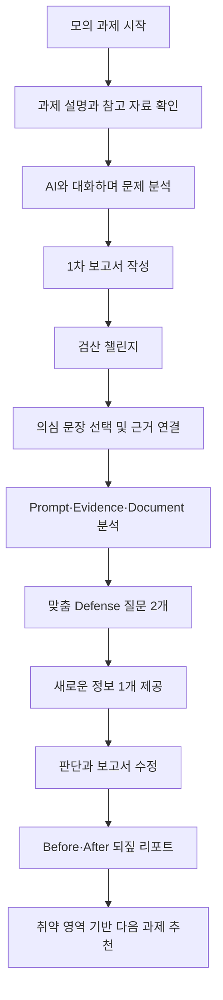
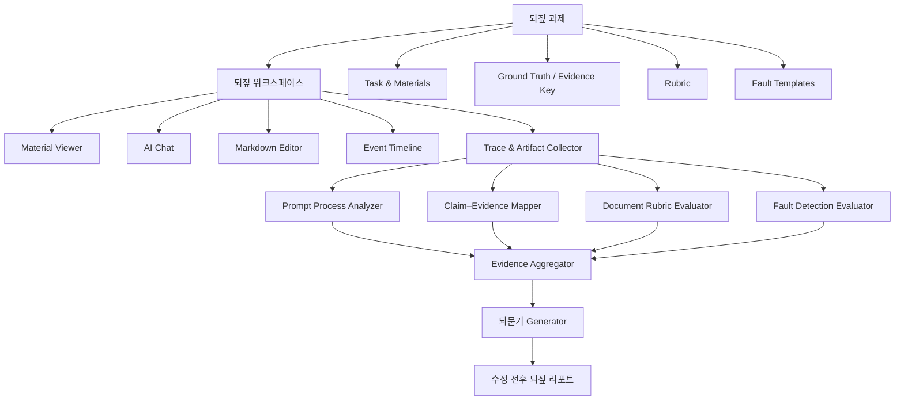

# 되짚 (Doezip)

> ## **AI의 답을, 근거로 되짚다.**
>
> AI 과제를 수행하는 동안의 요청 설계, 근거 검증, 결과 문서화, 판단 수정 과정을 분석하고, 통제된 오류 검증과 맞춤 피드백을 통해 사용자가 **AI와 함께 신뢰할 수 있는 결과물을 만드는 능력**을 훈련하는 서비스.
>
> **AI에게 잘 묻는 법뿐 아니라, AI가 틀렸을 때 알아차리는 법까지.**

---


## 브랜드 네이밍

### 네이밍 원칙

- **한글 이름을 메인**, 영문 표기를 서브로 사용한다.
- 초기 진입점인 `AI 과제 전형`이나 `개발자`에 이름을 묶지 않는다.
- 프롬프트 작성만이 아니라 **검증·문서화·판단 수정까지 포괄**해야 한다.
- 사용자를 시험하거나 감시하는 인상보다, 과정을 다시 살피고 성장시키는 인상을 준다.
- 짧고 발음하기 쉬우며, 기능 확장 후에도 사용할 수 있어야 한다.

### 네이밍 최종 후보 3안

| 순위 | 이름 | 핵심 의미 | 대표 카피 | 장점 | 주의점 |
|---:|---|---|---|---|---|
| **1** | **되짚 (Doezip)** | AI와 수행한 과정을 다시 따라가며 놓친 맥락·근거·판단을 확인한다 | **AI의 답을, 근거로 되짚다.** | 서비스 전체 과정과 가장 잘 맞고, 한국어로 기억하기 쉬우며 직무 확장성이 높다 | 영문만 보면 발음과 의미가 바로 전달되지 않으므로 초기에는 한글을 항상 병기한다 |
| **2** | **검산 (Geomsan)** | AI가 만든 결과를 제출하기 전에 오류와 근거를 다시 확인한다 | **AI가 만든 결과, 한 번 더 검산하다.** | 검증 챌린지와 오류 탐지 가치를 매우 직관적으로 전달한다 | 계산·수학 서비스로 좁게 인식될 수 있고, 프롬프트·문서화·성장까지 포괄하기에는 다소 좁다 |
| **3** | **되묻 (Doemut)** | AI가 제시한 답에 근거와 판단 이유를 다시 질문한다 | **AI의 답에, 근거를 되묻다.** | 능동적인 질문·반증·Defense 경험이 선명하다 | 대화 기능에 치우쳐 보일 수 있으며, 최종 문서와 반복 학습까지는 이름만으로 드러나지 않는다 |

### 1순위 권고

현재 서비스명은 **`되짚 (Doezip)`을 1순위 가칭**으로 사용한다.

```text
공식 표기     되짚 (Doezip)
로고 표기     되짚
영문 서브     Doezip
메인 슬로건   AI의 답을, 근거로 되짚다.
보조 카피     AI에게 잘 묻는 법뿐 아니라,
              AI가 틀렸을 때 알아차리는 법까지.
```

`Doezip`은 영문 독립 브랜드라기보다 한글 브랜드 `되짚`을 보조하는 스타일 표기다. 랜딩페이지·발표 자료·초기 제품에서는 반드시 `되짚 (Doezip)`을 함께 노출한다.

### 브랜드 언어 구조

후보에서 파생된 단어를 기능명으로 활용하면 제품 경험을 한글 중심으로 통일할 수 있다.

| 기능명 | 역할 | 기존 기술 용어 |
|---|---|---|
| **되짚 과제** | 직무별 AI 모의 과제 | Task Pack |
| **되짚 흐름** | 프롬프트·자료 확인·문서 수정 과정 | Trace Timeline |
| **검산 챌린지** | 통제된 오류를 찾아 근거로 수정 | Output Defense / Controlled Fault Injection |
| **되묻기** | 산출물 기반 후속 질문과 조건 변경 | Adaptive Defense |
| **근거 지도** | 영역별 판단과 관찰 근거 표시 | Evidence Map |
| **되짚 리포트** | 수정 전후와 다음 행동을 제공 | Evidence Report |

### 네이밍 최종 확정 전 점검

- 팀 외부 사용자 5명에게 이름의 발음·기억성·서비스 연상 내용을 확인한다.
- 도메인, SNS 핸들, 앱 이름, 상표 충돌 여부는 별도로 점검한다.
- 10분 뒤에도 이름을 기억하는지, `압축 파일 서비스` 등 다른 의미로 오해하는지 확인한다.
- 대안 이름은 버리지 않고 `검산 챌린지`, `되묻기`처럼 기능 언어로 활용한다.

---

## 0. 기획 결론 요약

### 서비스의 출발점

AI 활용이 허용되는 과제 전형을 준비하는 개발자에게 실제와 유사한 연습 환경과 피드백을 제공한다.

### 서비스의 궁극적인 목표

특정 채용 전형을 통과시키는 데 그치지 않고, AI를 사용하는 사람이 다음 역량을 갖추도록 돕는다.

- 해결해야 할 문제와 맥락을 AI에 정확히 전달한다.
- AI에게 적절한 단위로 작업을 맡긴다.
- AI가 제시한 사실과 판단을 원본 자료로 검증한다.
- 사실·추론·불확실성을 구분해 문서화한다.
- AI의 오류를 발견하고 올바르게 수정한다.
- 새로운 정보가 들어오면 기존 판단을 설명하고 수정한다.

### 해커톤 MVP

개발 직군의 **결제 API 장애 원인 분석 및 RCA 보고서 작성 과제 1개**를 제공한다. 사용자는 내장 AI와 자료를 분석하고 보고서를 작성한다. 시스템은 `요청 설계(Prompt) → 근거 검증(Evidence) → 결과 문서화(Document) → 판단 방어(Defense)` 과정을 분석하며, AI 산출물에 통제된 오류를 주입해 사용자의 검증 능력도 확인한다.

### 이 서비스가 아닌 것

- 프롬프트를 길고 그럴듯하게 바꿔주는 도구가 아니다.
- 보고서를 대신 완성해주는 문서 생성기가 아니다.
- AI를 사용하지 못하게 막는 시험이 아니다.
- 초기 단계에서 기업의 합격·불합격을 자동 결정하는 평가 플랫폼이 아니다.
- 근거 없이 사용자의 역량을 하나의 숫자로 단정하는 서비스가 아니다.

---

## 1. 제품 비전

AI를 사용하는 사람은 점점 더 빠르게 결과물을 만들 수 있다. 그러나 결과물을 빠르게 얻는 것과 그 결과를 신뢰할 수 있게 만드는 것은 다른 능력이다.

`되짚`이 만들고 싶은 변화는 다음과 같다.

```text
AI가 생성한 답을 받는 사용자
                ↓
AI가 생성한 답을 검증하는 사용자
                ↓
AI와 함께 만든 결과를 설명·수정·책임질 수 있는 사용자
```

### 장기 비전

> **AI의 답을 소비하는 사람에서, AI의 답을 책임질 수 있는 사람으로.**

### 초기 시장 진입점

> **AI 과제 전형을 준비하는 개발자 취업 준비생을 위한 실전형 AI 활용 역량 훈련.**

비전은 넓게 두되, 첫 제품은 개발 직군의 AI 분석·문서 작성 과제 하나로 좁힌다.

---

## 2. 선정 배경

기존 코딩테스트는 준비 방식이 비교적 명확하다.

```text
알고리즘 학습 → 문제 풀이 → 테스트 통과 → 복잡도 개선
```

반면 AI를 활용하는 실무형 과제는 다음처럼 진행될 수 있다.

```text
문제 해석
  ↓
참고 자료 탐색
  ↓
AI에 분석 요청
  ↓
AI 결과 검토
  ↓
대안 가설 비교
  ↓
최종 판단 문서화
  ↓
추가 질문에 판단 근거 설명
```

사용자는 AI를 통해 결과물은 만들 수 있지만, 자신의 수행이 좋은 과정이었는지는 판단하기 어렵다.

- 첫 질문에서 필요한 맥락과 제약을 전달했는가
- AI가 생성한 사실과 수치가 실제 자료와 일치하는가
- 그럴듯한 첫 번째 가설을 그대로 받아들이지는 않았는가
- 다른 가능성을 비교하고 배제한 이유가 있는가
- 보고서의 결론마다 근거가 연결되어 있는가
- 확인된 사실과 추정한 내용을 구분했는가
- 새로운 정보가 들어왔을 때 판단을 수정할 수 있는가

일반 AI에게 프롬프트 첨삭이나 보고서 수정을 요청할 수는 있다. 그러나 사용자가 **어떤 과정에서 판단을 놓쳤는지**, **어떤 근거를 확인하지 않았는지**, **다음 과제에서는 어떤 행동을 바꿔야 하는지**까지 일관된 기준으로 훈련하기는 어렵다.

---

## 3. 문제 정의

### 핵심 문제

> **AI를 활용해 결과물을 완성할 수는 있지만, 그 결과가 신뢰할 만한지 검증하고 자신의 판단으로 설명·수정하는 능력을 체계적으로 연습할 공간이 부족하다.**

### 사용자가 겪는 문제

1. **프롬프트 형식과 실제 업무 수행 능력을 혼동한다.**
   - 긴 프롬프트, 역할 지정, Markdown 형식이 곧 좋은 수행을 의미하지 않는다.

2. **AI의 그럴듯한 오류를 놓친다.**
   - 자료에 없는 수치, 근거 없는 인과관계, 지나치게 확정적인 결론을 사실처럼 받아들일 수 있다.

3. **최종 문서의 근거를 추적하기 어렵다.**
   - 결론은 있지만 어떤 자료와 판단 과정을 거쳐 나온 것인지 명확하지 않다.

4. **정답을 받은 뒤 학습이 종료된다.**
   - AI가 수정본을 만들어주면 결과물은 좋아지지만, 사용자의 판단 습관은 그대로 남을 수 있다.

5. **AI 과제 전형의 연습 기준이 불명확하다.**
   - 사용자는 무엇을 연습하고 어떤 피드백을 받아야 하는지 알기 어렵다.

---

## 4. 타깃 사용자

### 1차 타깃

> **AI 활용 과제 전형이나 실무형 분석 과제를 준비하는 0~3년 차 개발자 취업 준비생**

- ChatGPT, Claude, Codex, Cursor 등 AI 도구를 사용해본 경험은 있다.
- AI로 답을 얻는 데는 익숙하지만 결과 검증과 문서화에는 자신이 없다.
- 장애 분석, 기술 대안 비교, 원인 분석, 개선안 보고서 경험이 적다.
- 실제 과제와 비슷한 환경에서 연습하고 구체적인 보완점을 받고 싶다.

### 대표 페르소나

> 백엔드 개발자 취업을 준비하는 지훈은 지원 기업의 과제 전형에서 로그와 시스템 자료를 AI로 분석한 뒤 원인 보고서를 작성해야 한다. AI에게 질문하는 것은 익숙하지만 어떤 자료를 전달해야 하는지, AI가 제시한 원인을 어디까지 검증해야 하는지, 보고서의 결론에 근거를 어떻게 연결해야 하는지는 자신이 없다. 실제와 유사한 과제를 수행하고 자신의 취약점을 확인하고 싶다.

### 2차 타깃 및 구매자

- AI 활용 과제를 운영하는 부트캠프와 개발 교육기관
- 수강생의 결과물뿐 아니라 검증 과정을 확인하고 싶은 강사
- 신입·주니어에게 안전한 AI 업무 수행 방법을 교육하려는 조직

### 장기 확장 타깃

- 데이터 분석가: 데이터 해석과 인사이트 보고서
- 서비스 기획자: 사용자 문제 분석과 요구사항 문서
- 마케터: 캠페인 성과 분석과 전략 제안
- 운영·CS 담당자: VOC 분석과 정책 개선안

MVP에서는 개발 직군만 다룬다.

---

## 5. 사용자가 해결하려는 일

사용자가 원하는 것은 단순히 “좋은 프롬프트 작성법”을 배우는 것이 아니다.

> **실제 AI 과제와 비슷한 환경에서 문제를 해결하고, 내가 AI를 통해 내린 판단과 작성한 문서가 왜 부족한지 행동 근거와 함께 알고 싶다.**

### 기대 결과

- 과제 초기에 필요한 맥락과 제약을 정의할 수 있다.
- AI의 결론에 근거를 요구하는 습관을 익힌다.
- 원본 자료와 AI의 주장을 대조할 수 있다.
- 사실, 추론, 미확인 사항을 구분해 작성할 수 있다.
- 결론마다 근거를 연결할 수 있다.
- 새로운 증거가 들어왔을 때 기존 판단을 수정할 수 있다.
- 실제 과제 전에 자신의 취약 영역을 확인할 수 있다.

---

## 6. AI를 잘 사용한다는 것의 정의

`되짚`은 AI 활용 역량을 프롬프트 작성 기술 하나로 정의하지 않는다. 다음 네 단계가 모두 포함되어야 한다.

```text
요청 설계(Prompt) → 근거 검증(Evidence)
→ 결과 문서화(Document) → 판단 방어(Defense)
```

### 6.1 요청 설계 (Prompt) — 문제를 정확히 정의하고 AI에 일을 맡기는 능력

| 평가 요소 | 핵심 질문 |
|---|---|
| 목표 명확성 | 무엇을 해결해야 하는지 구체적인가 |
| 맥락 제공 | AI가 판단하는 데 필요한 시스템·시간·자료를 제공했는가 |
| 제약 전달 | 제공 자료 밖의 사실을 단정하지 않는 등 판단 범위를 정했는가 |
| 산출물 정의 | 원하는 결과의 항목과 형식이 명확한가 |
| 작업 분해 | 복잡한 문제를 탐색·가설·검증·작성 단계로 나눴는가 |
| 반복 개선 | AI 답변의 문제를 발견한 뒤 질문 전략을 수정했는가 |

평가하지 않는 것:

- 프롬프트 길이
- 특정 템플릿 사용 여부
- “전문가 역할을 부여했는가” 같은 형식적 체크리스트
- 영어 표현이나 어려운 용어 사용량

### 6.2 근거 검증 (Evidence) — AI의 답을 근거로 검증하는 능력

| 평가 요소 | 핵심 질문 |
|---|---|
| 근거 요청 | 결론을 뒷받침하는 원본 자료를 요구했는가 |
| 사실 확인 | AI의 주장과 자료가 실제로 일치하는지 확인했는가 |
| 대안 가설 | 하나의 원인에 고정되지 않고 다른 가능성을 비교했는가 |
| 반증 탐색 | 자신의 가설을 틀리게 만들 수 있는 자료를 찾았는가 |
| 불확실성 관리 | 현재 정보로 확인할 수 없는 내용을 구분했는가 |
| 모순 처리 | 충돌하는 자료를 발견하고 해소하거나 보류했는가 |

이 영역은 전체 평가에서 가장 높은 중요도를 갖는다.

### 6.3 결과 문서화 (Document) — 판단을 신뢰할 수 있게 문서화하는 능력

| 평가 요소 | 핵심 질문 |
|---|---|
| 문제 정의 | 무엇이 언제 어디서 어떤 영향을 일으켰는가 |
| 논리 구조 | 현상·가설·근거·조치가 자연스럽게 연결되는가 |
| 주장-근거 연결 | 핵심 결론마다 확인 가능한 자료가 연결되는가 |
| 사실·추론 분리 | 관찰된 사실과 작성자의 판단이 구분되는가 |
| 대안 검토 | 다른 가능성을 배제하거나 보류한 이유가 있는가 |
| 한계 표시 | 미확인 사항과 추가 조사가 필요한 지점이 명시되는가 |
| 실행 가능성 | 대응 방안의 우선순위와 검증 방법이 구체적인가 |

### 6.4 판단 방어 (Defense) — 결과를 설명하고 새로운 조건에 맞게 수정하는 능력

최종 문서가 완성됐더라도 사용자가 그 판단을 소유하고 있는지는 별도로 확인해야 한다.

- 핵심 결론을 자신의 언어로 설명할 수 있는가
- 가장 약한 근거와 남아 있는 불확실성을 인식하는가
- 반대 질문에 판단 근거를 제시할 수 있는가
- 새로운 자료가 추가됐을 때 가설의 우선순위를 조정할 수 있는가
- 변경된 판단을 문서에 일관되게 반영할 수 있는가

새로운 증거에 따라 결론을 바꾸는 것은 감점 요소가 아니다. **근거를 반영해 판단을 수정하는 행동 자체가 좋은 AI 활용 증거**다.

---

## 7. 핵심 가치 제안

1. **프롬프트만 보지 않는다.**
   - 과제, 자료, AI 대화, 최종 문서를 하나의 수행 과정으로 분석한다.

2. **표현보다 결과의 신뢰성을 본다.**
   - 프롬프트가 멋진지가 아니라 문제 해결에 필요한 정보를 만들었는지 확인한다.

3. **AI의 오류를 발견하는 능력까지 훈련한다.**
   - AI를 무조건 신뢰하거나 무조건 불신하지 않고, 근거 수준에 따라 판단하도록 돕는다.

4. **문서를 대신 완성하지 않는다.**
   - 문제와 보완 방향을 제시하고 사용자가 직접 수정하게 한다.

5. **점수보다 증거를 보여준다.**
   - 어떤 프롬프트, 자료, 문장, 수정 행동을 근거로 판단했는지 확인할 수 있다.

6. **진단 후 재수행까지 연결한다.**
   - 피드백 → 수정 → 새로운 정보 → 재검증의 닫힌 학습 루프를 만든다.

---

## 8. 핵심 차별화 기능 — 검산 챌린지

### 8.1 개념

AI가 생성한 코드나 문서는 대부분 자연스럽고 그럴듯하다. 따라서 사용자는 잘못된 내용도 쉽게 받아들일 수 있다.

`되짚`은 일부 훈련 과제에서 AI 산출물에 사전에 설계된 오류를 주입한다. 사용자는 오류의 위치와 정확한 개수를 모르는 상태에서 결과물을 검토하고, 원본 자료를 근거로 잘못된 부분을 찾아 수정해야 한다.

내부 기술명은 `Controlled Fault Injection`, 사용자에게 노출되는 기능명은 **`검산 챌린지`**로 사용한다.

### 8.2 목표

```text
AI 결과 수령
  ↓
의심 지점 발견
  ↓
원본 자료와 대조
  ↓
오류 판단 근거 제시
  ↓
올바르게 수정
  ↓
수정 결과 재검증
```

### 8.3 문서형 오류 유형

| 오류 유형 | 예시 |
|---|---|
| 수치 불일치 | 원본 자료에는 DB CPU가 정상인데 92%라고 작성 |
| 근거 없는 인과관계 | connection timeout만 보고 DB 풀 고갈을 원인으로 확정 |
| 자료에 없는 사실 | 제공되지 않은 배포 이력을 사실처럼 추가 |
| 과도한 확정 표현 | 가능성 중 하나를 “직접 원인”으로 단정 |
| 상충 근거 누락 | 외부 결제사 지연 자료를 무시하고 내부 원인만 제시 |
| 실행 불가능한 대책 | 원인 확인 없이 커넥션 풀을 2배로 늘리라고 제안 |

### 8.4 코드형 확장 오류 유형

MVP 이후에는 다음 오류를 코드 과제로 확장할 수 있다.

- 경계 조건 오류
- 권한 검증 누락
- 기존 기능의 회귀 오류
- 무의미하거나 잘못된 테스트
- 비효율적인 반복 조회
- 동시성 상황에서의 공유 상태 문제
- 보안상 위험한 기본값

### 8.5 설계 원칙

- 사용자는 “AI 결과에 검증이 필요한 내용이 포함될 수 있다”는 사실을 미리 안내받는다.
- 정확한 오류 개수와 위치는 공개하지 않는다.
- 실제 제품에서는 오류가 없는 세션도 섞어 무조건적인 의심을 학습하지 않게 한다.
- 문법 오류처럼 너무 쉬운 문제보다, **대부분 맞지만 특정 근거나 조건에서 틀리는 오류**를 사용한다.
- 시스템이 무엇을 주입했는지 정답 키를 보유해 평가의 객관성을 높인다.

### 8.6 평가 방식

| 평가 요소 | 확인 내용 |
|---|---|
| 오류 탐지 | 실제 주입된 오류를 발견했는가 |
| 근거 제시 | 왜 오류인지 원본 자료로 설명했는가 |
| 수정 정확성 | 잘못된 부분을 올바르게 고쳤는가 |
| 재검증 | 수정 후 결론과 자료를 다시 확인했는가 |
| 오탐 제어 | 정상인 내용을 무작정 오류로 판단하지 않았는가 |

훈련의 목표는 AI를 불신하게 만드는 것이 아니다.

```text
AI를 전부 믿는다            X
AI를 전부 의심한다          X
근거 수준에 따라 신뢰한다   O
```

---

## 9. 주요 기능

### 9.1 되짚 과제 — 직무 기반 AI 모의 과제

- 실제 업무 상황을 축약한 과제와 자료 묶음 제공
- 과제마다 성공 기준, Ground Truth, 평가 루브릭, 오류 주입 시나리오 정의
- MVP는 개발 직군 장애 원인 분석 과제 1개만 제공

### 9.2 되짚 워크스페이스 — AI 협업 공간

- 과제 설명
- 참고 자료 열람
- 내장 AI 채팅
- Markdown 보고서 편집기
- 프롬프트와 문서 변경 타임라인

### 9.3 프롬프트 흐름 분석

- 첫 질문의 목표·맥락·제약 누락 확인
- 질문이 어떻게 보완됐는지 분석
- 각 프롬프트가 실제 판단과 문서에 어떤 영향을 줬는지 연결
- 문장 형식이 아니라 **효과적인 탐색과 검증 흐름**을 평가

### 9.4 Claim–Evidence Mapper

- 보고서의 핵심 주장 자동 추출
- 각 주장에 연결되는 참고 자료 후보 제시
- 자료로 뒷받침되지 않는 주장 표시
- 사실, 추론, 미확인 항목 분류
- 서로 모순되는 주장과 자료 탐지

### 9.5 문서 보완 코치

- 문서의 구조적 누락과 근거 부족 설명
- 완성 문장보다 수정 우선순위와 보완 방향 제공
- 수정 전후 버전을 비교해 어떤 문제가 해소됐는지 표시

### 9.6 검산 챌린지

- 통제된 오류가 포함될 수 있는 AI 산출물 제공
- 오류로 의심되는 문장 선택
- 사용자가 근거 자료 연결 및 수정 이유 작성
- 탐지, 근거, 수정, 오탐, 재검증 결과 제공

### 9.7 되묻기 — Adaptive Defense

- 실제 프롬프트와 문서에 기반한 후속 질문 2개 생성
- 새로운 정보 또는 조건 변경 1개 제공
- 사용자가 결론과 문서를 다시 수정하도록 유도

### 9.8 되짚 리포트

- 요청 설계 / 근거 검증 / 결과 문서화 / 판단 방어 영역별 상태
- 각 판단에 연결된 프롬프트·자료·문장·수정 기록
- 잘한 행동과 다음에 바꿔야 할 행동
- 오류 탐지 및 오탐 기록
- 수정 전후 비교
- 다음 추천 과제

---

## 10. 사용자 플로우



### 연습 모드 (Practice) — MVP

- 수행 중 AI를 자유롭게 사용한다.
- 1차 제출 이후 구체적인 보완점을 확인한다.
- 사용자가 문서를 직접 수정하고 변화를 확인한다.
- 오류가 포함될 수 있다는 사실을 안내한다.

### 모의평가 모드 (Mock Assessment) — MVP 이후

- 제한 시간 적용
- 수행 중 평가 피드백 비공개
- 제출 후 검산 챌린지와 결과 리포트 진행
- 실제 과제 전형 직전 모의 연습에 활용

---

## 11. 대표 MVP 과제

### 과제명

**결제 API 장애 원인 분석 및 RCA 보고서 작성**

### 제공 자료

1. 결제 서비스 구조도
2. 장애 발생 전후 API 오류 로그
3. 서버 및 DB 주요 지표
4. 최근 배포 이력
5. 외부 결제사 응답 시간 기록
6. 고객 문의 요약

### 과제 설명

```text
최근 결제 API의 오류율이 급증했습니다.
제공된 자료와 AI를 활용해 가능한 원인을 분석하고,
다음 내용을 포함한 1페이지 장애 분석 보고서를 작성하세요.

- 장애 현상과 사용자 영향
- 주요 원인 가설과 근거
- 검토한 대안 가설
- 현재 확인할 수 없는 사항
- 즉시 대응 방안
- 재발 방지 방안
```

### 검산 챌린지용 주입 오류

MVP 데모에서는 아래 두 개를 고정한다.

1. **수치 불일치**
   - DB CPU는 정상 범위인데 “DB CPU가 92%까지 증가했다”고 작성

2. **근거 없는 인과관계**
   - DB 커넥션 풀 사용률 자료가 없는데 “장애의 직접 원인은 DB 커넥션 풀 고갈이다”라고 단정

### 조건 변경 미션

```text
추가 정보
장애 발생 3분 전에 HTTP Client 재시도 횟수를
1회에서 3회로 늘린 배포가 있었습니다.

요청
기존 원인 가설의 우선순위, 확신도,
즉시 대응 방안을 수정하세요.
```

### 기대되는 좋은 수행

- 분석 시간과 대상 시스템을 명확히 지정한다.
- 사실과 추정을 분리해 AI에 요청한다.
- DB, 최근 배포, 외부 결제사 지연 가능성을 비교한다.
- 각 가설을 지지하거나 반박하는 자료를 연결한다.
- 제공 자료로 확정할 수 없는 부분을 표시한다.
- 주입된 오류를 발견하고 근거를 들어 수정한다.
- 추가 배포 정보에 따라 가설 우선순위와 대응 방안을 조정한다.

---

## 12. 평가 및 근거 지도

최종 결과는 하나의 `AI 활용 역량 82점`으로 끝내지 않는다. 네 영역의 상태와 근거를 보여준다.

```text
Prompt
- 목표와 산출물 정의             충분한 근거
- 필요한 맥락 제공               일부 근거
- 질문 흐름 개선                 충분한 근거

Evidence
- 원본 자료 확인                 일부 근거
- 대안 가설 비교                 추가 확인 필요
- 통제된 오류 탐지               충분한 근거
- 오탐 제어                      충분한 근거

Document
- 문제와 영향 정리               충분한 근거
- 주장-근거 연결                 일부 근거
- 사실과 추론 분리               추가 확인 필요

Defense
- 핵심 결론 설명                 일부 근거
- 새로운 정보 반영               충분한 근거
- 문서 일관성 유지               충분한 근거
```

### 상태 판단 기준

| 상태 | 기준 |
|---|---|
| 충분한 근거 | 서로 다른 종류의 긍정 증거가 2개 이상이며 직접 반증이 없음 |
| 일부 근거 | 긍정 증거는 있으나 한 종류에 치우치거나 반대 증거와 충돌함 |
| 추가 확인 필요 | 직접 증거가 없거나 결과만 완성했거나 판단이 상충함 |

### 증거 신뢰도

| 증거 유형 | 예시 | 신뢰도 |
|---|---|---:|
| 원본 자료 참조 | 로그·지표·배포 기록을 정확히 연결 | 높음 |
| 오류 탐지 및 수정 | 주입 오류를 찾아 근거와 함께 교정 | 높음 |
| 반증·대안 검토 | 다른 원인을 비교하고 배제 기준 제시 | 높음 |
| 조건 변경 대응 | 추가 정보에 따라 판단과 문서를 수정 | 높음 |
| 방어 설명 | 핵심 판단을 자신의 언어로 설명 | 중간~높음 |
| 프롬프트 개선 | 누락된 맥락과 제약을 보완 | 중간 |
| 단순 자기 진술 | “확인했다”, “이해했다”고 응답 | 낮음 |

### 내부 평가 우선순위 제안

외부 화면에는 점수보다 근거 상태를 보여주되, 내부 계산에서는 다음 우선순위를 실험할 수 있다.

```text
Prompt      20
Evidence    35
Document    25
Defense     20
```

수치는 초기 가설이며 사용자 테스트와 평가자 검수로 조정한다.

---

## 13. AI가 꼭 필요한 이유

정적인 체크리스트만으로는 다음을 수행하기 어렵다.

- 여러 차례 이어진 프롬프트의 목적과 수정 맥락 해석
- AI 답변과 참고 자료 사이의 의미적 근거 연결
- 자유 형식 문서에서 핵심 주장과 추론 추출
- 사용자가 놓친 근거에 맞춘 후속 질문 생성
- 새로운 증거 전후로 판단이 어떻게 바뀌었는지 비교
- 같은 문장도 과제 맥락에 따라 달라지는 확실성 판단

그러나 최종 평가는 LLM의 인상 비평에만 맡기지 않는다.

```text
고정 과제 + Ground Truth + Evidence Key + Fault Key
                         ↓
              Deterministic Evaluator
- 필수 섹션 포함 여부
- 명시된 수치와 원본 자료 일치 여부
- 주입 오류 탐지 여부
- 오류 수정 정확성
- 정상 문장에 대한 오탐 여부
                         +
                   LLM Evaluator
- 목표와 맥락의 충분성
- 주장과 근거의 의미적 연결
- 사실·추론·불확실성 구분
- 대안 가설과 판단 수정의 적절성
                         ↓
                Evidence Aggregator
                         ↓
          보완점 + Defense + 근거 지도
```

모든 평가에는 가능하면 다음 정보를 함께 제공한다.

- 평가 기준
- 관찰된 프롬프트·행동·문장
- 연결된 원본 자료
- 반대 증거 또는 누락된 증거
- 판단 확신도
- 사용자가 취할 수 있는 다음 행동

---

## 14. 시스템 아키텍처



### 핵심 데이터 구조

```text
Task
Material
GroundTruth
RubricDimension
FaultTemplate
Session
PromptEvent
AIResponseEvent
DocumentVersion
Claim
EvidenceLink
FaultAttempt
EvaluationEvidence
DefenseQuestion
DefenseAnswer
FeedbackReport
```

---

## 15. 해커톤 MVP 범위

### 반드시 구현

1. 개발 직군 장애 분석 과제 1개
2. 참고 자료 4~6개
3. 내장 AI 채팅
4. 간단한 Markdown 보고서 편집기
5. 프롬프트·AI 응답·문서 수정 타임라인
6. 요청 설계 / 근거 검증 / 결과 문서화 / 판단 방어 고정 루브릭
7. 핵심 주장과 자료를 연결하는 Claim–Evidence 분석
8. 통제된 문서 오류 2개
9. 오류 선택·근거 연결·직접 수정 UI
10. 맞춤 Defense 질문 2개
11. 추가 정보 기반 판단 수정 미션 1개
12. 수정 전후 근거 지도 비교 화면

### 구현 우선순위

#### P0 — 핵심 데모

- 과제 및 자료 열람
- AI 채팅
- 보고서 작성
- 통제된 오류 주입
- 오류 탐지와 근거 연결
- 되짚 리포트

#### P1 — 완성도 향상

- 프롬프트 흐름 분석
- Claim–Evidence 자동 연결
- 맞춤 Defense 질문
- 수정 전후 비교

#### P2 — 시간 여유가 있을 때

- 다음 과제 추천
- 수행 타임라인 시각화
- 동일 과제 재도전

### 의도적으로 제외

- 코드 실행 및 테스트 샌드박스
- 실제 GitHub Repository 연동
- 여러 직무와 난이도
- 개인 업무 문서 업로드
- 기업용 지원자 관리 대시보드
- 자동 합격·불합격 판정
- 실시간 감독과 부정행위 탐지
- 공식 역량 인증 배지
- 장기 적응형 커리큘럼
- 보고서 전체 자동 재작성 버튼

### MVP 원칙

> **서비스가 보고서를 대신 완성하면 생산성 도구가 되고, 부족한 근거와 판단 과정을 보여줘 사용자가 직접 수정하게 하면 훈련 도구가 된다.**

---

## 16. 5분 데모 시나리오

### 0:00 — 문제 제기

> “AI에게 보고서를 작성시켰습니다. 문장이 자연스럽다면, 그 내용도 믿을 수 있을까요?”

### 0:30 — 과제와 첫 프롬프트

사용자가 다음처럼 질문한다.

```text
“이 로그를 보고 장애 원인을 찾아줘.”
```

시스템은 목표 범위, 시간대, 대안 가설, 근거 요구가 누락됐음을 기록한다.

### 1:15 — 그럴듯하지만 틀린 AI 결과

AI 초안에는 다음 문장이 포함된다.

```text
“DB CPU가 92%까지 증가했고,
DB 커넥션 풀 고갈이 장애의 직접 원인이다.”
```

하지만 제공 자료에서는 DB CPU가 정상이며 커넥션 풀 사용률은 제공되지 않았다.

### 2:00 — 검산 챌린지

사용자는 의심 문장을 선택하고 원본 자료를 연결해 오류를 설명한다.

```text
- DB CPU 92%는 원본 지표와 일치하지 않음
- 커넥션 풀 고갈을 확정할 직접 자료가 없음
- 외부 결제사 응답 지연 가능성을 비교해야 함
```

### 3:00 — 개선된 질문과 문서 수정

```text
“14:00~14:20 자료만 사용해 장애 타임라인을 정리해줘.
DB, 최근 배포, 외부 결제사 지연 가설을 각각 비교하고,
각 판단을 지지하거나 반박하는 자료를 연결해줘.
확정할 수 없는 부분은 별도로 표시해줘.”
```

사용자가 보고서를 직접 수정한다.

### 4:00 — Defense와 조건 변경

장애 3분 전 재시도 횟수를 늘린 배포가 있었다는 정보가 추가된다. 사용자는 가설 우선순위와 즉시 대응 방안을 수정한다.

### 4:40 — 결과 화면

```text
Before
- 맥락 정의                  추가 확인 필요
- 원본 자료 검증             추가 확인 필요
- 통제된 오류 탐지           미확인
- 주장-근거 연결             추가 확인 필요
- 새로운 정보 반영           미확인

After
- 맥락 정의                  충분한 근거
- 원본 자료 검증             충분한 근거
- 통제된 오류 탐지           충분한 근거
- 주장-근거 연결             일부 근거
- 새로운 정보 반영           충분한 근거
```

### 발표 핵심 문장

> **처음부터 완벽한 프롬프트를 쓰는 사람이 좋은 AI 사용자는 아닙니다. AI의 답을 의심하고, 근거를 확인하고, 틀린 부분을 바로잡고, 새로운 정보에 따라 판단을 수정하는 사람이 신뢰할 수 있는 결과물을 만듭니다.**

---

## 17. 기존 방식 대비 차별점

| 기존 방식 | 한계 | 되짚 |
|---|---|---|
| 프롬프트 자동 개선 | 문장은 좋아지지만 사용자의 판단 습관이 바뀌지 않을 수 있음 | 누락된 맥락이 결과에 어떤 문제를 만들었는지 연결 |
| 일반 AI 문서 첨삭 | 표현과 구조를 개선하지만 원본 자료의 근거성 확인이 약함 | 핵심 주장과 원본 자료를 연결하고 근거 없는 단정을 표시 |
| 범용 AI 챗봇 | 원하는 답을 생성하지만 고정된 성공 기준과 학습 루프가 없음 | 직무 과제·Ground Truth·루브릭·재수행 구조 제공 |
| 기업용 AI 역량평가 | 선발과 진단이 중심 | 개인의 연습·수정·재검증을 중심으로 설계 |
| 정답 채점 | 최종 결과만 확인 | Prompt·Evidence·Document·Defense 전체 과정 확인 |
| AI 튜터 | 설명과 정답 제공 중심 | AI 오류를 직접 발견하고 수정하도록 훈련 |

### 차별화의 핵심

```text
일반 생산성 도구
입력 → 더 나은 결과물 생성

되짚
과제 수행 → 오류·공백 발견 → 근거 확인 → 사용자 수정
→ 새로운 조건으로 재검증 → 다음 수행 방식 개선
```

제품의 장기적인 방어력은 단순한 프롬프트 분석 모델이 아니라 다음 자산의 축적에서 만든다.

- 직무별 실제 과제 템플릿
- 검증 가능한 Ground Truth와 Evidence Key
- 통제된 오류 시나리오
- 수행 행동과 실제 오류 사이의 데이터
- 직무별 평가 루브릭
- 사용자의 반복 수행 및 개선 데이터

---

## 18. 파트너사 적합성

파트너사 적합성은 선정 근거가 아니라 제품 방향을 보완하는 연결점으로 사용한다.

- **Cofa**: 결과물만이 아니라 AI와 협업하는 과정과 판단을 관찰한다는 방향과 맞닿아 있다.
- **Programmers**: AI 과제 경험과 인접하지만, 본 서비스는 기업의 선발보다 응시자의 훈련·수정·재검증을 중심으로 한다.
- **SelectStar**: LLM의 주관적 평가만 사용하지 않고 Ground Truth, 오류 키, 근거 공개를 결합하는 신뢰성 설계와 연결 가능하다.
- **Freewheelin**: 취약 영역 진단 후 다음 과제와 재학습으로 이어지는 개인화 학습 흐름과 어울린다.
- **SparkLabs**: 개인용 과제 훈련에서 교육기관·조직용 AI 업스킬링 제품으로 확장하는 사업 가설을 검토할 수 있다.

---

## 19. 비즈니스 모델과 시장 진입

### 1단계 — 개인용 AI 과제 모의훈련

월 구독보다 실제 과제 전형을 앞둔 시점의 **단건 구매 또는 직무별 과제 팩**을 우선 가설로 둔다.

```text
무료 체험
- 입문 과제 1개
- 기본 되짚 리포트

유료 과제 팩
- 직무별 실전 과제
- 검산 챌린지
- 상세 근거 리포트
- 조건 변경 미션
- 1회 재도전
```

### 2단계 — 부트캠프·교육기관 코호트 라이선스

- 수강생별 AI 과제 수행 기록
- 반복적으로 부족한 역량 집계
- 강사가 먼저 확인해야 할 수강생 추천
- 공통 오류와 문서화 문제 분석
- 개별 리뷰 시간 절감

### 3단계 — 조직 AI 활용 훈련

- 신입·주니어 AI 업무 교육
- 직무별 시뮬레이션 과제
- 조직 내부 정책을 반영한 오류 검증 훈련
- 팀 단위 요청 설계 / 근거 검증 / 결과 문서화 / 판단 방어 개선 추적

### 초기 BM에서 제외

- 공신력이 없는 상태에서의 유료 인증 배지
- 자동 채용 판정
- 범용 AI 튜터 월 구독
- 기업용 ATS 전체 기능

---

## 20. 사용자 검증 계획

플랫폼 전체를 구현하기 전에 수동 또는 반자동으로 첫 과제를 테스트한다.

### 테스트 대상

- AI 도구를 사용해본 개발자 취업 준비생 5명
- 가능하면 AI 과제나 실무형 과제 경험자 1~2명 포함

### 테스트 방식

1. 결제 장애 분석 자료 제공
2. 사용자가 평소 사용하는 AI 또는 간단한 내장 채팅으로 과제 수행
3. 프롬프트와 최종 보고서 수집
4. 통제된 오류 검증 진행
5. Defense 질문과 조건 변경 미션 수행
6. 되짚 리포트 제공
7. 인터뷰 진행

### 검증할 가설

| 가설 | 확인 질문 |
|---|---|
| 문제 가설 | AI 과제를 어떻게 준비해야 하는지 실제로 어려움을 느끼는가 |
| 가치 가설 | 일반 AI 첨삭보다 근거 기반 보완점이 유용한가 |
| 검증 가설 | 의도적 오류 찾기가 AI 활용 역량 훈련으로 느껴지는가 |
| 행동 가설 | 피드백 후 사용자가 직접 문서를 수정하는가 |
| 신뢰 가설 | 평가 근거가 연결되면 결과를 납득하는가 |
| 반복 가설 | 다른 유형의 과제에도 다시 도전할 의향이 있는가 |
| 구매 가설 | 실제 전형 전 단건 과제에 결제할 의향이 있는가 |

### 초기 성공 기준

5명 기준으로 다음을 목표로 한다.

- 4명 이상이 자신이 인식하지 못했던 문제를 1개 이상 발견
- 4명 이상이 평가 근거를 납득 가능하다고 응답
- 3명 이상이 오류 검증과 문서 재작성까지 완료
- 3명 이상이 실제 과제 전형 전에 다시 사용할 의향 표시
- 2명 이상이 합리적인 가격의 단건 모의 과제 결제 의향 표시
- 수정 후 근거 없는 주장과 사실·추론 혼재가 명확하게 감소

---

## 21. 예상 리스크와 대응

| 리스크 | 대응 |
|---|---|
| 단순 프롬프트 첨삭 서비스로 보임 | Prompt보다 Evidence·오류 검증·Defense를 데모 전면에 배치 |
| 범용 ChatGPT로 대체 가능 | 고정 과제, Ground Truth, 행동 기록, 오류 키, 재검증을 결합 |
| LLM 평가가 주관적임 | 결정적 검사, 고정 루브릭, 원본 근거 링크, 확신도 공개 |
| 긴 프롬프트가 높은 평가를 받음 | 길이와 형식을 평가하지 않고 실제 정보 생성 및 검증 행동을 평가 |
| 고의 오류가 사용자 신뢰를 해침 | 챌린지 모드임을 명시하고 정확한 개수만 숨김 |
| 사용자가 모든 내용을 무조건 의심함 | 오류가 없는 세션과 오탐 평가를 포함해 신뢰 보정 능력을 훈련 |
| AI가 결과물을 전부 대신 작성함 | 완성본 자동 재작성 대신 문제와 보완 방향을 제공하고 직접 수정 요구 |
| 과제·루브릭 제작 비용이 큼 | MVP는 과제 1개로 시작하고 검증된 과제 패키지(Task Pack) 구조를 재사용 |
| 개인 반복 사용이 약함 | 실제 전형 직전 단건 상품으로 진입하고 교육기관 반복 사용으로 확장 |
| 기존 AI 역량평가와 유사함 | 선발보다 훈련, 결과보다 오류 검증과 재수행 루프를 차별점으로 고정 |
| 민감한 업무 자료 업로드 우려 | MVP는 플랫폼이 제공하는 가상 자료만 사용 |

---

## 22. 제품 원칙

앞으로 기능을 결정할 때 다음 원칙으로 판단한다.

1. **AI 사용 자체를 감점하지 않는다.**
2. **프롬프트의 길이와 형식을 실력으로 간주하지 않는다.**
3. **모든 평가에는 가능한 한 관찰 근거를 연결한다.**
4. **AI를 무조건 의심하게 하지 않고 신뢰 수준을 보정하게 한다.**
5. **서비스가 정답을 대신 작성하기보다 사용자가 직접 수정하게 한다.**
6. **새로운 정보에 따라 판단을 바꾸는 것을 좋은 행동으로 본다.**
7. **하나의 종합점수보다 강점·공백·다음 행동을 보여준다.**
8. **첫 제품은 AI 과제 전형에 집중하되 장기 비전은 AI 활용 역량 전체로 둔다.**

핵심 판단 질문:

> **이 기능이 사용자를 대신해 더 좋은 결과를 만들어주는가, 아니면 사용자가 더 좋은 판단을 내릴 수 있도록 훈련하는가?**

후자에 가까운 기능을 우선한다.

---

## 23. 해커톤 심사 관점의 강점

- **기획력**: “좋은 프롬프트”가 아니라 “신뢰할 수 있는 AI 결과”라는 구체적인 문제를 다룬다.
- **AI 활용 적절성**: 다중 프롬프트 분석, 주장-근거 연결, 맞춤 질문 생성에 AI가 본질적으로 필요하다.
- **기술력**: LLM Judge 하나가 아니라 이벤트 수집, Claim–Evidence Mapping, 결정적 오류 검사, 적응형 Defense를 결합한다.
- **실현 가능성**: 과제 1개와 문서형 흐름으로 제한해 코드 샌드박스 없이도 핵심 가치를 구현할 수 있다.
- **발표 전달력**: 자연스럽지만 틀린 AI 보고서를 사용자가 직접 찾아 고치는 장면이 직관적이다.
- **확장성**: 개발 직군 과제에서 직무별 AI 업무 훈련과 교육기관용 제품으로 확장할 수 있다.

### 가장 중요한 데모 포인트

> **AI가 틀린 답을 생성한다 → 사용자가 근거로 오류를 찾아낸다 → 새로운 정보로 판단을 수정한다 → 행동 근거 기반 리포트가 생성된다.**

이 장면이 구현되지 않으면 일반 프롬프트·문서 첨삭 서비스처럼 보일 가능성이 높다.

---

## 24. 30초 피치

> 생성형 AI를 사용하면 누구나 빠르게 보고서를 만들 수 있습니다. 하지만 문장이 자연스럽다고 해서 내용까지 믿을 수 있는 것은 아닙니다. **되짚**은 AI 과제를 수행하는 동안 사용자의 요청, 근거 확인, 문서 작성 과정을 분석하고, 일부러 설계된 AI 오류를 직접 찾아 수정하게 합니다. 우리는 좋은 프롬프트를 대신 써주는 것이 아니라, AI가 틀렸을 때 알아차리고 최종 결과를 책임질 수 있는 사람을 훈련합니다.

---

## 25. 최종 제품 정의

> **되짚(Doezip)은 AI 과제 전형 훈련에서 시작해, 사용자가 문제와 맥락을 AI에 정확히 전달하고, AI의 답을 근거로 검증하며, 신뢰할 수 있는 결과물로 문서화하고, 오류와 조건 변화에 맞춰 판단을 수정·설명하는 능력을 반복적으로 훈련하는 AI 활용 역량 학습 플랫폼이다.**

### 브랜드 메시지

```text
브랜드명       되짚 (Doezip)
메인 슬로건    AI의 답을, 근거로 되짚다.
보조 카피      AI에게 잘 묻는 법뿐 아니라,
               AI가 틀렸을 때 알아차리는 법까지.
비전 카피      AI의 답을 얻는 사람에서,
               AI의 답을 책임질 수 있는 사람으로.
```

### 랜딩페이지 첫 화면 권장안

```text
되짚 (Doezip)

AI의 답을, 근거로 되짚다.

AI와 실제 과제를 수행하고,
내가 어떤 맥락을 놓쳤는지, 어떤 근거를 확인하지 않았는지,
그럴듯한 AI 오류를 제대로 발견했는지 확인하세요.

[첫 되짚 과제 시작하기]
```

---

## 26. 현재 확정 사항과 남은 결정

### 확정 사항

- 브랜드 네이밍 1순위는 **`되짚 (Doezip)`**이다.
- 한글 `되짚`을 메인으로 사용하고 `Doezip`은 서브 표기로 둔다.
- 네이밍 2순위는 **검산(Geomsan)**, 3순위는 **되묻(Doemut)**이다.
- 서비스의 장기 목표는 AI를 더 잘 사용하는 사람을 만드는 것이다.
- 초기 진입점은 개발 직군 AI 과제 전형 훈련이다.
- MVP 과제는 장애 원인 분석 및 RCA 보고서 작성이다.
- 핵심 프레임워크는 `요청 설계 → 근거 검증 → 결과 문서화 → 판단 방어`다.
- 핵심 차별 기능은 통제된 오류 검증인 **검산 챌린지**다.
- 결과는 단일 점수보다 근거 중심의 **근거 지도**로 제공한다.
- 사용자가 결과물을 직접 수정하는 학습 구조를 유지한다.

### 팀에서 추가 결정할 사항

1. 외부 사용자 네이밍 테스트 후 `되짚`을 최종 확정할지
2. 로고에서 `되짚`, `되짚 Doezip`, `DOEZIP` 중 어떤 조합을 사용할지
3. 도메인·SNS 핸들·상표 확인 후 영문 표기를 그대로 유지할지
4. 내장 AI가 수행 중 어느 수준까지 힌트를 제공할지
5. 첫 과제의 자료와 Ground Truth를 누가 검수할지
6. 오류 주입을 고정 규칙으로만 구현할지, LLM 기반 변형도 포함할지
7. 최종 리포트에서 내부 점수를 어느 수준까지 노출할지
8. 5명 사용자 테스트를 개발 전에 먼저 진행할지, 최소 UI 구현 후 진행할지

---

## 참고 링크

- [Cofa Probe](https://www.getcofa.com/ko/probe)
- [Programmers AI 역량평가](https://www.programmers.co.kr/ai-assessment)
